---
## Front matter
lang: ru-RU
title: Лабораторная работа № 1
subtitle: Знакомство с Cisco Packet Tracer
author:
  - Демидова Е. А.
institute:
  - Российский университет дружбы народов, Москва, Россия
date: 16 февраля 2024

## i18n babel
babel-lang: russian
babel-otherlangs: english

## Formatting pdf
toc: false
toc-title: Содержание
slide_level: 2
aspectratio: 169
section-titles: true
theme: metropolis
header-includes:
 - \metroset{progressbar=frametitle,sectionpage=progressbar,numbering=fraction}
 - '\makeatletter'
 - '\beamer@ignorenonframefalse'
 - '\makeatother'
---

# Вводная часть

## Цели и задачи

**Цели**

Установка инструмента моделирования конфигурации сети Cisco Packet Tracer, знакомство с его интерфейсом.

**Задачи**

1. Установить на домашнем устройстве Cisco Packet Tracer.
2. Постройте простейшую сеть в Cisco Packet Tracer, проведите простейшую настройку оборудования.

# Выполнение лабораторной работы

## Простейшая сеть с концентратором

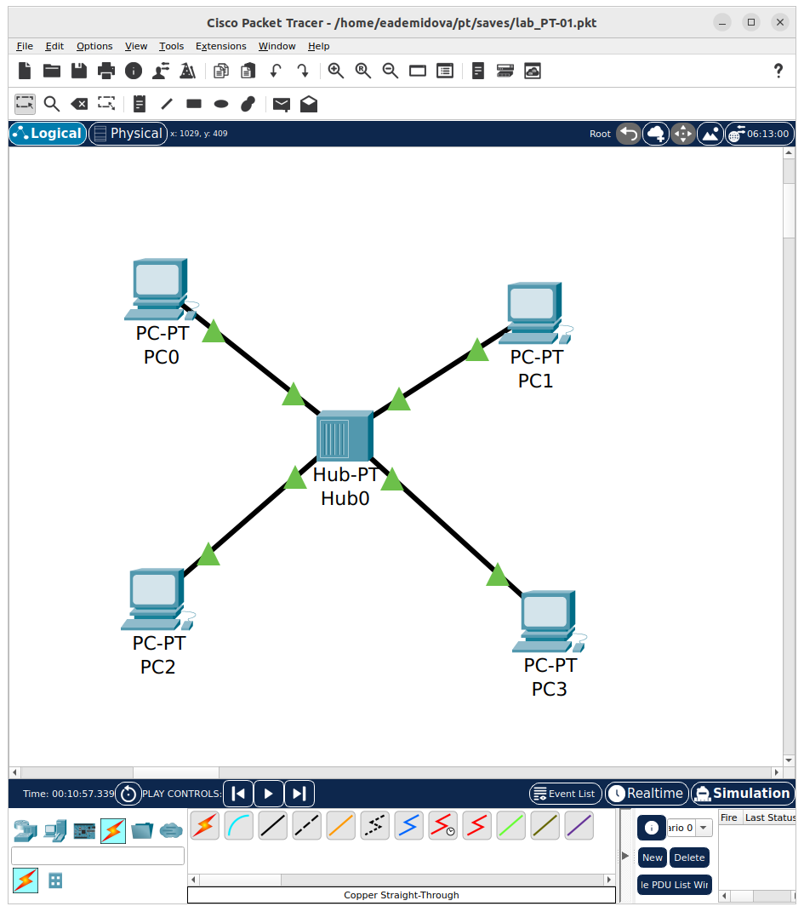{#fig:001 width=40%}

## Простейшая сеть с концентратором

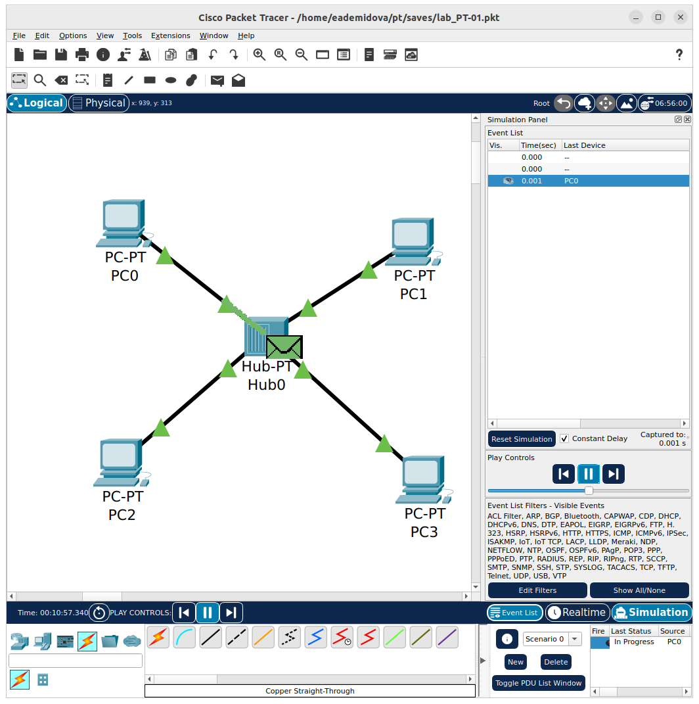{#fig:002 width=50%}

## Простейшая сеть с концентратором

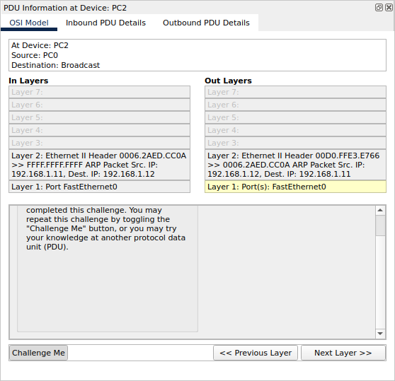{#fig:003 width=50%}

## Простейшая сеть с концентратором

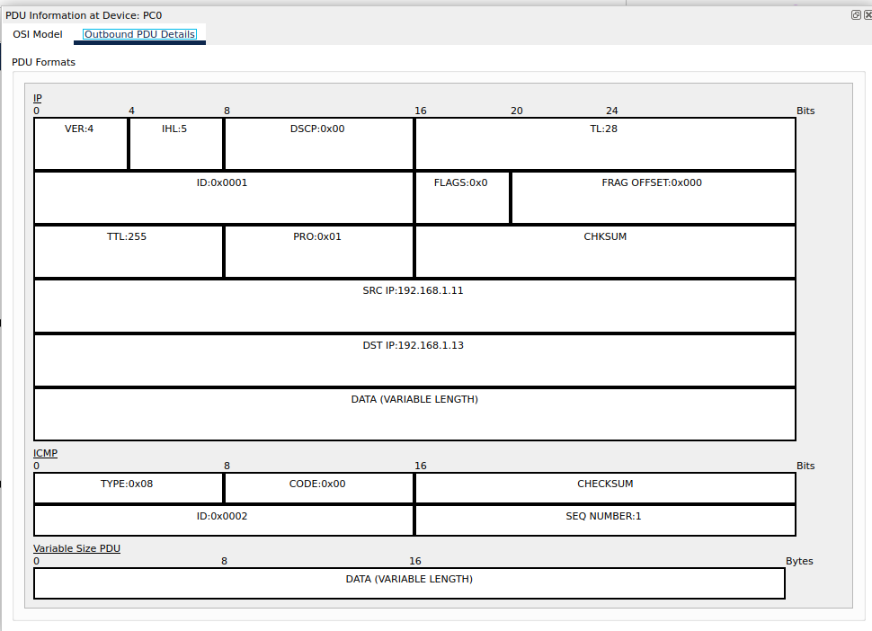{#fig:004 width=60%}

## Простейшая сеть с концентратором

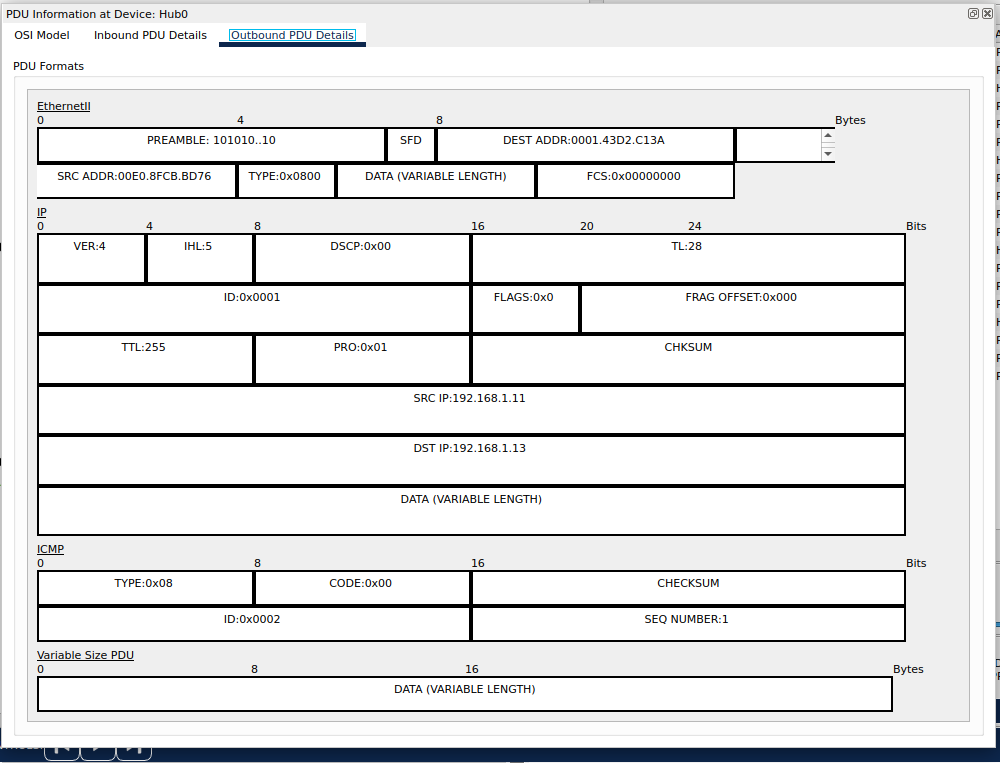{#fig:005 width=60%}

## Простейшая сеть с концентратором

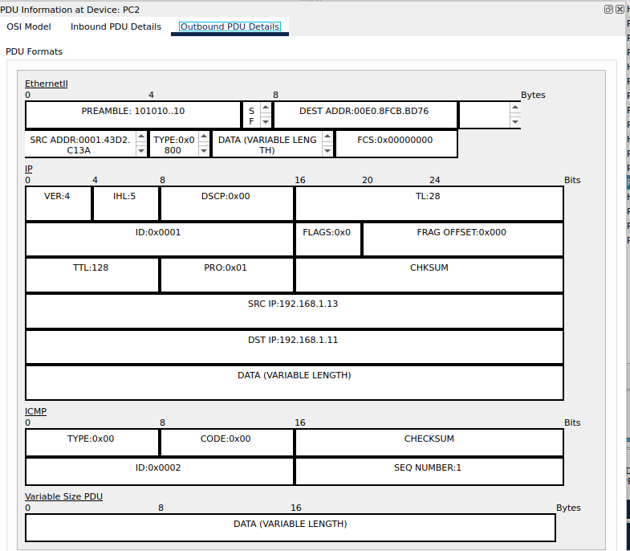{#fig:006 width=50%}

## Простейшая сеть с концентратором

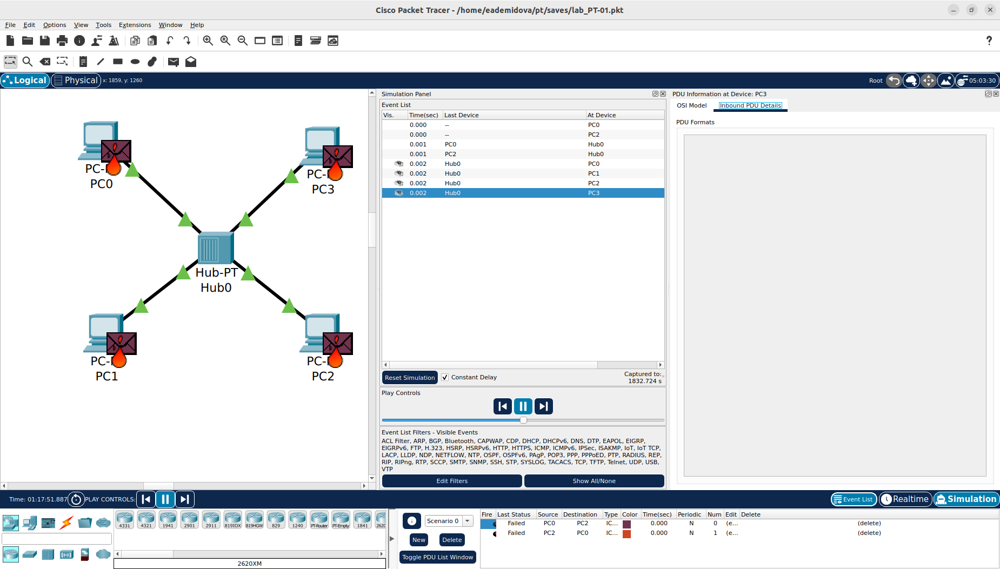{#fig:007 width=70%}

## Простейшая сеть с коммутатором

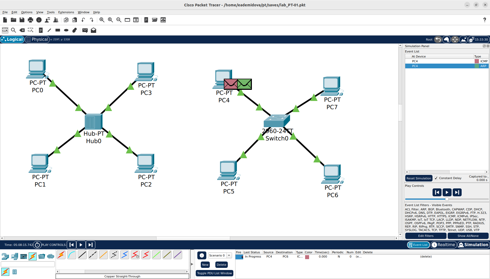{#fig:008 width=70%}

## Простейшая сеть с коммутатором

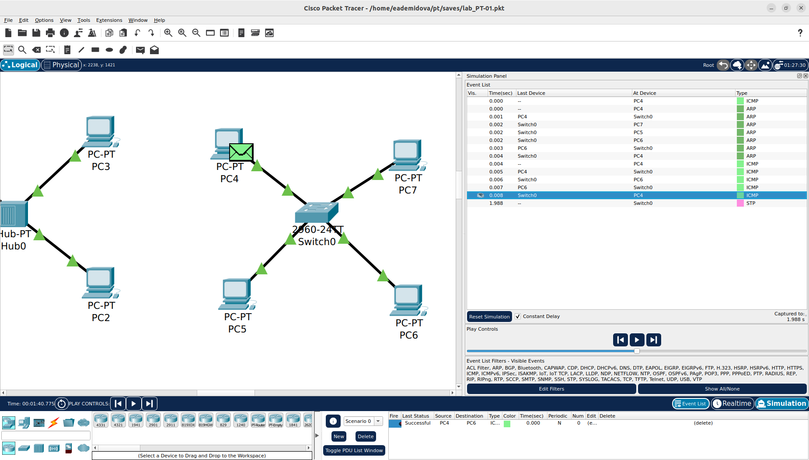{#fig:009 width=70%}

## Простейшая сеть с коммутатором

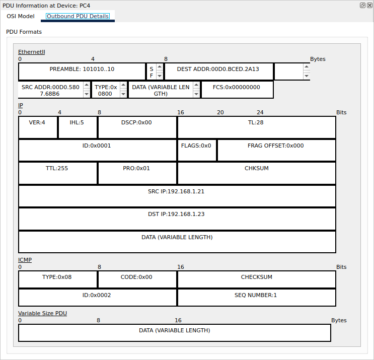{#fig:010 width=50%}

## Простейшая сеть с коммутатором

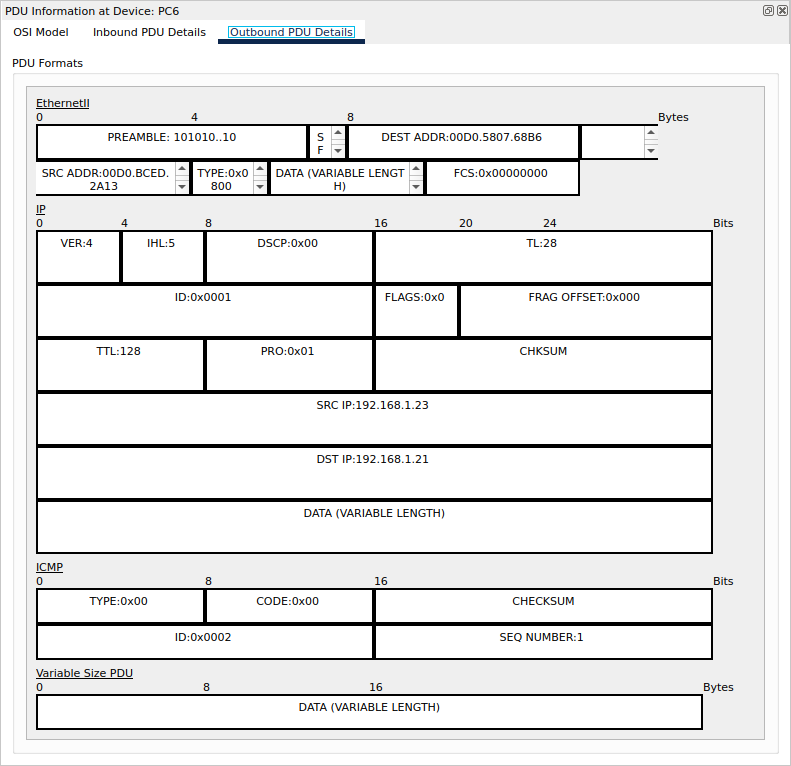{#fig:011 width=50%}

## Простейшая сеть с коммутатором

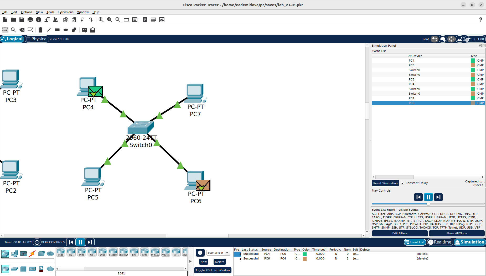{#fig:012 width=70%}

## Простейшая сеть с коммутатором

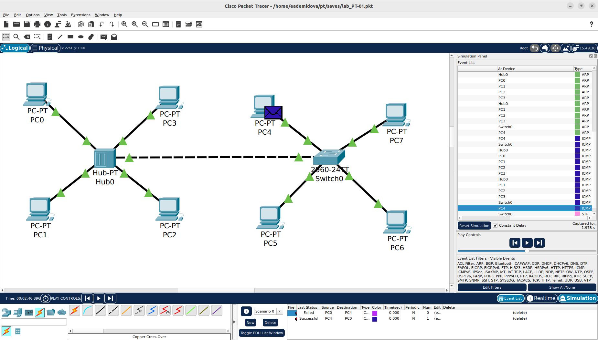{#fig:013 width=70%}

## Простейшая сеть с коммутатором

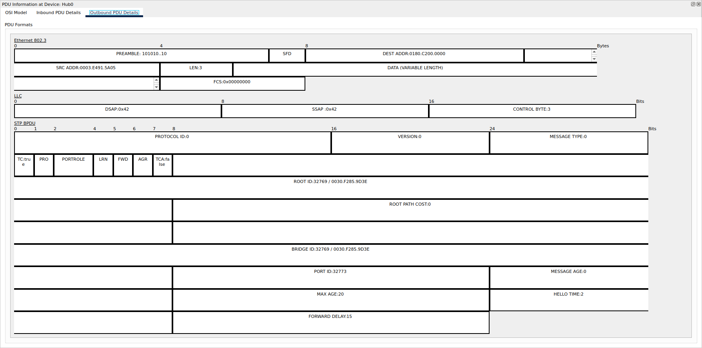{#fig:014 width=75%}

## Простейшая сеть с коммутатором

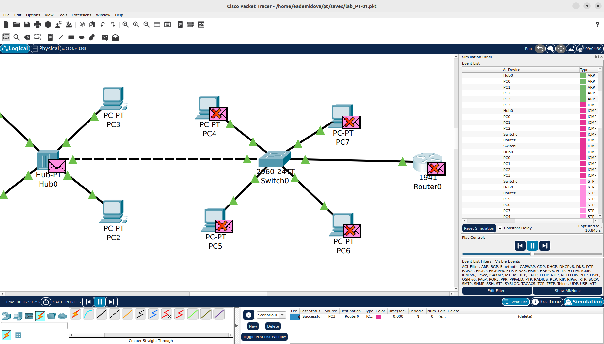{#fig:015 width=70%}

## Простейшая сеть с коммутатором

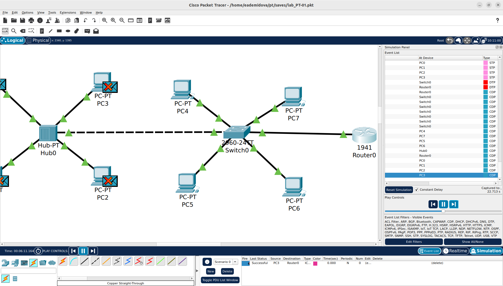{#fig:016 width=70%}

## Простейшая сеть с коммутатором

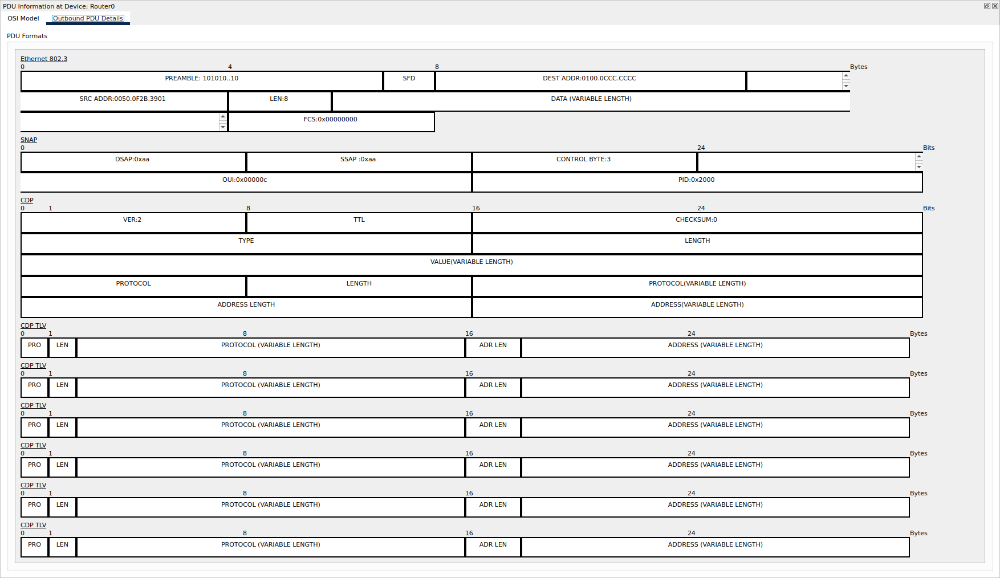{#fig:017 width=70%}

# Выводы

В результате выполнения лабораторной работы был установлен инструмент моделирования конфигурации сети Cisco Packet Tracer, и было проведено знакомство с его интерфейсом.