---
## Front matter
title: "Лабораторная работа № 1"
subtitle: "Знакомство с Cisco Packet Tracer"
author: "Демидова Екатерина Алексеевна"

## Generic otions
lang: ru-RU
toc-title: "Содержание"

## Bibliography
bibliography: bib/cite.bib
csl: pandoc/csl/gost-r-7-0-5-2008-numeric.csl

## Pdf output format
toc: true # Table of contents
toc-depth: 2
lof: true # List of figures
lot: false # List of tables
fontsize: 12pt
linestretch: 1.5
papersize: a4
documentclass: scrreprt
## I18n polyglossia
polyglossia-lang:
  name: russian
  options:
	- spelling=modern
	- babelshorthands=true
polyglossia-otherlangs:
  name: english
## I18n babel
babel-lang: russian
babel-otherlangs: english
## Fonts
mainfont: PT Serif
romanfont: PT Serif
sansfont: PT Sans
monofont: PT Mono
mainfontoptions: Ligatures=TeX
romanfontoptions: Ligatures=TeX
sansfontoptions: Ligatures=TeX,Scale=MatchLowercase
monofontoptions: Scale=MatchLowercase,Scale=0.9
## Biblatex
biblatex: true
biblio-style: "gost-numeric"
biblatexoptions:
  - parentracker=true
  - backend=biber
  - hyperref=auto
  - language=auto
  - autolang=other*
  - citestyle=gost-numeric
## Pandoc-crossref LaTeX customization
figureTitle: "Рис."
tableTitle: "Таблица"
listingTitle: "Листинг"
lofTitle: "Список иллюстраций"
lotTitle: "Список таблиц"
lolTitle: "Листинги"
## Misc options
indent: true
header-includes:
  - \usepackage{indentfirst}
  - \usepackage{float} # keep figures where there are in the text
  - \floatplacement{figure}{H} # keep figures where there are in the text
---

# Цель работы

Установка инструмента моделирования конфигурации сети Cisco Packet Tracer, знакомство с его интерфейсом.

# Задание

1. Установить на домашнем устройстве Cisco Packet Tracer.
2. Постройте простейшую сеть в Cisco Packet Tracer, проведите простейшую настройку оборудования.

# Выполнение лабораторной работы

## Построение простейшей сети

Снчала мы установили на на домашнем устройстве Cisco Packet Tracer. Теперь создадим новый проект lab_PT-01.pkg.

В рабочем пространстве разместим концентратор (Hub-PT) и четыре оконечных устройства PC. Соединим оконечные устройства с концентратором прямым кабелем. Щёлкнув последовательно на каждом оконечном устройстве, зададим статические IP-адреса 192.168.1.11, 192.168.1.12, 192.168.1.13, 192.168.1.14 с маской подсети 255.255.255(рис. [-@fig:001]).

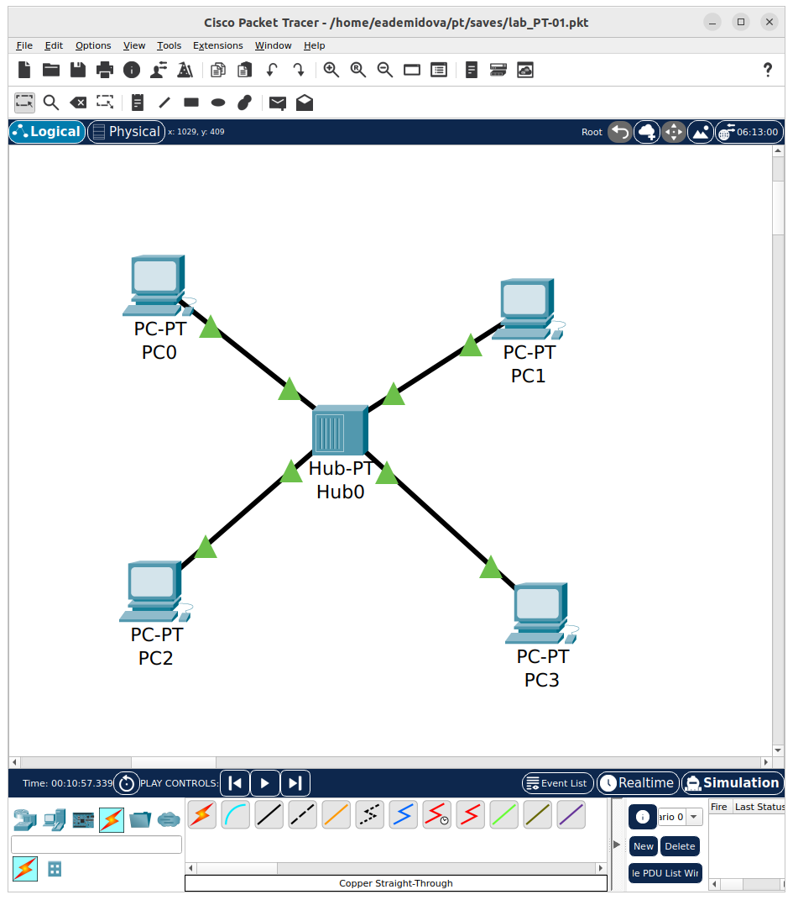{#fig:001 width=70%}

В основном окне проекта перейдем из режима реального времени (Realtime) в режим моделирования (Simulation). Выберем на панели инструментов мышкой «Add Simple PDU (P)» и щёлкните сначала на PC0, затем на PC2. В рабочей области появились два конверта, обозначающих пакеты, в списке событий на панели моделирования появитлись два события, относящиеся к пакетам ARP и ICMP соответственно. На панели моделирования нажмем кнопку «Play» и проследим за движением пакетов ARP и ICMP от устройства PC0 до устройства PC2 и обратно(рис. [-@fig:002]).

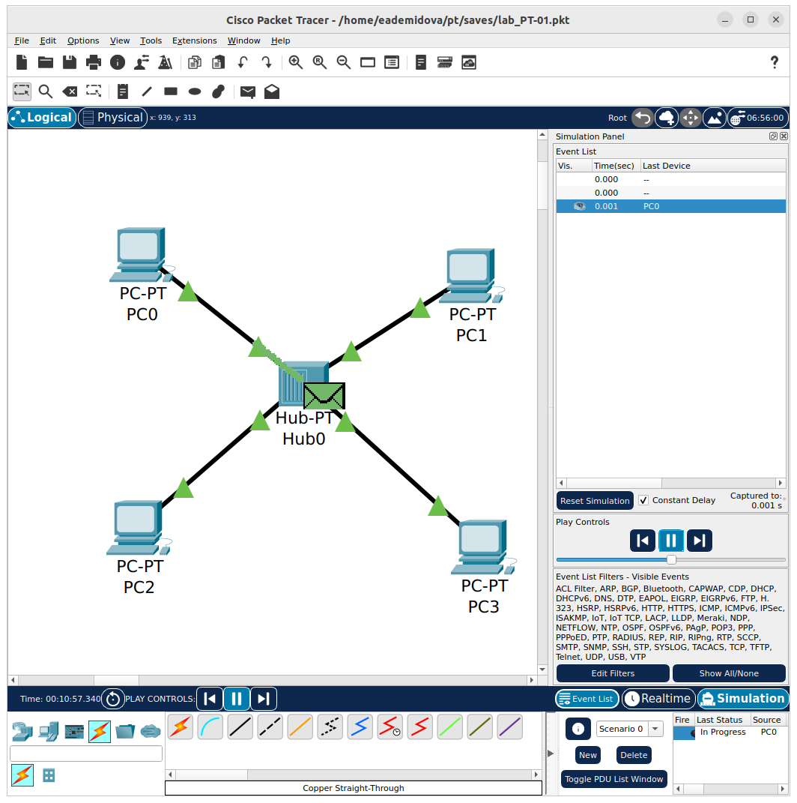{#fig:002 width=70%}

Видно, что пакет сначала отправляется на хаб, потом ко всем устройствам, но принимает его только то, которому оно изначально отпрвлялось.

Щёлкнув на строке события, откроем окно информации о PDU и изучим, что происходит на уровне модели OSI при перемещении пакета. Используя кнопку «Проверь себя» (Challenge Me) на вкладке OSI Model, ответим на вопросы(рис. [-@fig:003]).

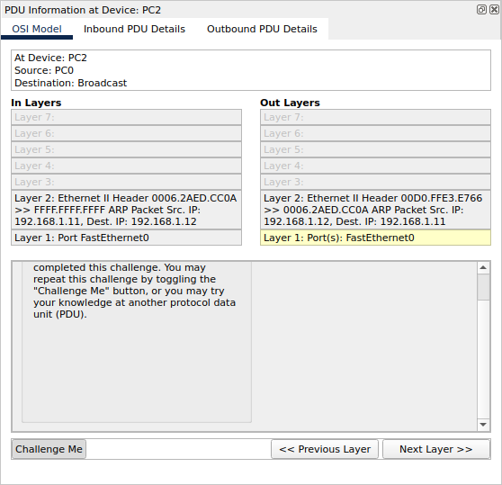{#fig:003 width=70%}

Исследуем структуру пакета ICMP. Сначала в PDU есть только заголовки IP, можно увидеть адрес отправителя и получателя, и ICMP. В заголовке ICMP содержится информация о типе сообщения, коде дополнительной диагностической информации, контрольная сумма сообщения, его индентификатор и порядковый номер. Эти заголовоки не меняются при передаче пакета(рис. [-@fig:004]).

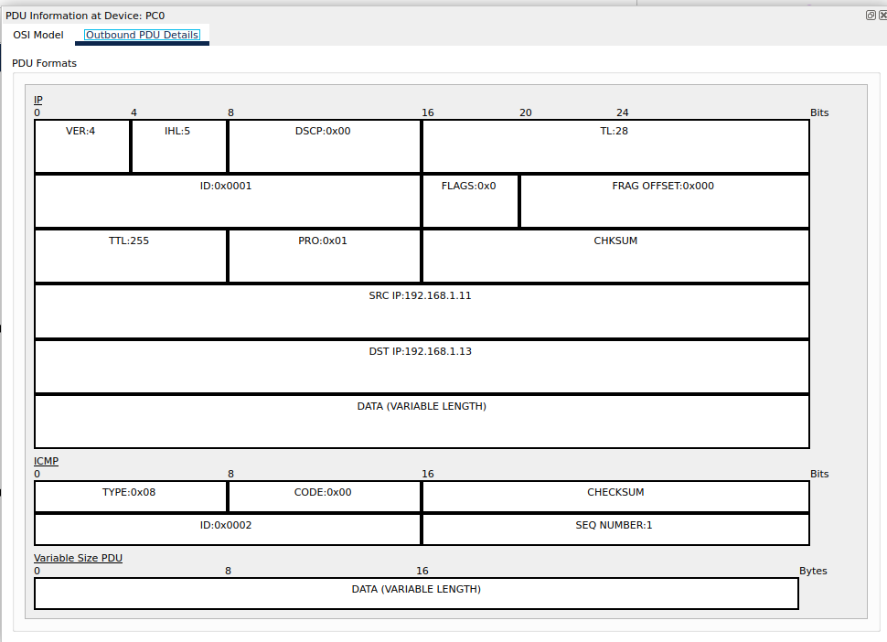{#fig:004 width=70%}

Теперь рассмотрим заголовок Ethernet. Сначала посмотрим MAC-адреса PC0 и PC2. У PC0 - 00E0.8FCB.BD76, а у PC2 - 0001.43D2.C13A. Сначала пакет отправляется на хаб, в заголовке указаны MAC-адреса, показывающие, что пакет пришел от PC0 и отправляется на PC2(рис. [-@fig:005]).

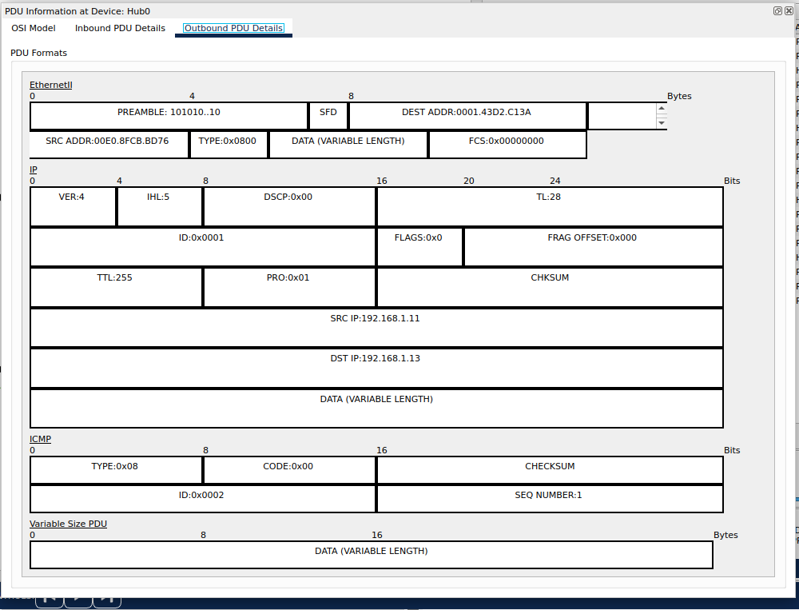{#fig:005 width=70%}

Затем от хаба пакет рассылается по всем устройствам в сети. Получив пакет PC3 посылает ответ, в котором в заголовке источник его MAC-адрес, а пункт назнаяения -- PC0(затем пакет рассылается обратно всем именно с таким заголовком)(рис. [-@fig:006]).

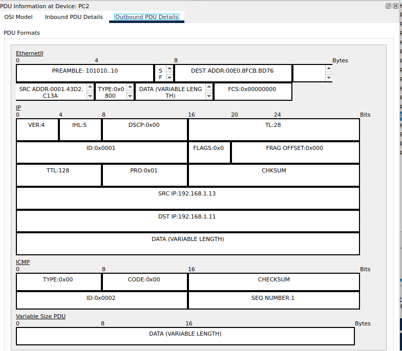{#fig:006 width=70%}

Обратим внимание на структуру MAC-адресов. Они состоят из 12 символов. Первые 6 - это код производителя, остальные 6 - сам идентификатор. Наши MAC-адреса: PC0 - 00E0.8FCB.BD76, PC1 - 00E0.8F85.D351, PC2 - 0001.43D2.C13A, PC3 - 00D0.BCAD.3826. Первые 6 цифр разные, но все указывают на производителя CISCO.

Очистим список событий, удалив сценарий моделирования. Выберем на панели инструментов мышкой «Add Simple PDU (P)» и щёлкним сначала на PC0, затем на PC2. Снова выберите на панели инструментов мышкой «Add Simple PDU (P)» и щёлкним сначала на PC2, затем на PC0. На панели моделирования нажмем кнопку «Play» и проследим за возникновением коллизии . В списке событий посмотрим информацию о PDU. Сначала пакеты передаются на хаб, на котором и происходит коллизия, так как он не может отправить два сообщения одновременно. У первого сообщения информация об исходящем PDU не отображаются, а у второго их не предполагается. Затем второй пакет исчезает, а первый отправляется на все устройства сети, но пустой и дальше не идёт(рис. [-@fig:007]).

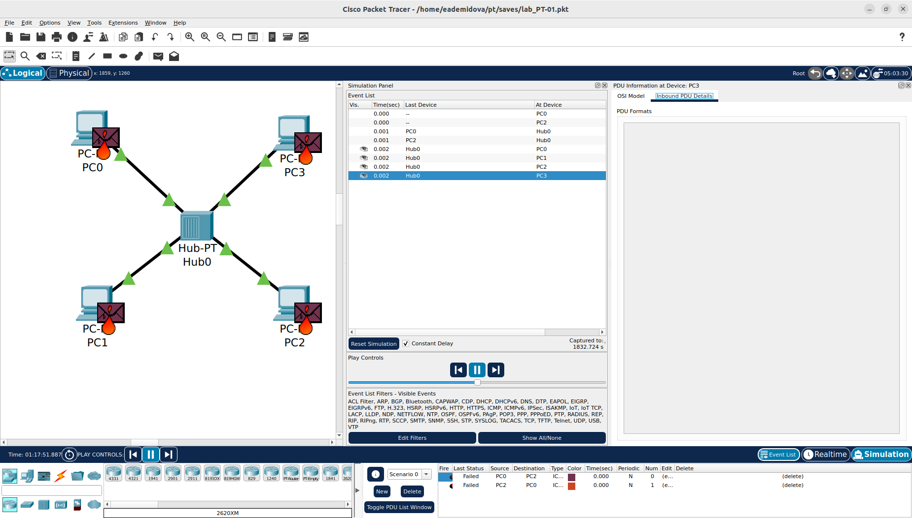{#fig:007 width=70%}

## Простейшая сеть с коммутатором

Перейдем в режим реального времени (Realtime). В рабочем пространстве разместим коммутатор (например Cisco 2950-24) и 4 оконечных устройства PC. Соединим оконечные устройства с коммутатором прямым кабелем. Щёлкнув последовательно на каждом оконечном устройстве, зададим статические IP-адреса 192.168.1.21, 192.168.1.22, 192.168.1.23, 192.168.1.24 с маской подсети 255.255.255.0.

В основном окне проекта перейдем из режима реального времени (Realtime) в режим моделирования (Simulation). Выберем на панели инструментов мышкой «Add Simple PDU (P)» и щёлкним сначала на PC4, затем на PC6. В рабочей области появились два конверта, обозначающие пакеты, в списке событий на панели моделирования появились два события, относящиеся к пакетам ARP и ICMP соответственно(рис. [-@fig:008]).

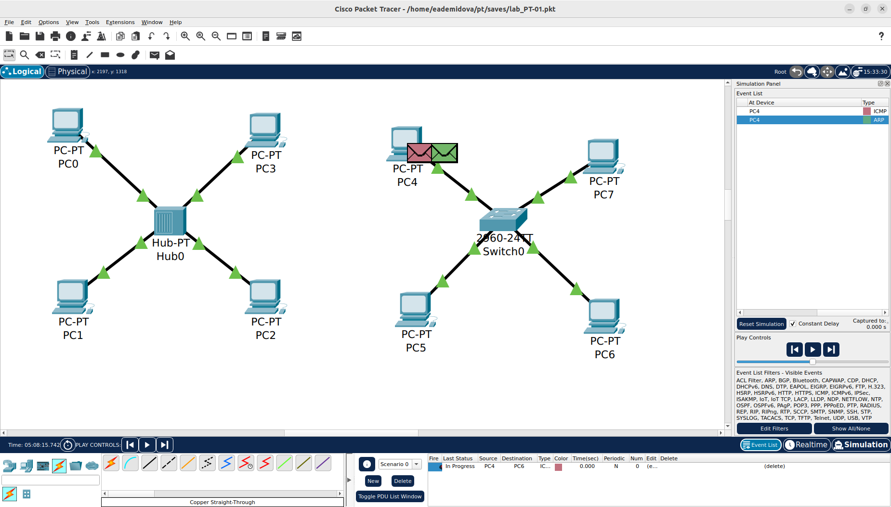{#fig:008 width=70%}

На панели моделирования нажмем кнопку «Play» и проследим за движением пакетов ARP и ICMP от устройства PC4 до устройства PC6 и обратно. Сначала, как и в случае с конвентратором пакеты ARP рассылаются всем устройствам сети, но принимает его только PC6. Обратно ARP не рассылается по всем устройства, а только к PC0. И затем пакет ICMP также посылается только между PC4 и PC6(рис. [-@fig:009]).

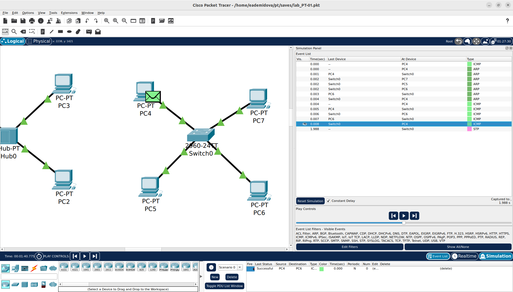{#fig:009 width=70%}

Исследуем структуру пакета ICMP. Сначала в PDU есть только заголовки IP, можно увидеть адрес отправителя и получателя, и ICMP. В заголовке ICMP содержится информация о типе сообщения, коде дополнительной диагностической информации, контрольная сумма сообщения, его индентификатор и порядковый номер. Эти заголовоки не меняются при передаче пакета. Рассмотрим кадр Ethernet. Сначала пакет отправляется на коммутатор, в заголовке указаны MAC-адреса, показывающие, что пакет пришел от PC4 и отправляется на PC6 (рис. [-@fig:010]).

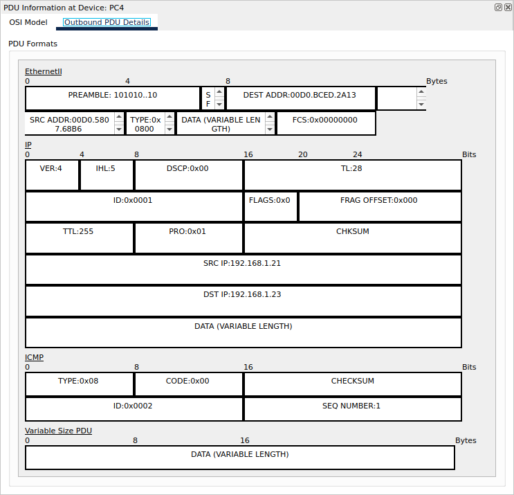{#fig:010 width=70%}

Затем пакет приходит к PC6 и во входной информации видна информация, описанная ранее, а отправляется пакет, в котором источник и пункт назначения поменяны местами. В таком виде этот пакет снова отправляется на хаб и затем достигает PC4(рис. [-@fig:011]).

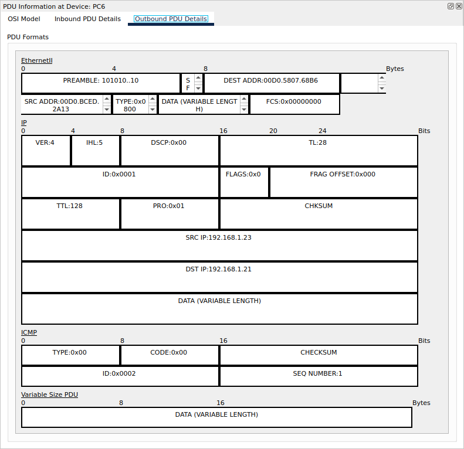{#fig:011 width=70%}

Обратим внимание на структуру MAC-адресов. Они состоят из 12 символов. Первые 6 - это код производителя, остальные 6 - сам идентификатор. Первые 6 цифр у всех устройств разные, но все указывают на производителя CISCO.

Очистим список событий, удалив сценарий моделирования. Выберем на панели инструментов мышкой «Add Simple PDU (P)» и щёлкним сначала на PC4, затем на PC6. Снова выберем на панели инструментов мышкой «Add Simple PDU (P)» и щёлкним сначала на PC6, затем на PC4. На панели моделирования нажмем кнопку «Play» и проследим за движением пакетов. Можно увидеть, что коллизия не возникает, так как пакет не отправляется всем устройства, а разводится по точным пунктам назначения коммутатором(рис. [-@fig:012]).

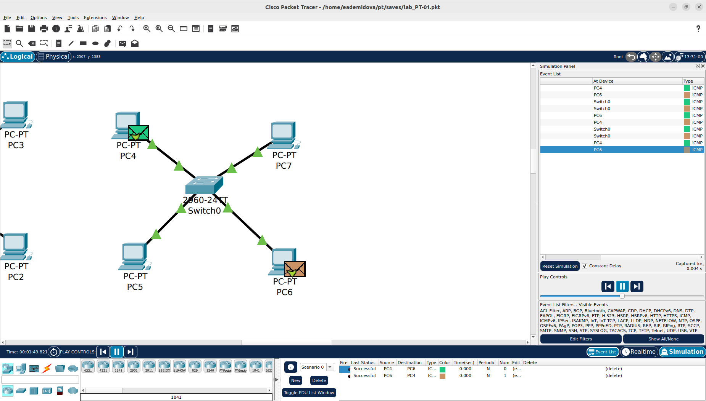{#fig:012 width=70%}

Перейдем в режим реального времени (Realtime). В рабочем пространстве соединим кроссовым кабелем концентратор и коммутатор. Перейдем в режим моделирования (Simulation). Очистим список событий, удалив сценарий моделирования. Выберием на панели инструментов мышкой «Add Simple PDU (P)» и щёлкним сначала на PC0, затем на PC4. Снова выберем на панели инструментов мышкой «Add Simple PDU (P)» и щёлкним сначала на PC4, затем на PC0. На панели моделирования нажмем кнопку «Play» и проследим за движением пакетов. В отчёте поясните, почему сначала возникает коллизия (рис. 1.10), а затем пакеты успешно достигают пункта назначения. Пакет отпрвленный из сети с хабом так же, как и в прошлый раз исчезает. Но пакет, отпрвленный из сети с коммутатором достигает пункта назначения. Это связано с тем, что порты коммутатора могут работать в режиме полного дуплекса и отправляют пакеты не на все устройства сети, а в соответствии с таблицей MAC-адресов(рис. [-@fig:013]).

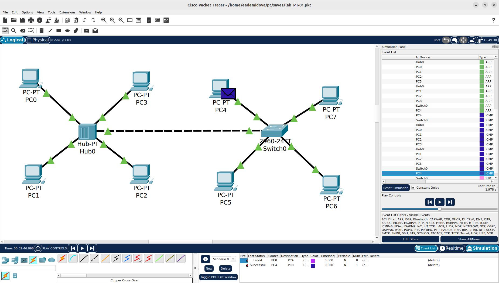{#fig:013 width=70%}

Очистим список событий, удалив сценарий моделирования. На панели моделирования нажмем «Play» и в списке событий получим пакеты STP. Исследуем структуру STP. Заголовок в протоколе STP (Spanning Tree Protocol) состоит из следующих полей: Protocol Identifier (Идентификатор протокола): Это поле указывает на использование STP и имеет фиксированное значение, Version Identifier (Идентификатор версии): Это поле указывает на версию протокола STP, которая используется в сети, BPDU Type (Тип BPDU): Это поле определяет тип Bridge Protocol Data Unit (BPDU), которая является основным сообщением, обмениваемым между коммутаторами STP, Flags (Флаги): Это поле содержит различные флаги, которые указывают на состояние и свойства коммутатора, такие как состояние корневого моста, состояние порта и другие атрибуты, Root Identifier (Идентификатор корневого моста): Это поле содержит информацию о корневом мосте в сети STP, включая его MAC-адрес и путь к корневому мосту, Bridge Identifier (Идентификатор моста): Это поле содержит информацию о коммутаторе, отправляющем BPDU, включая его MAC-адрес и путь к корневому мосту, Port Identifier (Идентификатор порта): Это поле указывает на порт коммутатора, через который отправляется BPDU, Message Age (Возраст сообщения): Это поле указывает на время, прошедшее с момента отправки BPDU, Max Age (Максимальный возраст): Это поле указывает на максимальное время ожидания, после которого BPDU считается устаревшим, Hello Time (Время Hello): Это поле указывает на интервал времени между отправками BPDU, Forward Delay (Задержка пересылки): Это поле указывает на время задержки, прежде чем порт может перейти в состояние пересылки данных после активации. Опишем структуру кадра Ethernet. В ICMP использовался кадр EthernetII, теперь Ethernet 802.3. В нём так же указана преамбула, MAC-адрес источники и пункта назначения, но ещё есть длина (рис. [-@fig:014]).

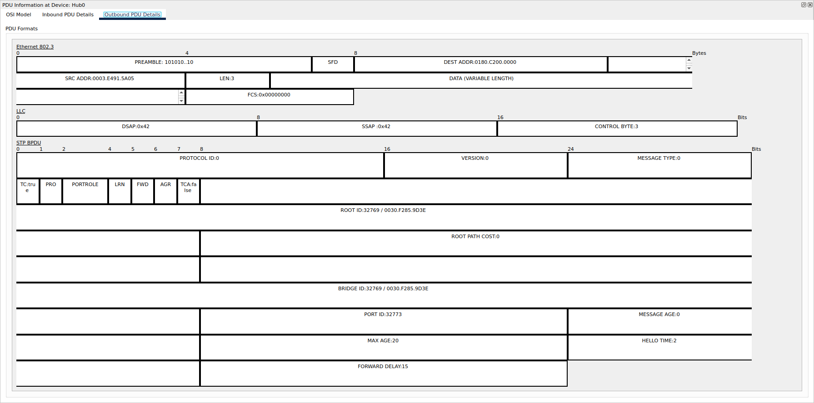{#fig:014 width=70%}

MAC-адреса имеют такую же структуру как и ранее описывалось.

Перейдем в режим реального времени (Realtime). В рабочем пространстве добавим маршрутизатор. Соединим прямым кабелем коммутатор и маршрутизатор. Щёлкним на маршрутизаторе и на вкладке его конфигурации пропишите статический IP-адрес 192.168.1.254 с маской 255.255.255.0, активируем порт, поставив галочку «On» напротив «Port Status».

Перейдем в режим моделирования (Simulation). Очистим список событий, удалив сценарий моделирования. Выберем на панели инструментов мышкой «Add Simple PDU (P)» и щёлкним сначала на PC3, затем на маршрутизаторе. На панели моделирования нажмем кнопку «Play» и проследим за движением пакетов ARP, ICMP, STP и CDP(рис. [-@fig:015]).

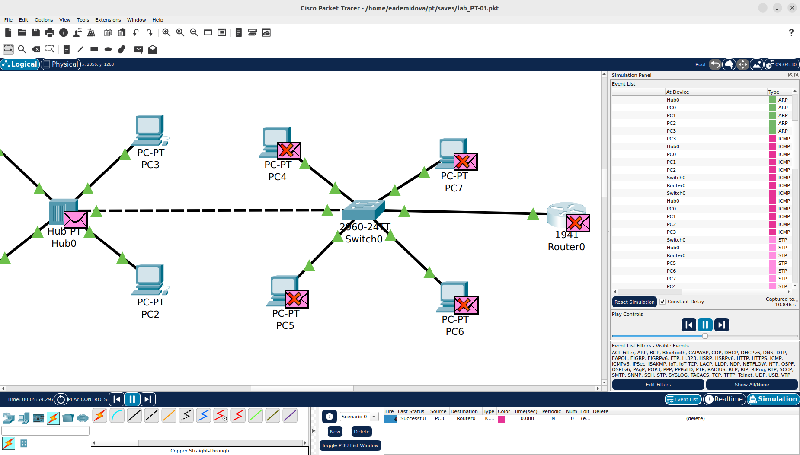{#fig:015 width=70%}

Сначала рассылаются пакеты ARP, затем ICMP. В сети с концентратором эти пакеты посылаются всем устройствам, а в сети с коммутатором на основе таблицы MAC-адресов. После того как пакет получен и отправлено подтверждение начинают рассылаться STP пакеты всем устройствам сети, затем появляются пакеты DTP и только после повторной такой рассылки начинают рассылаться пакеты CDP так же всем устройствам сети(рис. [-@fig:016]).

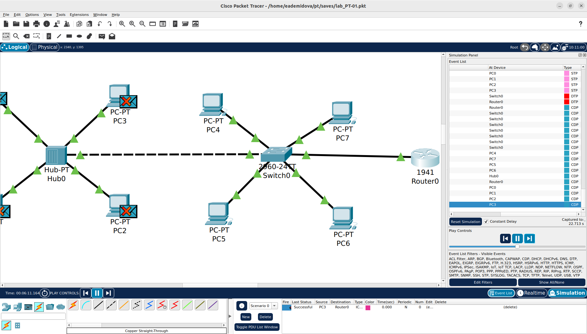{#fig:016 width=70%}

Исследуем структуру пакета CDP.  Поля заголовка CDP включают: Version (Версия): указывает версию протокола CDP, TTL (Time to Live) (Время жизни): определяет время, в течение которого информация в пакете CDP считается действительной,Checksum (Контрольная сумма): используется для проверки целостности пакета CDP, также указаны заголовки CDP TLV - это блоки информации об устройстве. Структура кадра Ethernet 802.3 такая же как в STP. MAC-адреса также ничем не отличаются(рис. [-@fig:017]).

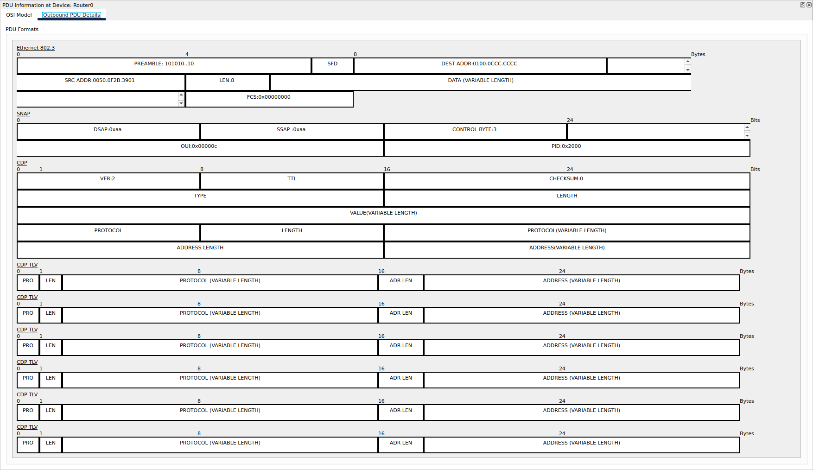{#fig:017 width=70%}

# Выводы

В результате выполнения лабораторной работы был установлен инструмент моделирования конфигурации сети Cisco Packet Tracer, и было проведено знакомство с его интерфейсом.

