---
## Front matter
title: "Лабораторная работа № 2"
subtitle: "Предварительная настройка оборудования Cisco"
author: "Демидова Екатерина Алексеевна"

## Generic otions
lang: ru-RU
toc-title: "Содержание"

## Bibliography
bibliography: bib/cite.bib
csl: pandoc/csl/gost-r-7-0-5-2008-numeric.csl

## Pdf output format
toc: true # Table of contents
toc-depth: 2
lof: true # List of figures
lot: false # List of tables
fontsize: 12pt
linestretch: 1.5
papersize: a4
documentclass: scrreprt
## I18n polyglossia
polyglossia-lang:
  name: russian
  options:
	- spelling=modern
	- babelshorthands=true
polyglossia-otherlangs:
  name: english
## I18n babel
babel-lang: russian
babel-otherlangs: english
## Fonts
mainfont: PT Serif
romanfont: PT Serif
sansfont: PT Sans
monofont: PT Mono
mainfontoptions: Ligatures=TeX
romanfontoptions: Ligatures=TeX
sansfontoptions: Ligatures=TeX,Scale=MatchLowercase
monofontoptions: Scale=MatchLowercase,Scale=0.9
## Biblatex
biblatex: true
biblio-style: "gost-numeric"
biblatexoptions:
  - parentracker=true
  - backend=biber
  - hyperref=auto
  - language=auto
  - autolang=other*
  - citestyle=gost-numeric
## Pandoc-crossref LaTeX customization
figureTitle: "Рис."
tableTitle: "Таблица"
listingTitle: "Листинг"
lofTitle: "Список иллюстраций"
lotTitle: "Список таблиц"
lolTitle: "Листинги"
## Misc options
indent: true
header-includes:
  - \usepackage{indentfirst}
  - \usepackage{float} # keep figures where there are in the text
  - \floatplacement{figure}{H} # keep figures where there are in the text
---

# Цель работы

Получить основные навыки по начальному конфигурированию оборудования Cisco.

# Задание

1. Сделать предварительную настройку маршрутизатора.
2. Сделать предварительную настройку коммутатора.

# Выполнение лабораторной работы

## Настройка маршрутизатора

Снчала мы установили на на домашнем устройстве Cisco Packet Tracer. Теперь создадим новый проект lab_PT-02.pkg. 

В логической рабочей области Packet Tracer разместим коммутатор, маршрутизатор и 2 оконечных устройства типа PC, соединим один PC с маршрутизатором, другой PC — с коммутатором(рис. [-@fig:001]).

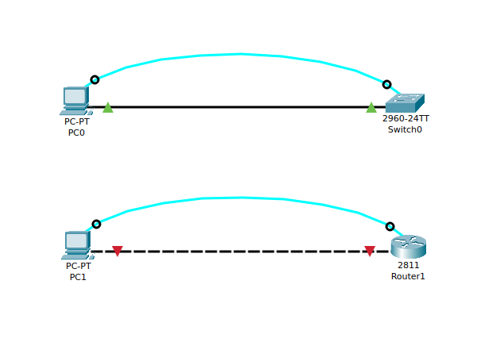{#fig:001 width=70%}

Проведем настройку маршрутизатора. Перейдем в привилегированный режим из пользовательского режима, используя команду `enable`. Затем зададим имя хоста с помощью команды `hostname`. Интерфейсу Fast Ethernet зададим с номером 0 ip-адрес 192.168.1.254 и маску 255.255.255.0, затем поднимем интерфейс с помощью команды `no shutdown`(рис. [-@fig:002]).

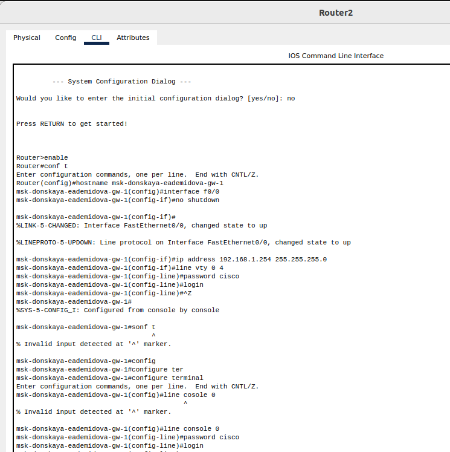{#fig:002 width=70%}

Также зададим пароль доступа к привилегированному режиму (сначала в открытом виде, затем — в зашифрованном). Затем настроим доступ к оборудованию через telnet, настроив виртуальный интерфейс `line vty 0 4`, и через ssh (используя в качестве имени домена donskaya.rudn.edu)(рис. [-@fig:003]).

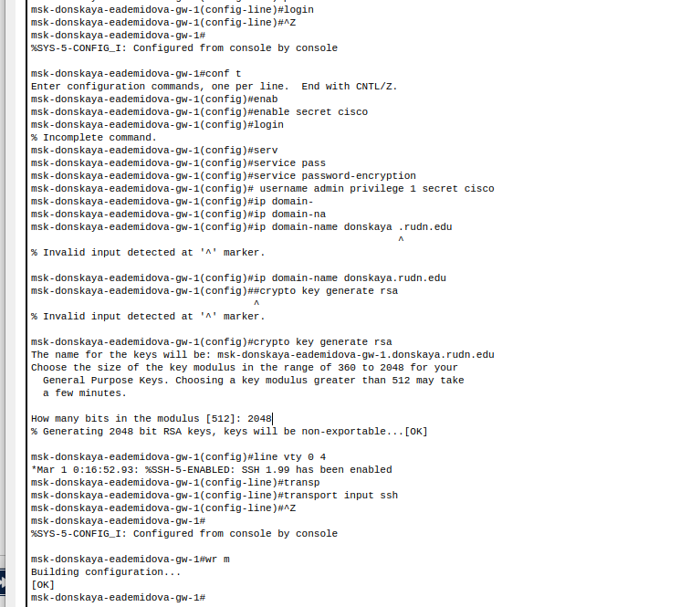{#fig:003 width=70%}

Проверим работоспособность соединения с помощью команды `ping`(рис. [-@fig:004]).

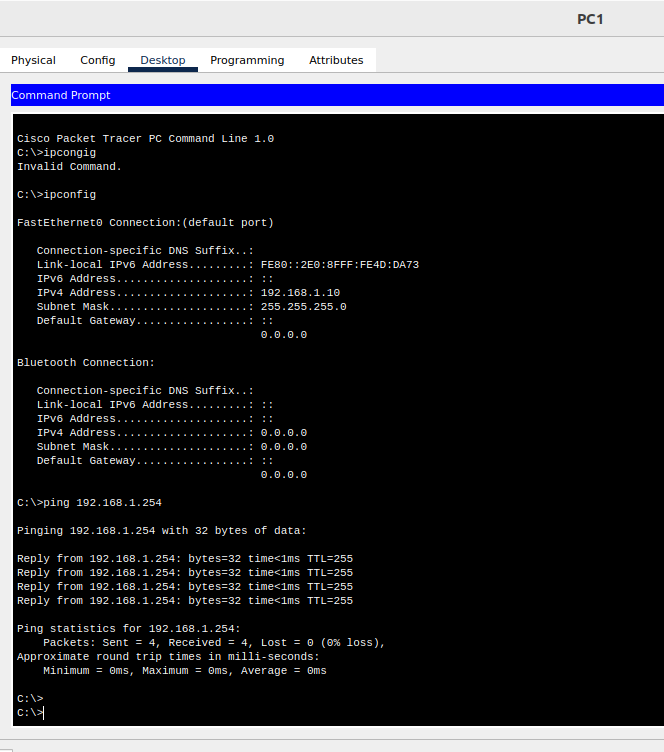{#fig:004 width=70%}

Теперь подключимся к маршрутизатору разными способами: с помощью консольного кабеля, по протоколу удалённого доступа(telnet, ssh)(рис. [-@fig:005]).

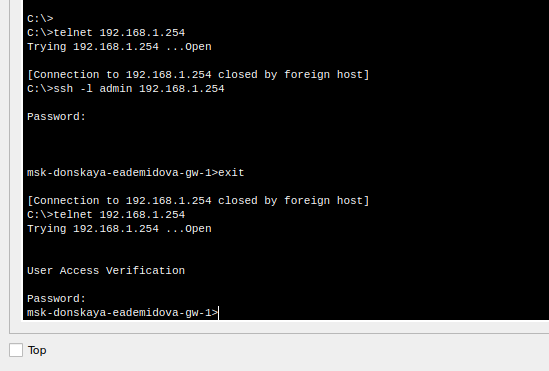{#fig:005 width=70%}

Поменяем дисполейное имя маршрутизатора и сохраним файл с конфигурациями(рис. [-@fig:006]).

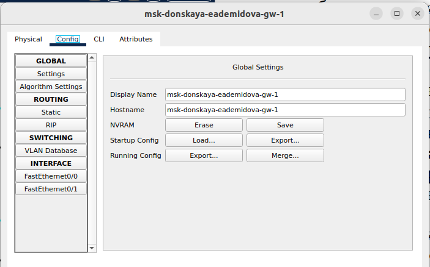{#fig:006 width=70%}

## Настройка коммутатора

Проведем настройку маршрутизатора. Перейдем в привилегированный режим из пользовательского режима, используя команду `enable`. Затем зададим имя хоста с помощью команды `hostname`. Интерфейсу vlan 2 зададим с номером 0 ip-адрес 192.168.2.254 и маску 255.255.255.0, затем поднимем интерфейс с помощью команды `no shutdown`. Такде привяжем  интерфейс Fast Ethernet с номером 1 к vlan 2; зададим в качестве адреса шлюза по умолчанию адрес 192.168.2.254(рис. [-@fig:007]).

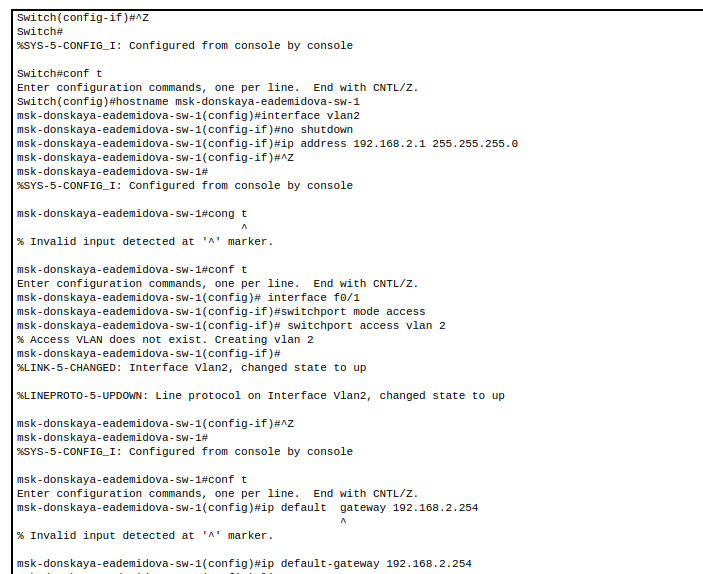{#fig:007 width=70%}

И зададим пароль для доступа к привилегированному режиму (сначала в открытом виде, затем — в зашифрованном). Также зададим пароль доступа к привилегированному режиму (сначала в открытом виде, затем — в зашифрованном). Затем настроим доступ к оборудованию через telnet, настроив виртуальный интерфейс `line vty 0 4`, и через ssh (используя в качестве имени домена donskaya.rudn.edu). Для пользователя admin зададим доступ 1-го уровня по паролю(рис. [-@fig:008]).

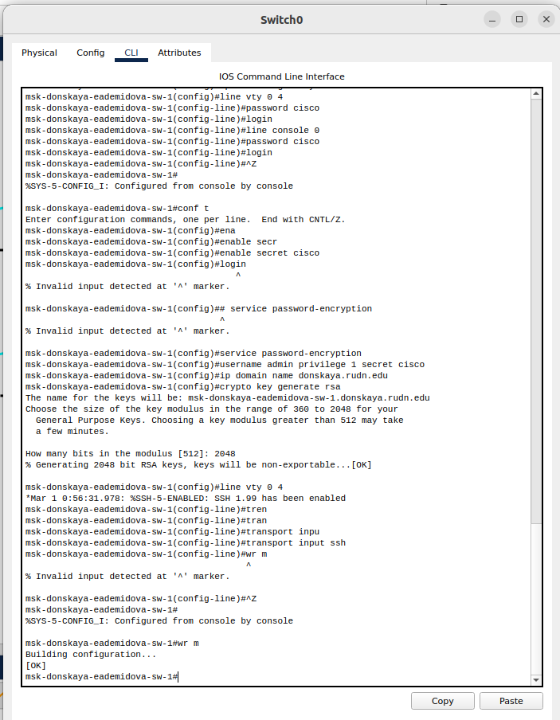{#fig:008 width=70%}

Проверим работоспособность соединения с помощью команды `ping`(рис. [-@fig:009]).

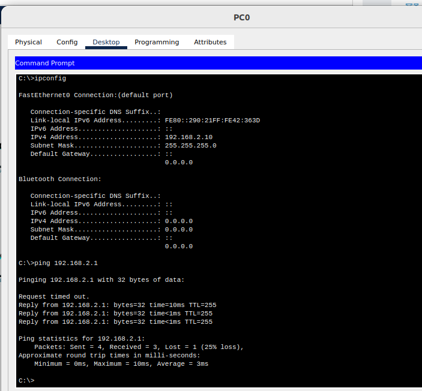{#fig:009 width=70%}

Теперь подключимся к маршрутизатору разными способами: с помощью консольного кабеля, по протоколу удалённого доступа(telnet, ssh)(рис. [-@fig:010]).

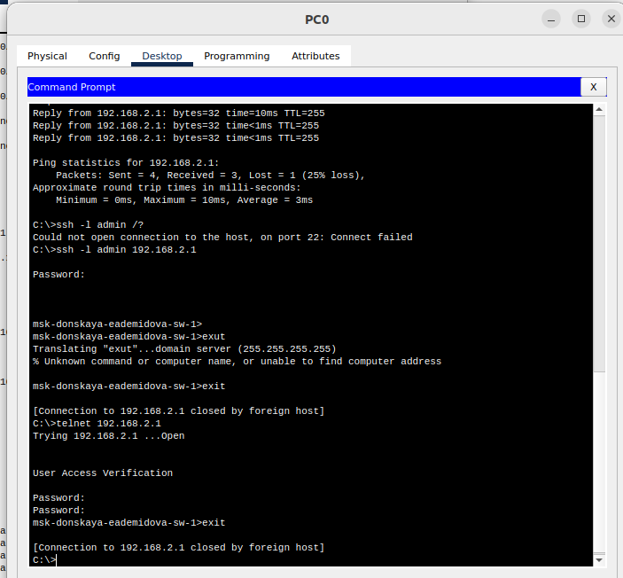{#fig:010 width=70%}

Поменяем дисполейное имя маршрутизатора и сохраним файл с конфигурациями(рис. [-@fig:011]).

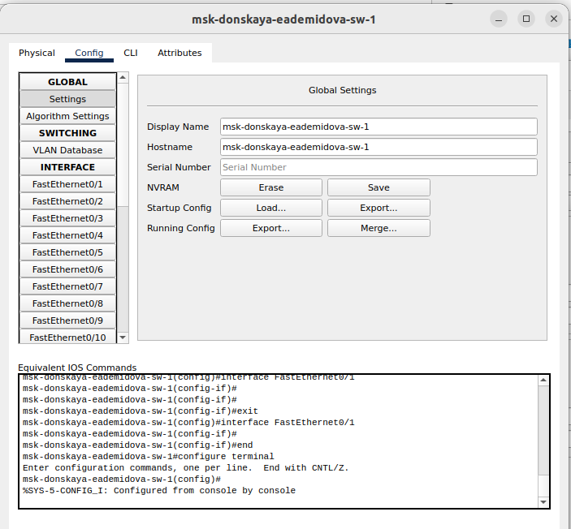{#fig:011 width=70%}

# Выводы

В результате выполнения лабораторной работы получили основные навыки по начальному конфигурированию оборудования Cisco

