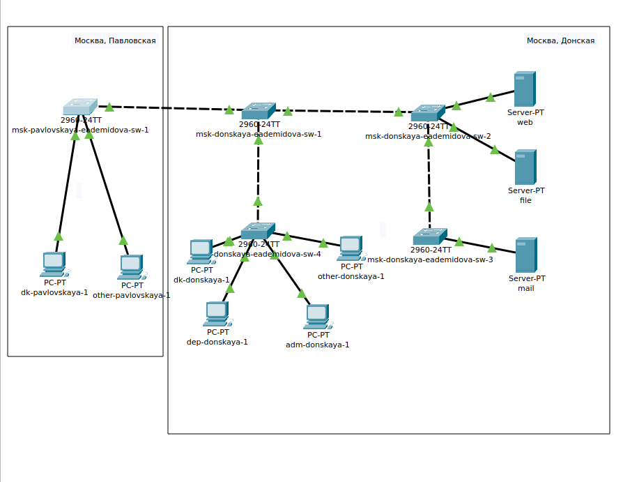
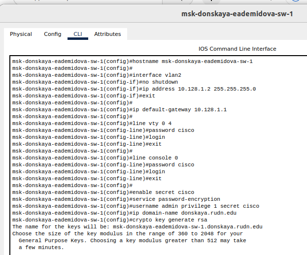
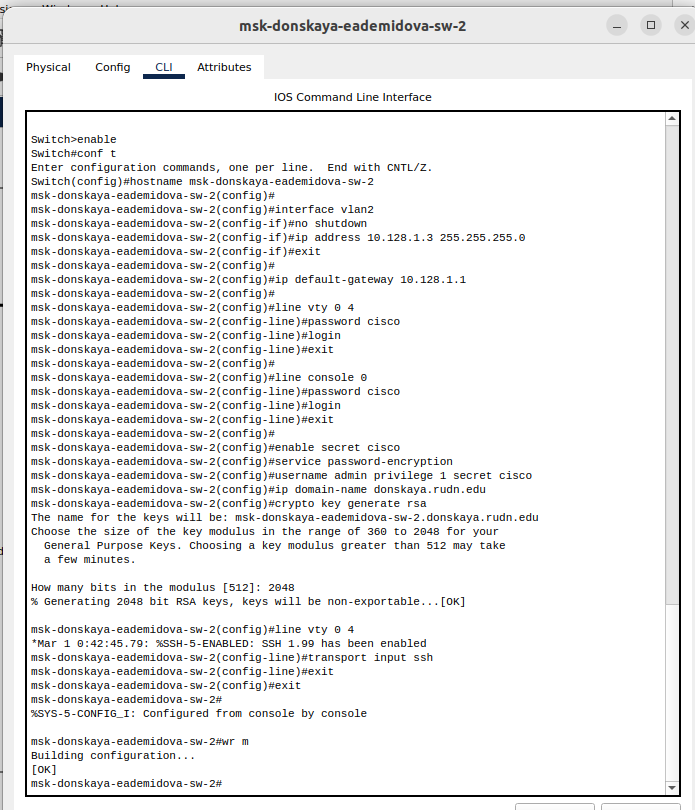
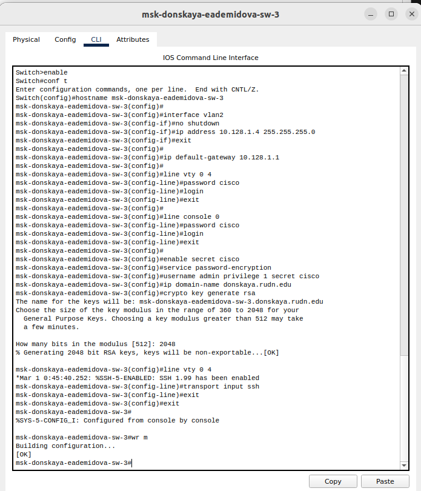
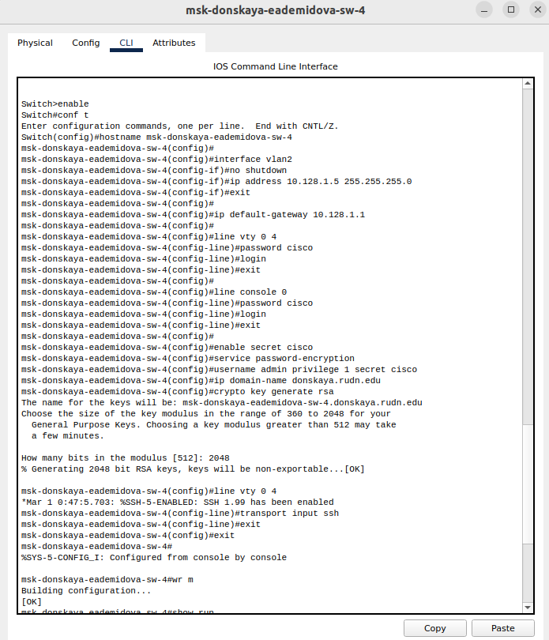
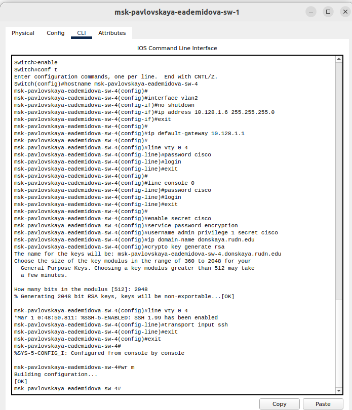
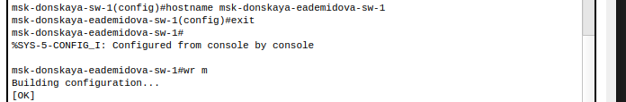

---
## Front matter
lang: ru-RU
title: Лабораторная работа № 4
subtitle: Первоначальное конфигурирование сети
author:
  - Демидова Е. А.
institute:
  - Российский университет дружбы народов, Москва, Россия
date: 07 марта 2024

## i18n babel
babel-lang: russian
babel-otherlangs: english

## Formatting pdf
toc: false
toc-title: Содержание
slide_level: 2
aspectratio: 169
section-titles: true
theme: metropolis
header-includes:
 - \metroset{progressbar=frametitle,sectionpage=progressbar,numbering=fraction}
 - '\makeatletter'
 - '\beamer@ignorenonframefalse'
 - '\makeatother'
---

# Вводная часть

## Цели и задачи

**Цели**

Провести подготовительную работу по первоначальной настройке коммутаторов сети.

**Задачи**

Требуется сделать первоначальную настройку коммутаторов сети, представленной на схеме L1. Под первоначальной настройкой понимается указание имени устройства, его IP-адреса, настройка доступа по паролю к виртуальным терминалам и консоли, настройка удалённого доступа к устройству по ssh.

# Выполнение лабораторной работы

## Размещение коммутаторов и оконечных устройств

{#fig:001 width=60%}

## Размещение коммутаторов и оконечных устройств

{#fig:002 width=45%}

## Настройка коммутаторов

{#fig:003 width=40%}

## Настройка коммутаторов

{#fig:004 width=40%}

## Настройка коммутаторов

{#fig:005 width=40%}

## Настройка коммутаторов

{#fig:006 width=40%}

## Настройка коммутаторов

{#fig:007 width=70%}

# Заключение

## Выводы

В результате выполнения лабораторной работы провели подготовительную работу по первоначальной настройке коммутаторов сети.
