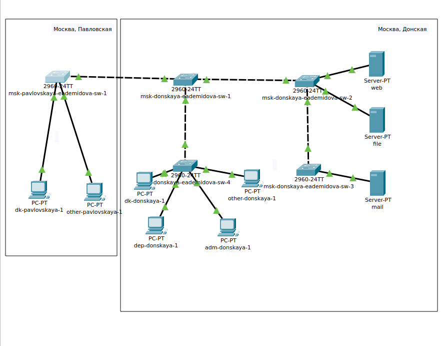
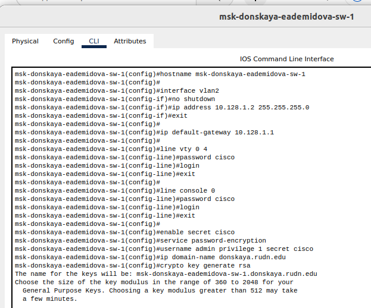
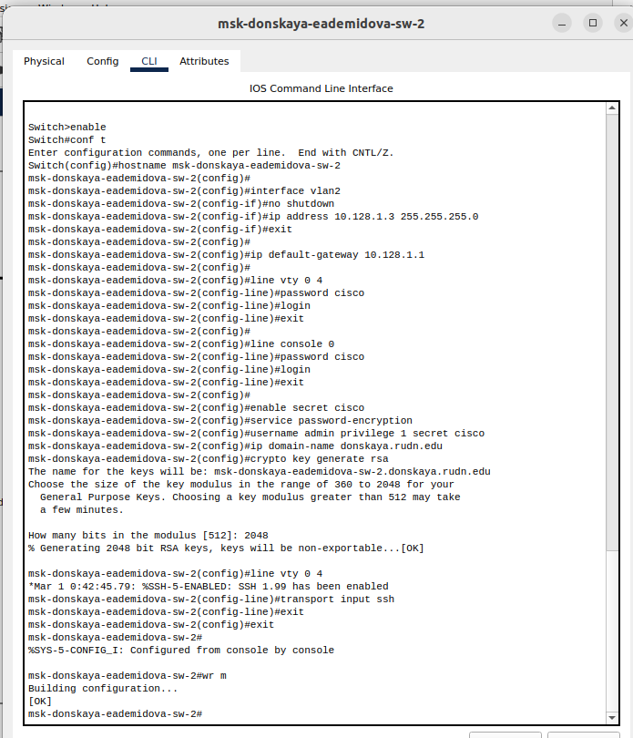
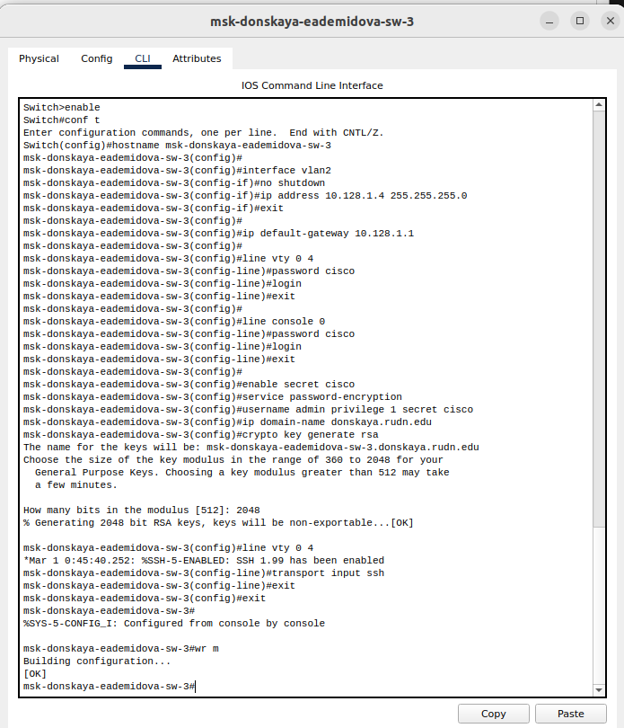
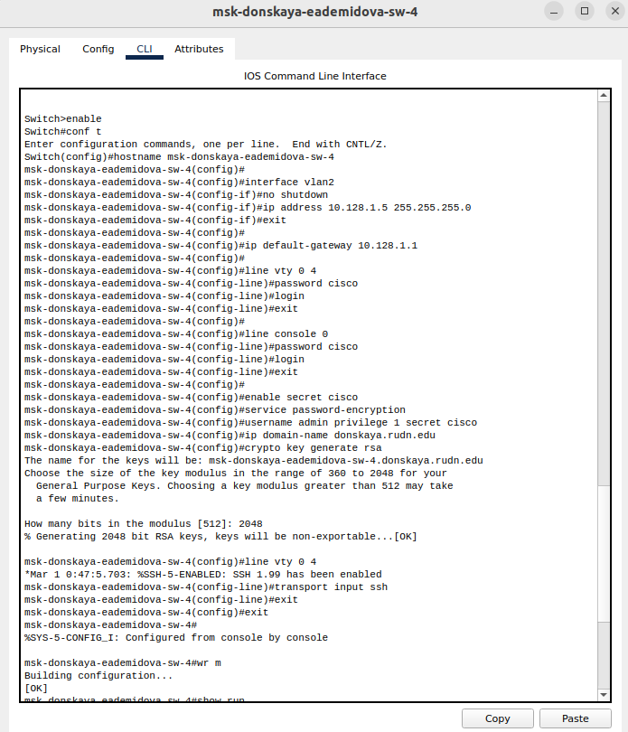
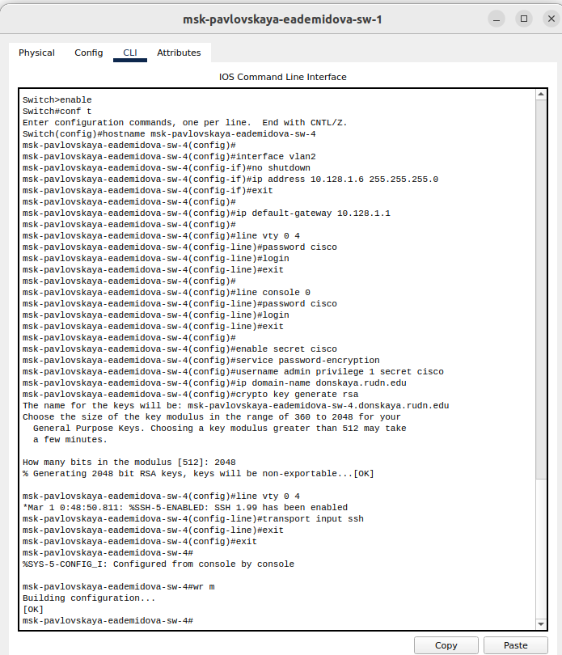
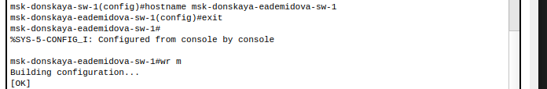

---
## Front matter
title: "Лабораторная работа № 4"
subtitle: "Первоначальное конфигурирование сети"
author: "Демидова Екатерина Алексеевна"

## Generic otions
lang: ru-RU
toc-title: "Содержание"

## Bibliography
bibliography: bib/cite.bib
csl: pandoc/csl/gost-r-7-0-5-2008-numeric.csl

## Pdf output format
toc: true # Table of contents
toc-depth: 2
lof: false # List of figures
lot: true # List of tables
fontsize: 12pt
linestretch: 1.5
papersize: a4
documentclass: scrreprt
## I18n polyglossia
polyglossia-lang:
  name: russian
  options:
	- spelling=modern
	- babelshorthands=true
polyglossia-otherlangs:
  name: english
## I18n babel
babel-lang: russian
babel-otherlangs: english
## Fonts
mainfont: PT Serif
romanfont: PT Serif
sansfont: PT Sans
monofont: PT Mono
mainfontoptions: Ligatures=TeX
romanfontoptions: Ligatures=TeX
sansfontoptions: Ligatures=TeX,Scale=MatchLowercase
monofontoptions: Scale=MatchLowercase,Scale=0.9
## Biblatex
biblatex: true
biblio-style: "gost-numeric"
biblatexoptions:
  - parentracker=true
  - backend=biber
  - hyperref=auto
  - language=auto
  - autolang=other*
  - citestyle=gost-numeric
## Pandoc-crossref LaTeX customization
figureTitle: "Рис."
tableTitle: "Таблица"
listingTitle: "Листинг"
lofTitle: "Список иллюстраций"
lotTitle: "Список таблиц"
lolTitle: "Листинги"
## Misc options
indent: true
header-includes:
  - \usepackage{indentfirst}
  - \usepackage{float} # keep figures where there are in the text
  - \floatplacement{figure}{H} # keep figures where there are in the text
---

# Цель работы

Провести подготовительную работу по первоначальной настройке коммутаторов сети.

# Задание

Требуется сделать первоначальную настройку коммутаторов сети, представленной на схеме L1. Под первоначальной настройкой понимается указание имени устройства, его IP-адреса, настройка доступа по паролю к виртуальным терминалам и консоли, настройка удалённого доступа к устройству по ssh.

# Выполнение лабораторной работы

Сначала разместим коммутаторы и оконечные устройства согласно данной нам схеме. Коммутаторы соединены кроссовым кабелем, так как являются устройствами одного типа, с остальными устройствами соединены прямым кабелем (рис. [-@fig:001]).

{#fig:001 width=90%}

Затем проведём базовую настройку всех коммутаторов. А именно укажем имена устройств, IP-адреса в соответствии с таблицей из прошлой лабораторной работы, проведём настройку доступа по паролю к виртуальным терминалам и настройку удалённого доступа к устройству по ssh.

Для первого устройства имя msk-donskaya-eademidova-sw-1, IP-адрес -- 10.128.1.2 (рис. [-@fig:002]).

{#fig:002 width=90%}

Для первого устройства имя msk-donskaya-eademidova-sw-2, IP-адрес -- 10.128.1.3 (рис. [-@fig:003]).

{#fig:003 width=90%}

Для первого устройства имя msk-donskaya-eademidova-sw-3, IP-адрес -- 10.128.1.4 (рис. [-@fig:004]).

{#fig:004 width=90%}

Для первого устройства имя msk-donskaya-eademidova-sw-4, IP-адрес -- 10.128.1.5 (рис. [-@fig:005]).

{#fig:005 width=90%}

Для первого устройства имя msk-pavlovskaya-eademidova-sw-1, IP-адрес -- 10.128.1.6 (рис. [-@fig:006]).

{#fig:006 width=90%}

На скриншоте указан неправильное имя хоста, которое было затем изменено(рис. [-@fig:007]).

{#fig:007 width=90%}

## Контрольные вопросы

1. При помощи каких команд можно посмотреть конфигурацию сетевого оборудования?

```
sh ru
show running-config
```

2. При помощи каких команд можно посмотреть стартовый конфигурационный файл оборудования?

```
sh sta
show run
```

3. При помощи каких команд можно экспортировать конфигурационный файл оборудования?

Экспортировать конфигурационный файл можно из окна для конфигуарции устройства, нажав на кнопку Export.

4. При помощи каких команд можно импортировать конфигурационный файл оборудования?

Экспортировать конфигурационный файл можно из окна для конфигуарции устройства, нажав на кнопку Export.

# Выводы

В результате выполнения лабораторной работы провели подготовительную работу по первоначальной настройке коммутаторов сети.