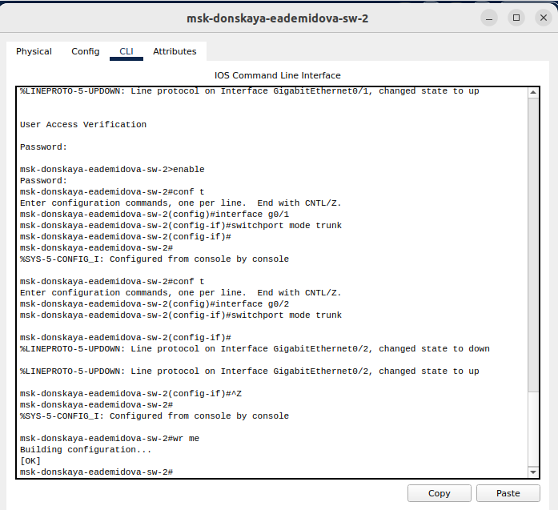

---
## Front matter
lang: ru-RU
title: Лабораторная работа № 5
subtitle: Конфигурирование VLAN
author:
  - Демидова Е. А.
institute:
  - Российский университет дружбы народов, Москва, Россия
date: 8 марта 2024

## i18n babel
babel-lang: russian
babel-otherlangs: english

## Formatting pdf
toc: false
toc-title: Содержание
slide_level: 2
aspectratio: 169
section-titles: true
theme: metropolis
header-includes:
 - \metroset{progressbar=frametitle,sectionpage=progressbar,numbering=fraction}
 - '\makeatletter'
 - '\beamer@ignorenonframefalse'
 - '\makeatother'
---

# Вводная часть

## Цели и задачи

**Цели**

Получить основные навыки по настройке VLAN на коммутаторах сети.

**Задачи**

1. На коммутаторах сети настроить Trunk-порты.
2. Коммутатор msk-donskaya-sw-1 настроить как VTP-сервер.
3. Остальные коммутаторы настроить как VTP-клиенты, приписать VLAN.
4. На оконечных устройствах указать адрес шлюза и статические IP-адреса.
5. Проверить доступность устройств.

# Выполнение лабораторной работы

## Настройка Trunk-порта коммутаторов

{#fig:001 width=50%}

## Настройка Trunk-порта коммутаторов

{#fig:002 width=50%}

## Настройка Trunk-порта коммутаторов

{#fig:003 width=50%}

## Настройка Trunk-порта коммутаторов

{#fig:004 width=50%}

## Настройка Trunk-порта коммутаторов

{#fig:005 width=50%}

## Настройка VTP-сервера

{#fig:006 width=35%}

## Настройка VTP-клиентов

{#fig:007 width=35%}

## Настройка VTP-клиентов

{#fig:008 width=50%}

## Настройка VTP-клиентов

{#fig:009 width=45%}

## Настройка VTP-клиентов

{#fig:0010 width=35%}

## Проверка доступности устройств

{#fig:011 width=50%}

## Проверка доступности устройств

{#fig:012 width=70%}

## Проверка доступности устройств

{#fig:013 width=50%}

## Проверка доступности устройств

{#fig:014 width=70%}

## Проверка доступности устройств

{#fig:015 width=50%}

# Выводы

В результате выполнения лабораторной работы получили основные навыки по настройке VLAN на коммутаторах сети.