---
## Front matter
title: "Лабораторная работа № 5"
subtitle: "Конфигурирование VLAN"
author: "Демидова Екатерина Алексеевна"

## Generic otions
lang: ru-RU
toc-title: "Содержание"

## Bibliography
bibliography: bib/cite.bib
csl: pandoc/csl/gost-r-7-0-5-2008-numeric.csl

## Pdf output format
toc: true # Table of contents
toc-depth: 2
lof: true # List of figures
lot: false # List of tables
fontsize: 12pt
linestretch: 1.5
papersize: a4
documentclass: scrreprt
## I18n polyglossia
polyglossia-lang:
  name: russian
  options:
	- spelling=modern
	- babelshorthands=true
polyglossia-otherlangs:
  name: english
## I18n babel
babel-lang: russian
babel-otherlangs: english
## Fonts
mainfont: PT Serif
romanfont: PT Serif
sansfont: PT Sans
monofont: PT Mono
mainfontoptions: Ligatures=TeX
romanfontoptions: Ligatures=TeX
sansfontoptions: Ligatures=TeX,Scale=MatchLowercase
monofontoptions: Scale=MatchLowercase,Scale=0.9
## Biblatex
biblatex: true
biblio-style: "gost-numeric"
biblatexoptions:
  - parentracker=true
  - backend=biber
  - hyperref=auto
  - language=auto
  - autolang=other*
  - citestyle=gost-numeric
## Pandoc-crossref LaTeX customization
figureTitle: "Рис."
tableTitle: "Таблица"
listingTitle: "Листинг"
lofTitle: "Список иллюстраций"
lotTitle: "Список таблиц"
lolTitle: "Листинги"
## Misc options
indent: true
header-includes:
  - \usepackage{indentfirst}
  - \usepackage{float} # keep figures where there are in the text
  - \floatplacement{figure}{H} # keep figures where there are in the text
---

# Цель работы

Получить основные навыки по настройке VLAN на коммутаторах сети.

# Задание

1. На коммутаторах сети настроить Trunk-порты на соответствующих интерфейсах (см. табл. 3.2 из раздела 3.3), связывающих коммутаторы между собой.
2. Коммутатор msk-donskaya-sw-1 настроить как VTP-сервер и прописать на нём номера и названия VLAN согласно табл. 3.1 из раздела 3.3.
3. Коммутаторы msk-donskaya-sw-2 -- msk-donskaya-sw-4, msk-pavlovskaya-sw-1 настроить как VTP-клиенты, на интерфейсах указать принадлежность к соответствующему VLAN (см. табл. 3.3 из раздела 3.3).
4. На оконечных устройствах указать соответствующий адрес шлюза и прописать статические IP-адреса из диапазона соответствующей сети, следуя регламенту выделения ip-адресов (см. табл. 3.4 из раздела 3.3).
5. Проверить доступность устройств, принадлежащих одному VLAN, и недоступность устройств, принадлежащих разным VLAN.

# Выполнение лабораторной работы

Сначала  на коммутаторах настроим Trunk-порты, чтобы передавать трафик всех будущих VLAN. Настроим Trunk-порт на интерфейсе g0/1 коммутатора msk-donskaya-sw-1(рис. [-@fig:001]).

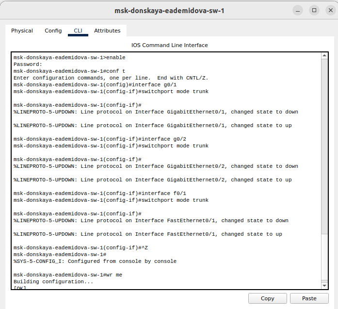{#fig:001 width=90%}

Для первого устройства msk-donskaya-eademidova-sw-1, интерфейсы -- g0/1, g0/2, f0/1 (рис. [-@fig:002]).

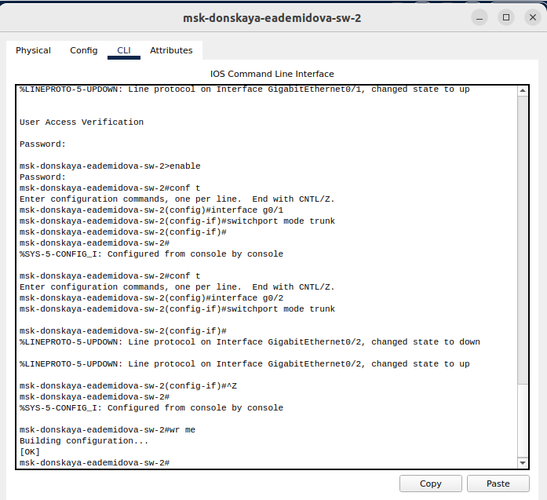{#fig:002 width=90%}

Для первого устройства msk-donskaya-eademidova-sw-2, интерфейсы -- g0/1 (рис. [-@fig:003]).

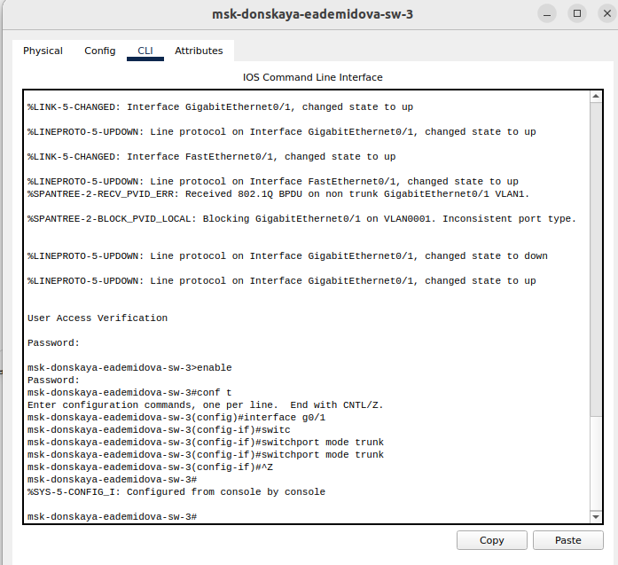{#fig:003 width=90%}

Для первого устройства имя msk-donskaya-eademidova-sw-3, интерфейс g0/1 (рис. [-@fig:004]).

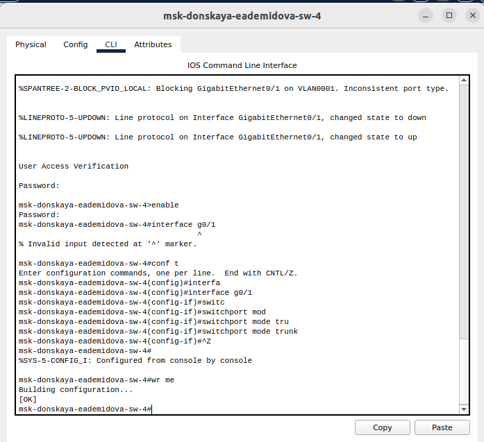{#fig:004 width=90%}

Для первого устройства имя msk-donskaya-eademidova-sw-4, интерфейс f0/24(рис. [-@fig:005]).

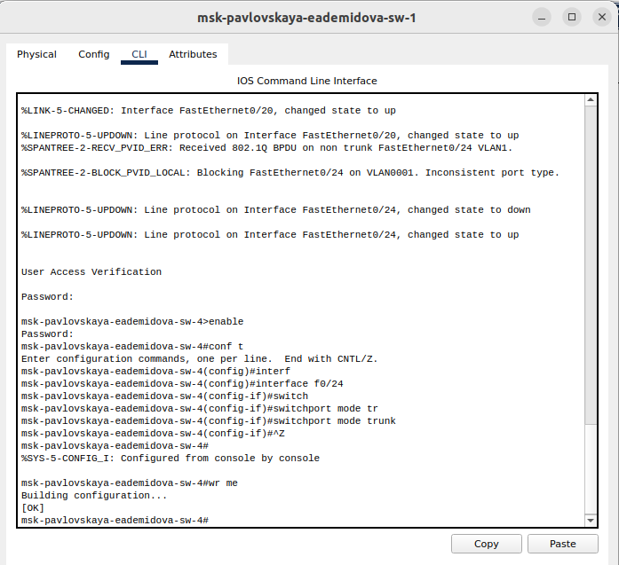{#fig:005 width=90%}

Настроим коммутатор msk-donskaya-sw-1 как VTP-сервер, чтобы он хранил список VLAN, и пропишем на нём номера и названия VLAN(рис. [-@fig:006]).

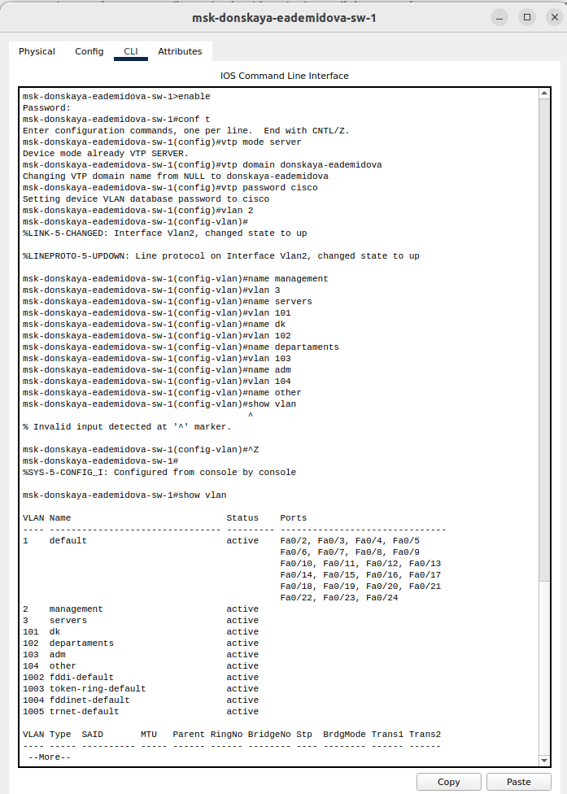{#fig:006 width=90%}

Настроим коммутаторы msk-donskaya-sw-2 -- msk-donskaya-sw-4, msk-pavlovskaya-sw-1 как VTP-клиенты, чтобы они получили список VLAN от сервера, и на интерфейсах укажем принадлежность к VLAN(рис. [-@fig:007-@fig:010]).

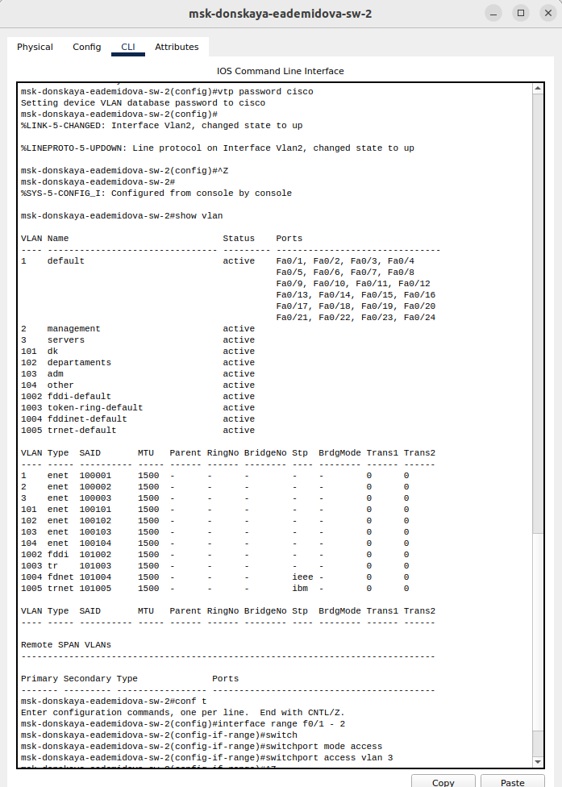{#fig:007 width=90%}

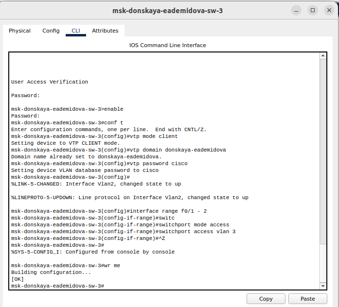{#fig:008 width=90%}

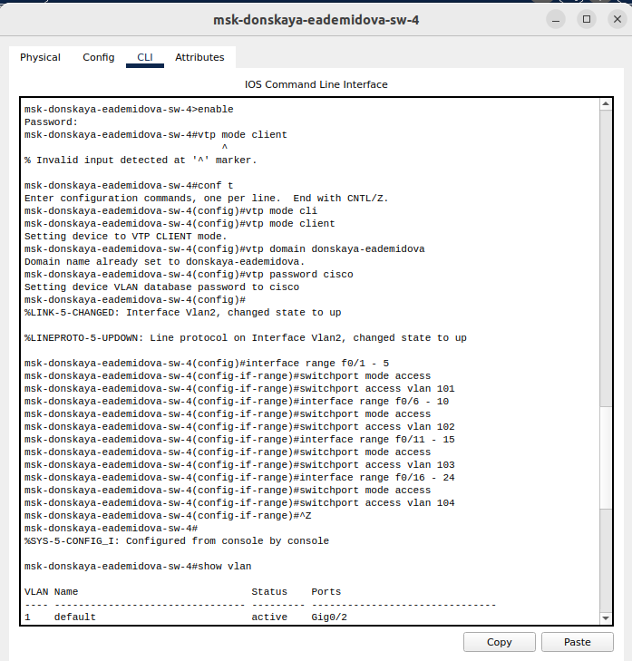{#fig:009 width=90%}

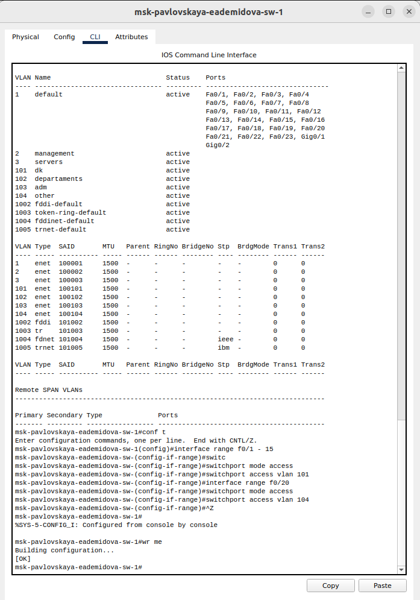{#fig:0010 width=90%}

Укажем статические IP-адреса на оконечных устройствах в соответсвии с таблицей из лабораторной работы №3.

Затем проверим с помощью команды ping доступность устройств, принадлежащих одному VLAN, и недоступность устройств, принадлежащих разным VLAN(рис. [-@fig:011]).

{#fig:011 width=90%}

Можно увидеть, что устройства из VLAN 3 успешно пингуются, а если попробовать пропинговать из VLAN 3 устройство, находящееся во VLAN 4 ничего не получится.

Используя режим симуляции в Packet Tracer, изучим процесс передвижения пакета ICMP по сети. Сначала отправим сообщение между устройствами из одного VLAN 3. Изучим содержимое передаваемого пакета и заголовки задействованных протоколов(рис. [-@fig:012]).  Исследуем структуру пакета ICMP. Сначала в PDU есть только заголовки IP, можно увидеть адрес отправителя и получателя, и ICMP. В заголовке ICMP содержится информация о типе сообщения, коде дополнительной диагностической информации, контрольная сумма сообщения, его индентификатор и порядковый номер. Эти заголовоки не меняются при передаче пакета. Теперь рассмотрим заголовок Ethernet. Сначала пакет отправляется на коммуатор msk-donskaya-eademidova-sw-4, в заголовке указаны MAC-адреса, показывающие, что пакет пришел от устройства dk в сети на Донской и отправляется на устройство dk в сети на Павловской. Затем пакет идёт к коммутатору msk-donskaya-eademidova-sw-1, потом к msk-pavlovskaya-eademidova-sw-1  наконец доходит до места назначения. После этого эхо-запроса отправляется эхо-ответ, пакет проходит обратный путь(рис. [-@fig:013]).

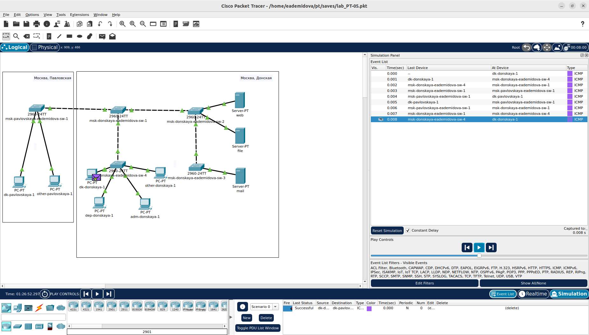{#fig:012 width=90%}

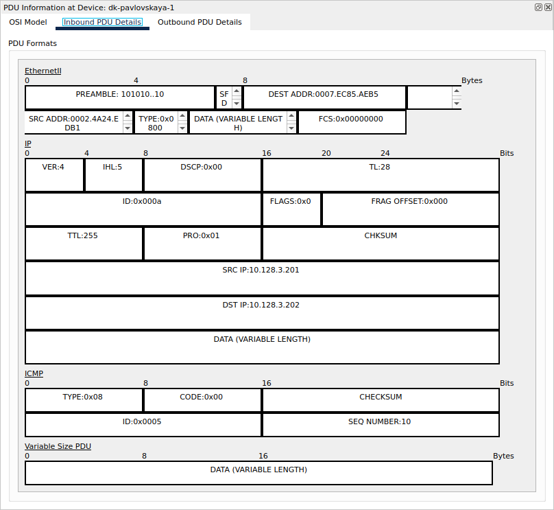{#fig:013 width=90%}

Теперь отправим пакет от устройства во VLAN 3 к устройству во VLAN 4. Так как у устройства из VLAN 3 нет информации об адресах из других VLAN в ARP таблице, то пакет сразу останавливается, не идя даже на марщрутизатор(рис. [-@fig:014]). Соответсвтенно в ICMP пакете есть те же заголовки, также указан IP-адрес отправителя и получателя в заголовке IP(рис. [-@fig:015]).

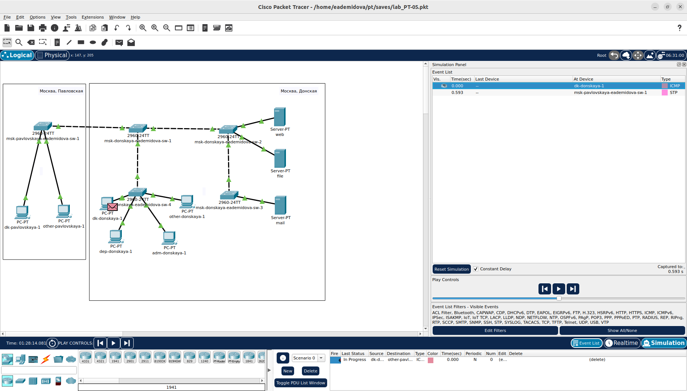{#fig:014 width=90%}

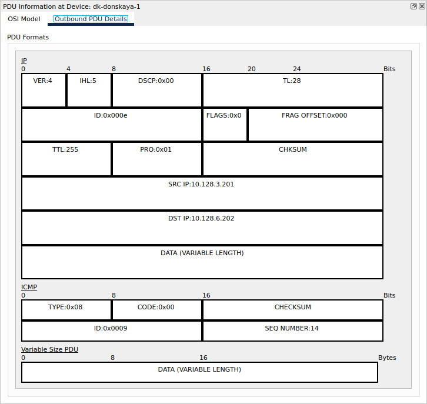{#fig:015 width=90%}

## Контрольные вопросы

1. Какая команда используется для просмотра списка VLAN на сетевом устройстве?

```
show vlan
```

2. Охарактеризуйте VLAN Trunking Protocol (VTP). Приведите перечень команд с пояснениями для настройки и просмотра информации о VLAN.

VLAN Trunking Protocol (VTP) - протокол для обмена информацией о VLAN между коммутаторами. Команды: 
   - vtp mode server/client/transparent - установить режим VTP
   - vtp domain <domain_name> - задать домен VTP
   - show vtp status - просмотр информации о статусе VTP

3. Охарактеризуйте Internet Control Message Protocol (ICMP). Опишите формат пакета ICMP.

ICMP - протокол управляющих сообщений Интернета. Формат: Заголовок ICMP (тип сообщения, код, контрольная сумма) + Данные.

4. Охарактеризуйте Address Resolution Protocol (ARP). Опишите формат пакета ARP.

ARP - протокол разрешения адресов. Формат: ARP-запрос (отправитель MAC, отправитель IP, получатель IP) + ARP-ответ (MAC отправителя, IP отправителя).

5. Что такое MAC-адрес? Какова его структура?

MAC-адрес - адрес устройства в сети. Структура: 6 октетов в шестнадцатеричной системе, разделенные двоеточиями (например, 00:1A:2B:3C:4D:5E).

# Выводы

В результате выполнения лабораторной работы получили основные навыки по настройке VLAN на коммутаторах сети.