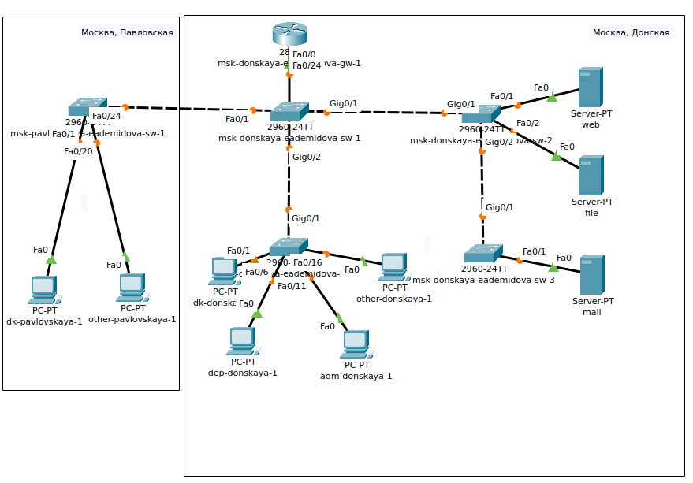

---
## Front matter
lang: ru-RU
title: Лабораторная работа № 7
subtitle: Учёт физических параметров сети
author:
  - Демидова Е. А.
institute:
  - Российский университет дружбы народов, Москва, Россия
date: 27 марта 2024

## i18n babel
babel-lang: russian
babel-otherlangs: english

## Formatting pdf
toc: false
toc-title: Содержание
slide_level: 2
aspectratio: 169
section-titles: true
theme: metropolis
header-includes:
 - \metroset{progressbar=frametitle,sectionpage=progressbar,numbering=fraction}
 - '\makeatletter'
 - '\beamer@ignorenonframefalse'
 - '\makeatother'
---

# Вводная часть

## Цели и задачи

**Цели**

Получить навыки работы с физической рабочей областью Packet Tracer, а также учесть физические параметры сети.

**Задачи**

Требуется заменить соединение между коммутаторами двух территорий msk-donskaya-eademidova-sw-1 и msk-pavlovskaya-eademidova-sw-1 на соединение, учитывающее физические параметры сети, а именно — расстояние между двумя территориями.

# Выполнение лабораторной работы

## Схема сети

{#fig:001 width=60%}

## Настройка физической области

{#fig:002 width=70%}

## Настройка физической области

{#fig:003 width=70%}

## Настройка физической области

{#fig:004 width=50%}

## Настройка физической области

{#fig:005 width=70%}

## Настройка физической области

{#fig:006 width=70%}

## Проверка соединения

{#fig:007 width=90%}

## Настройка физической области

{#fig:008 width=90%}

## Настройка физической области

{#fig:009 width=50%}

## Проверка соединения

{#fig:010 width=90%}

## Добавление устройств

{#fig:011 width=90%}

## Схема сети

{#fig:012 width=60%}

## Схема сети

:Таблица портов. Измененная часть

| Устройство        | Порт        | Примечание           |
|---------------------|---------------|------------------------|
| msk-donskaya-sw-1 | f0/24       | msk-donskaya-gw-1 |
|                   | g0/1        | msk-donskaya-sw-2 |
|                   | g0/2        | msk-donskaya-sw-4 |
|                   | f0/1        | msk-donskaya-mc-1 |
| msk-donskaya-mc-1    | f0/0       | msk-donskaya-sw-1    |
|                      | f0/1       | msk-pavlovskaya-mc-1 |
| msk-pavlovskaya-mc-1 | f0/0       | msk-pavlovskaya-sw-1 |
|                      | f0/1       | msk-donskaya-mc-1    |
| msk-pavlovskaya-sw-1 | f0/24      | msk-pavlovskaya-mc-1 |
|                      | f0/1–f0/15 | dk                   |
|                      | f0/20      | other                |

## Проверка соединения

{#fig:013 width=90%}

# Выводы

В результате выполнения лабораторной работы получили навыки работы с физической рабочей областью Packet Tracer, а также учесть физические параметры сети.