---
## Front matter
title: "Лабораторная работа № 7"
subtitle: "Учёт физических параметров сети"
author: "Демидова Екатерина Алексеевна"

## Generic otions
lang: ru-RU
toc-title: "Содержание"

## Bibliography
bibliography: bib/cite.bib
csl: pandoc/csl/gost-r-7-0-5-2008-numeric.csl

## Pdf output format
toc: true # Table of contents
toc-depth: 2
lof: true # List of figures
lot: false # List of tables
fontsize: 12pt
linestretch: 1.5
papersize: a4
documentclass: scrreprt
## I18n polyglossia
polyglossia-lang:
  name: russian
  options:
	- spelling=modern
	- babelshorthands=true
polyglossia-otherlangs:
  name: english
## I18n babel
babel-lang: russian
babel-otherlangs: english
## Fonts
mainfont: PT Serif
romanfont: PT Serif
sansfont: PT Sans
monofont: PT Mono
mainfontoptions: Ligatures=TeX
romanfontoptions: Ligatures=TeX
sansfontoptions: Ligatures=TeX,Scale=MatchLowercase
monofontoptions: Scale=MatchLowercase,Scale=0.9
## Biblatex
biblatex: true
biblio-style: "gost-numeric"
biblatexoptions:
  - parentracker=true
  - backend=biber
  - hyperref=auto
  - language=auto
  - autolang=other*
  - citestyle=gost-numeric
## Pandoc-crossref LaTeX customization
figureTitle: "Рис."
tableTitle: "Таблица"
listingTitle: "Листинг"
lofTitle: "Список иллюстраций"
lotTitle: "Список таблиц"
lolTitle: "Листинги"
## Misc options
indent: true
header-includes:
  - \usepackage{indentfirst}
  - \usepackage{float} # keep figures where there are in the text
  - \floatplacement{figure}{H} # keep figures where there are in the text
---

# Цель работы

Получить навыки работы с физической рабочей областью Packet Tracer, а также учесть физические параметры сети.

# Задание

Требуется заменить соединение между коммутаторами двух территорий msk-donskaya-eademidova-sw-1 и msk-pavlovskaya-eademidova-sw-1 на соединение, учитывающее физические параметры сети, а именно — расстояние между двумя территориями.

# Выполнение лабораторной работы

Откроем проект прошлой лабораторной работы(рис. [-@fig:001]).

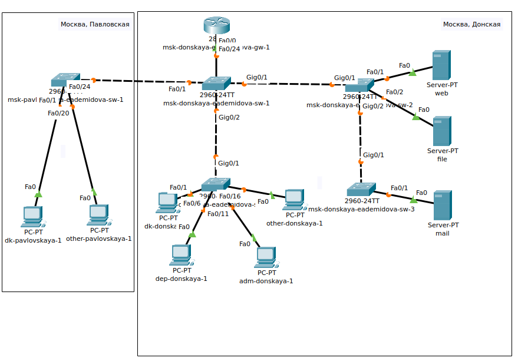{#fig:001 width=90%}

Перейдем в физическую рабочую область Packet Tracer. Присвоим название городу -- Moscow(рис. [-@fig:002]).

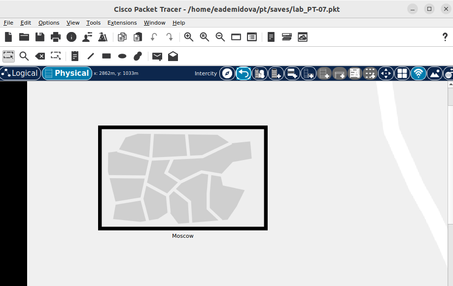{#fig:002 width=90%}

Щёлкнув на изображении города, увидим изображение здания. Присвоим ему название Donskaya. Добавим здание для территории Pavlovskaya(рис. [-@fig:003]).

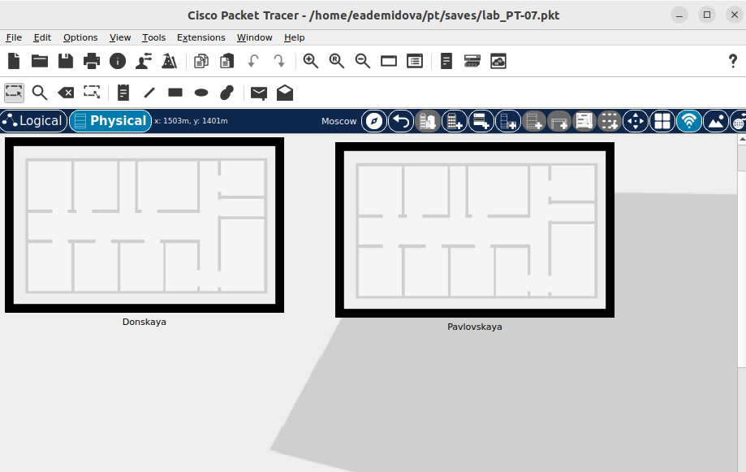{#fig:003 width=90%}

Щёлкнув на изображении здания Donskaya, переместим изображение, обозначающее серверное помещение, в него(рис. [-@fig:004]).

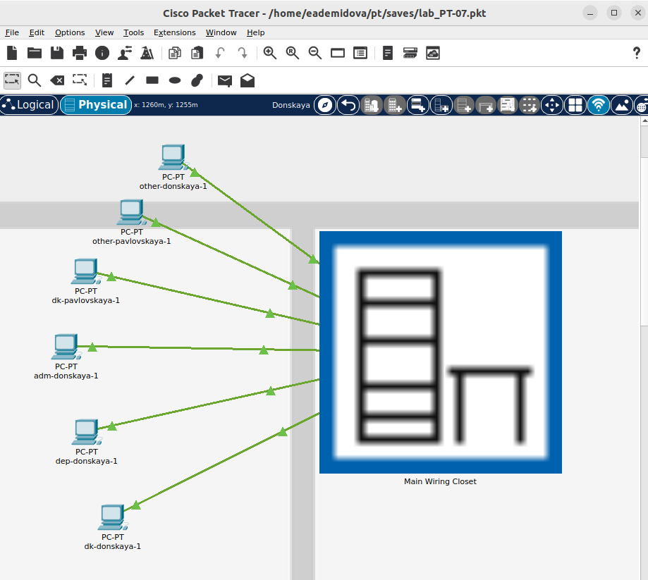{#fig:004 width=90%}

Щёлкнув на изображении серверной, посмотрим отображение серверных стоек(рис. [-@fig:005]).

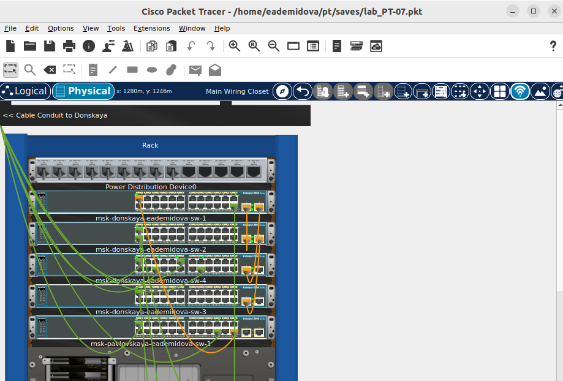{#fig:005 width=90%}

Переместим коммутатор msk-pavlovskaya-eademidova-sw-1 и два оконечных устройства dk-pavlovskaya-eademidova-1 и other-pavlovskaya-eademidova-1 на территорию Pavlovskaya, используя меню Move физической рабочей области Packet Tracer(рис. [-@fig:006]).

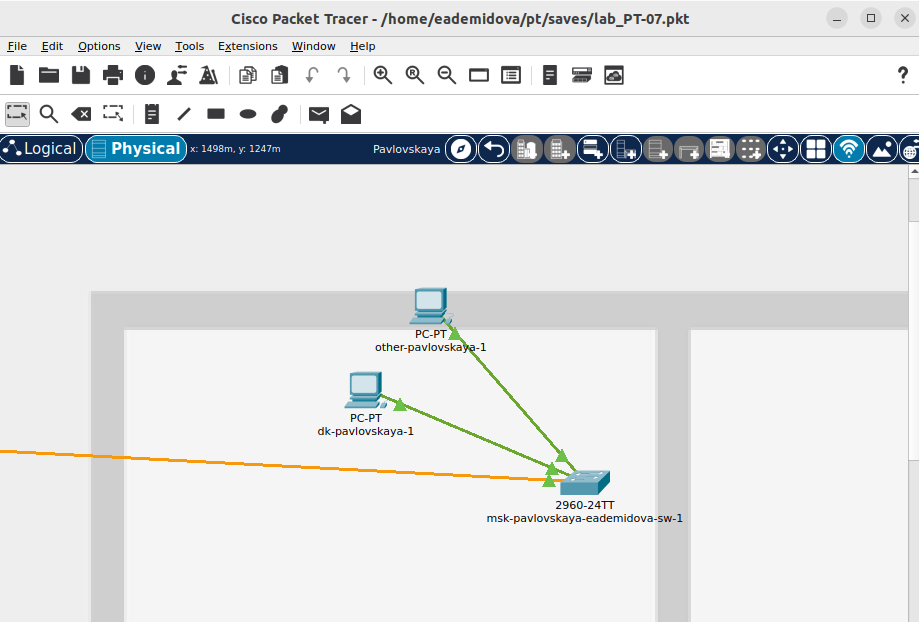{#fig:006 width=90%}

Вернувшись в логическую рабочую область Packet Tracer, пропингуем с коммутатора msk-donskaya-eademidova-sw-1 коммутатор msk-pavlovskaya-eademidova-sw-1. Убедимся, что соединение работоспособно(рис. [-@fig:007]).

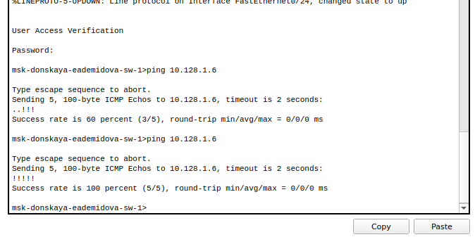{#fig:007 width=90%}

В меню Options, Preferences во вкладке Interface активируем разрешение на учёт физических характеристик среды передачи (Enable Cable Length Effects)(рис. [-@fig:008]).

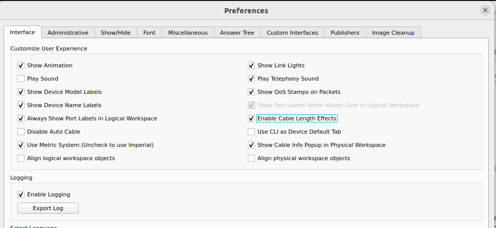{#fig:008 width=90%}

В физической рабочей области Packet Tracer разместим две территории на расстоянии  около 1000 м друг от друга(рис. [-@fig:009]).

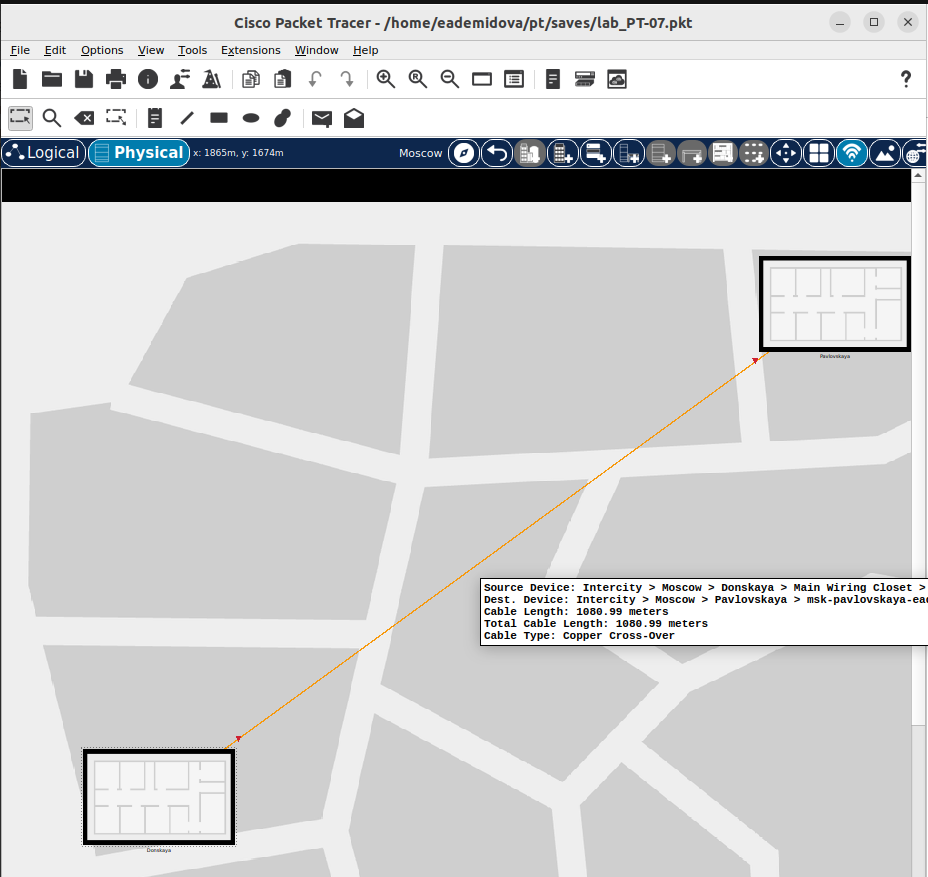{#fig:009 width=90%}

Вернувшись в логическую рабочую область Packet Tracer, пропингуем с коммутатора msk-donskaya-eademidova-sw-1 коммутатор msk-pavlovskaya-sw-1. Убедимся, что соединение не работает(рис. [-@fig:010]).

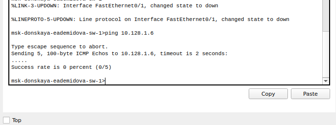{#fig:010 width=90%}

Удалим соединение между msk-donskaya-sw-1 и msk-pavlovskaya-sw-1. Добавим в логическую рабочую область два повторителя (Repeater-PT). Присвоим им соответствующие названия msk-donskaya-eademidova-mc-1 и msk-pavlovskaya-eademidova-mc-1. Заменим имеющиеся модули на PT-REPEATER-NM-1FFE и PT-REPEATER-NM-1CFE для подключения оптоволокна и витой пары по технологии Fast Ethernet(рис. [-@fig:011]).

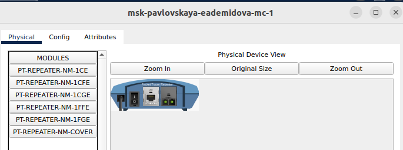{#fig:011 width=90%}

Переместим msk-pavlovskaya-mc-1 на территорию Pavlovskaya (в физичекой рабочей области Packet Tracer).

Подключим коммутатор msk-donskaya-eademidova-sw-1 к msk-donskaya-eademidova-mc-1 по витой паре, msk-donskaya-eademidova-mc-1 и msk-pavlovskaya-eademidova-mc-1 -- по оптоволокну, msk-pavlovskaya-eademidova-sw-1 к msk-pavlovskaya-eademidova-mc-1 -- по витой паре(рис. [-@fig:012]).

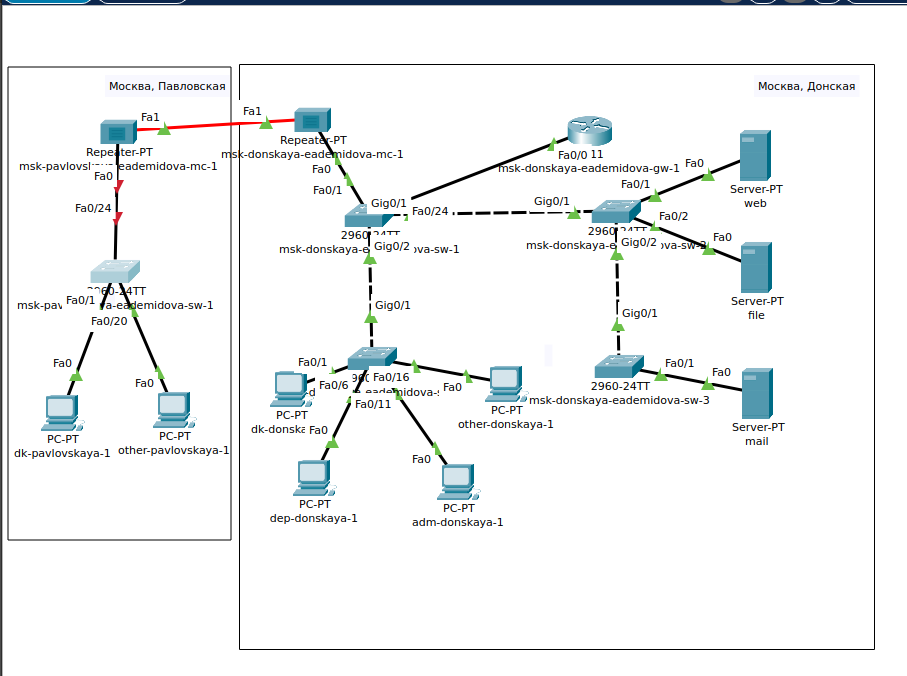{#fig:012 width=90%}

Также ынесйм соответсвующие изменения в таблицу портов из третьей лабораторной работы(табл. [-@tbl:fiz]).

:Таблица портов {#tbl:fiz}

| Устройство        | Порт        | Примечание           |
|-------------------|-------------|----------------------|
| msk-donskaya-gw-1 | f0/1        | UpLink            |
|                   | f0/0        | msk-donskaya-sw-1 |
| msk-donskaya-sw-1 | f0/24       | msk-donskaya-gw-1 |
|                   | g0/1        | msk-donskaya-sw-2 |
|                   | g0/2        | msk-donskaya-sw-4 |
|                   | f0/1        | msk-donskaya-mc-1 |
| msk-donskaya-sw-2 | g0/1        | msk-donskaya-sw-1 |
|                   | g0/2        | msk-donskaya-sw-3 |
|                   | f0/1        | Web-server        |
|                   | f0/2        | File-server       |
| msk-donskaya-sw-3 | g0/1        | msk-donskaya-sw-2 |
|                   | f0/1        | Mail-server       |
|                   | f0/2        | Dns-server        |
| msk-donskaya-sw-4 | g0/1        | msk-donskaya-sw-1 |
|                   | f0/1–f0/5   | dk                |
|                   | f0/6–f0/10  | departments       |
|                   | f0/11–f0/15 | adm               |
|                   | f0/16–f0/24 | other             |
| msk-donskaya-mc-1    | f0/0       | msk-donskaya-sw-1    |
|                      | f0/1       | msk-pavlovskaya-mc-1 |
| msk-pavlovskaya-mc-1 | f0/0       | msk-pavlovskaya-sw-1 |
|                      | f0/1       | msk-donskaya-mc-1    |
| msk-pavlovskaya-sw-1 | f0/24      | msk-pavlovskaya-mc-1 |
|                      | f0/1–f0/15 | dk                   |
|                      | f0/20      | other                |

Убедимся в работоспособности соединения междуmsk-donskaya-eademidova-sw-1 и msk-pavlovskaya-eademidova-sw-1(рис. [-@fig:013]).

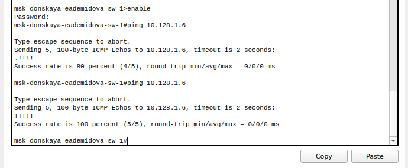{#fig:013 width=90%}

## Контрольные вопросы

1. Перечислите возможные среды передачи данных. На какие характеристики
среды передачи данных следует обращать внимание при планировании
сети?
2. Перечислите категории витой пары. Чем они отличаются? Какая категория
в каких условиях может применяться?
3. В чем отличие одномодового и многомодового оптоволокна? Какой тип
кабеля в каких условиях может применяться?
4. Какие разъёмы встречаются на патчах оптоволокна? Чем они отличаются?

1. Среды передачи данных: проводная (витая пара, коаксиальный кабель, оптоволокно), беспроводная (Wi-Fi, Bluetooth, сотовая связь). При планировании сети следует обращать внимание на пропускную способность каналов передачи данных, задержку (латентность), надежность соединения, уровень шума и помех, а также возможность интерференции сигналов.

2. Категории витой пары: Cat5, Cat6, Cat6a, Cat7. Они отличаются пропускной способностью и дальностью передачи. Cat5 подходит для домашних сетей, Cat6 для офисов, Cat6a и Cat7 для высокоскоростных сетей.

3. Одномодовое оптоволокно передает свет в одном направлении, многомодовое - в нескольких. Одномодовое используется на большие расстояния, многомодовое - на короткие.

4. Разъемы на патчах оптоволокна: LC, SC, ST. Они различаются по типу соединения. LC - для высокоскоростных сетей, SC и ST - для обычных сетей.

# Выводы

В результате выполнения лабораторной работы получили навыки работы с физической рабочей областью Packet Tracer, а также учесть физические параметры сети.
