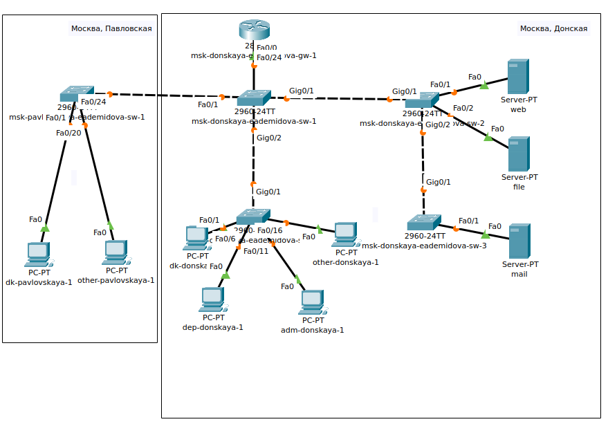
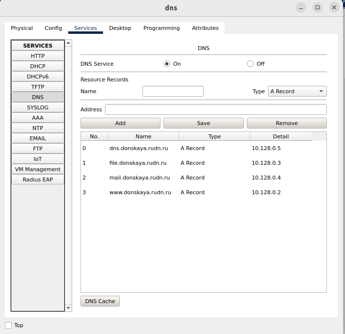
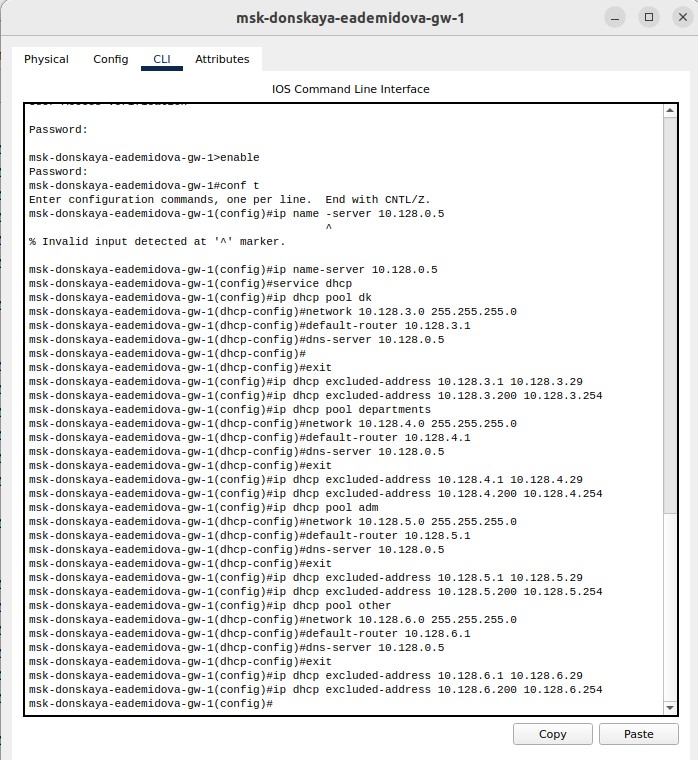
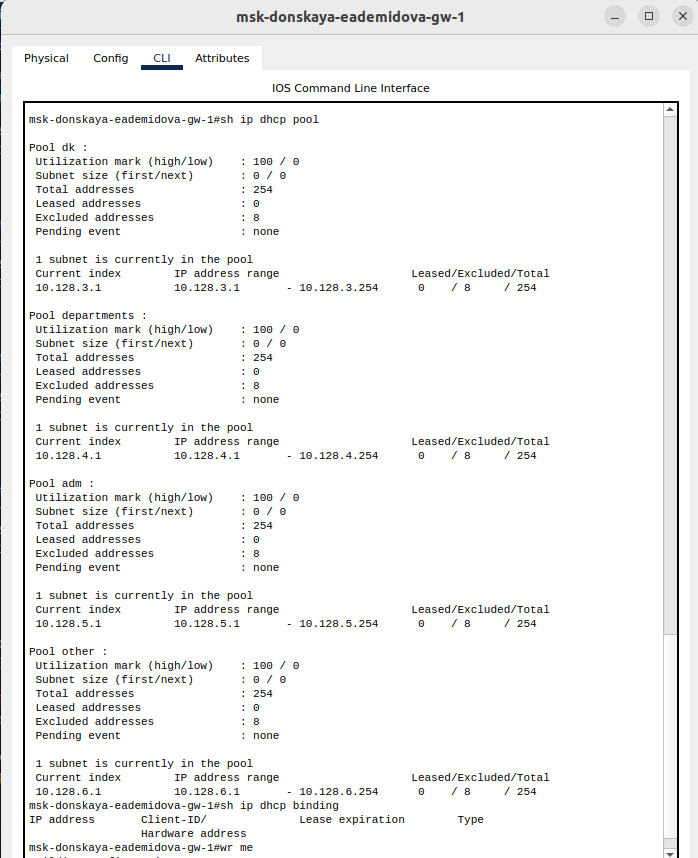
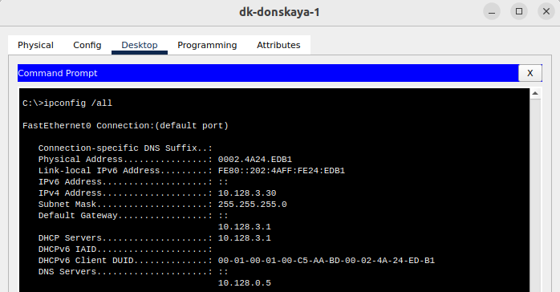
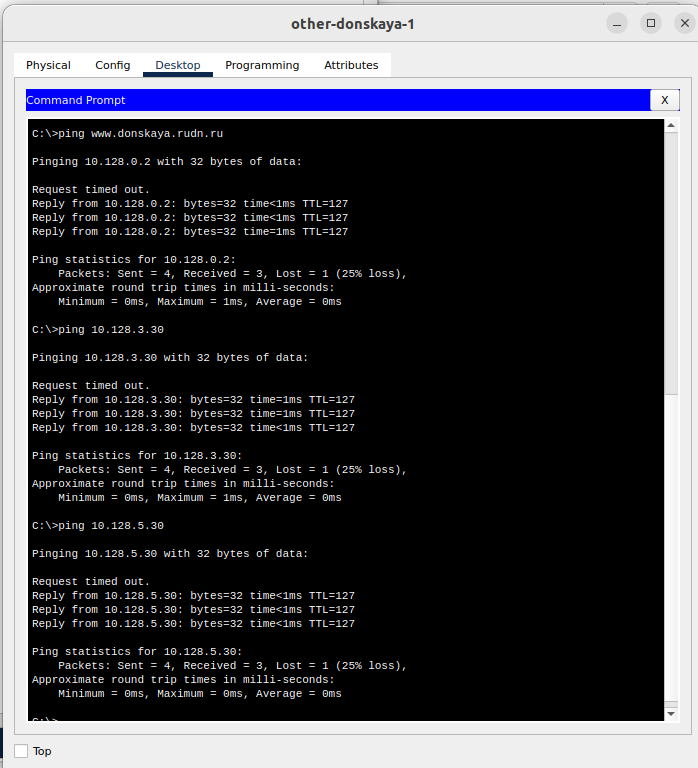
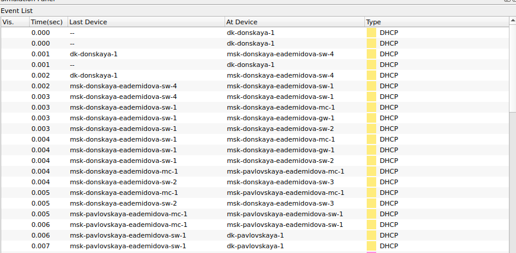
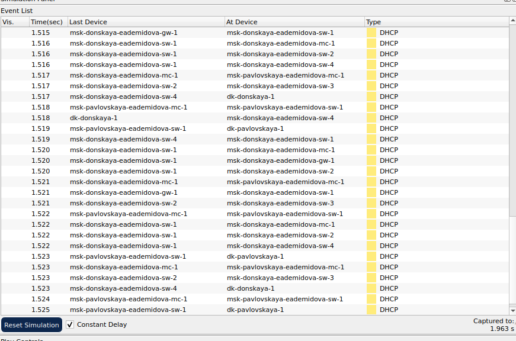
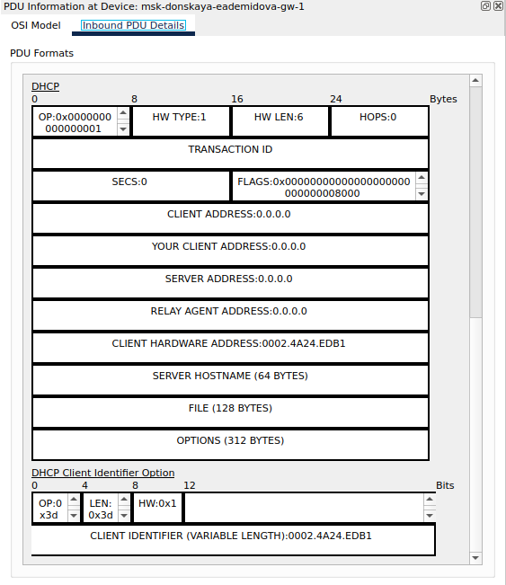
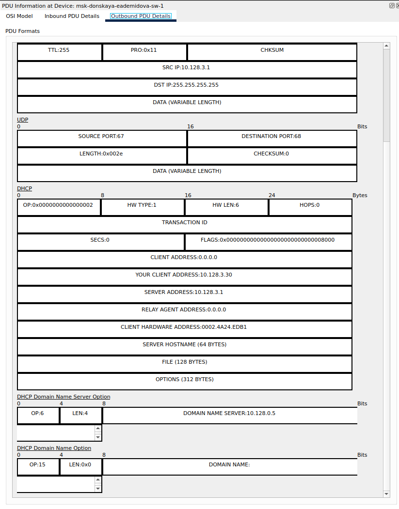

---
## Front matter
lang: ru-RU
title: Лабораторная работа № 8
subtitle: Настройка сетевых сервисов. DHCP
author:
  - Демидова Е. А.
institute:
  - Российский университет дружбы народов, Москва, Россия
date: 29 марта 2024

## i18n babel
babel-lang: russian
babel-otherlangs: english

## Formatting pdf
toc: false
toc-title: Содержание
slide_level: 2
aspectratio: 169
section-titles: true
theme: metropolis
header-includes:
 - \metroset{progressbar=frametitle,sectionpage=progressbar,numbering=fraction}
 - '\makeatletter'
 - '\beamer@ignorenonframefalse'
 - '\makeatother'
---

# Вводная часть

## Цели и задачи

**Цели**

Приобретение практических навыков по настройке динамического распределения IP-адресов посредством протокола DHCP (Dynamic Host Configuration Protocol) в локальной сети.

**Задачи**

1. Добавить DNS-записи для домена donskaya.rudn.ru на сервер dns.
2. Настроить DHCP-сервис на маршрутизаторе.
3. Заменить в конфигурации оконечных устройствах статическое распределение адресов на динамическое.
4. При выполнении работы необходимо учитывать соглашение об именовании.

# Выполнение лабораторной работы

## Схема сети

{#fig:001 width=60%}

## Настройка DNS-сервера

{#fig:002 width=70%}

## Настройка DNS-сервера

```
msk-donskaya-eademidova-sw-3>en
msk-donskaya-eademidova-sw-3#conf t
msk-donskaya-eademidova-sw-3(config)#interface f0/2
msk-donskaya-eademidova-sw-3(config-if)#switchport mode access 
msk-donskaya-eademidova-sw-3(config-if)#switchport access vlan 3
msk-donskaya-eademidova-sw-3(config-if)#exit
```

## Настройка DNS-сервера

{#fig:003 width=50%}

## Настройка DHCP-сервиса

{#fig:004 width=40%}

## Настройка DHCP-сервиса

| IP-адреса | Назначение           |
|-----------|----------------------|
| 1         | Шлюз                 |
| 2-19      | Сетевое оборудование |
| 20-29     | Серверы              |
| 30-199    | Компьютеры, DHCP     |
| 200-219   | Компьютеры, Static   |
| 220-229   | Принтеры             |
| 230-254   | Резерв               |

## Настройка DHCP-сервиса

{#fig:005 width=40%}

## Настройка DHCP-сервиса

{#fig:006 width=90%}

## Проверка соединения

{#fig:007 width=40%}

## Запрос адреса по протоколу DHCP

{#fig:008 width=90%}

## Запрос адреса по протоколу DHCP

{#fig:009 width=70%}

## Запрос адреса по протоколу DHCP

{#fig:010 width=40%}

## Запрос адреса по протоколу DHCP

{#fig:011 width=35%}

# Выводы

В результате выполнения лабораторной работы получили навыки по настройке динамического распределения IP-адресов посредством протокола DHCP в локальной сети.