---
## Front matter
lang: ru-RU
title: Лабораторная работа № 9
subtitle: Использование протокола STP. Агрегирование каналов
author:
  - Демидова Е. А.
institute:
  - Российский университет дружбы народов, Москва, Россия
date: 11 апреля 2024

## i18n babel
babel-lang: russian
babel-otherlangs: english

## Formatting pdf
toc: false
toc-title: Содержание
slide_level: 2
aspectratio: 169
section-titles: true
theme: metropolis
header-includes:
 - \metroset{progressbar=frametitle,sectionpage=progressbar,numbering=fraction}
 - '\makeatletter'
 - '\beamer@ignorenonframefalse'
 - '\makeatother'
---

# Вводная часть

## Цели и задачи

**Цели**

Изучение возможностей протокола STP и его модификаций по обеспечению отказоустойчивости сети, агрегированию интерфейсов и перераспределению нагрузки между ними.

**Задачи**

1. Сформируйте резервное соединение между коммутаторами msk-donskaya-sw-1 и msk-donskaya-sw-3.
2. Настройте балансировку нагрузки между резервными соединениями.
3. Настройте режим Portfast на тех интерфейсах коммутаторов, к которым подключены серверы.
4. Изучите отказоустойчивость резервного соединения.
5. Сформируйте и настройте агрегированное соединение интерфейсов Fa0/20 -- Fa0/23 между коммутаторами msk-donskaya-sw-1 и msk-donskaya-sw-4.

# Выполнение лабораторной работы

## Схема сети

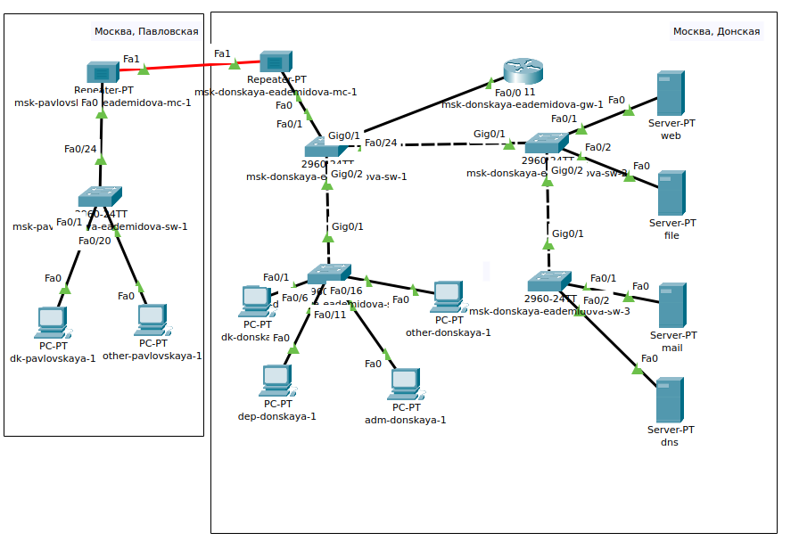{#fig:001 width=70%}

## Настройка резервного соединения

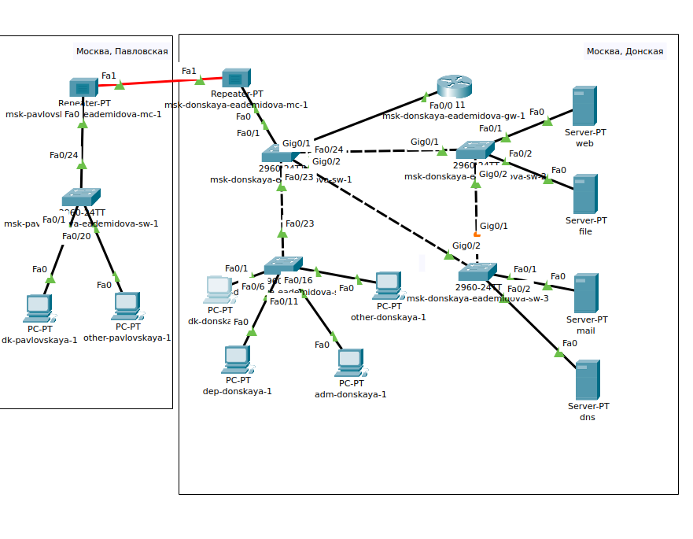{#fig:002 width=65%}

## Настройка резервного соединения

{#fig:003 width=50%}

## Настройка резервного соединения

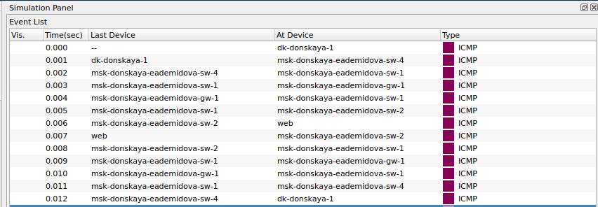{#fig:004 width=70%}

## Настройка STP

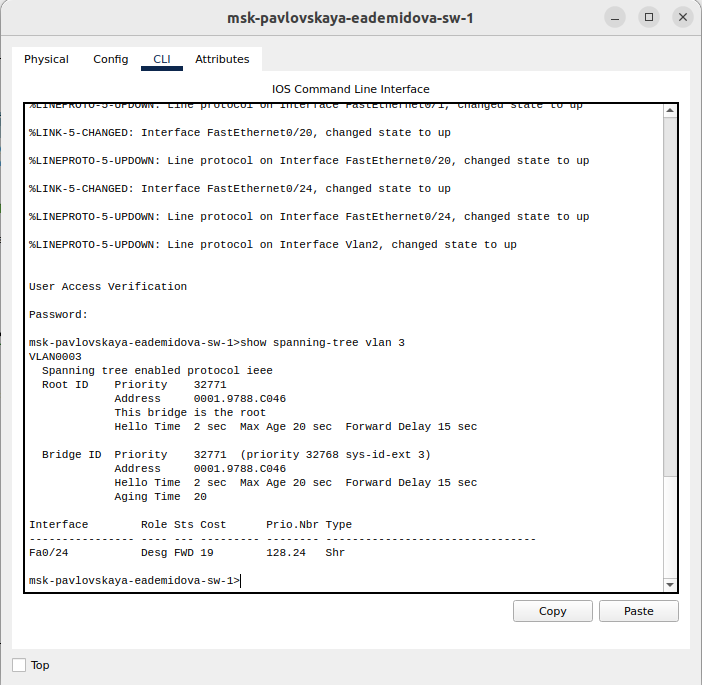{#fig:005 width=50%}

## Настройка STP

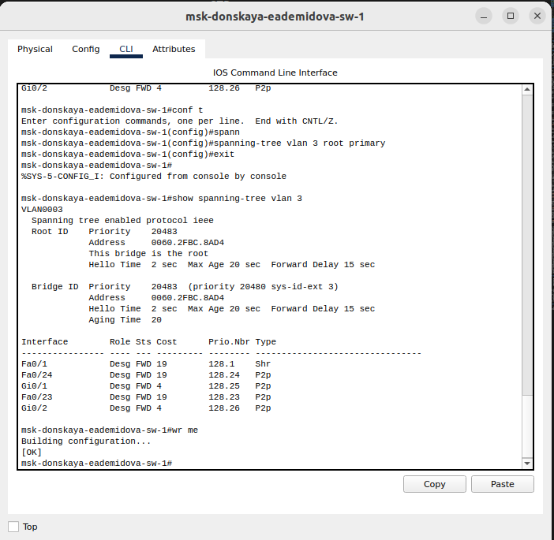{#fig:006 width=50%}

## Настройка STP

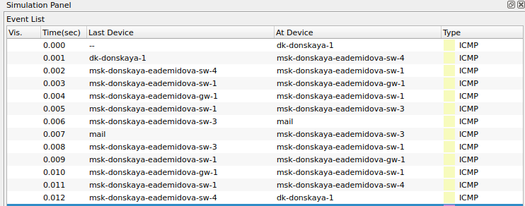{#fig:007 width=70%}

## Настройка STP

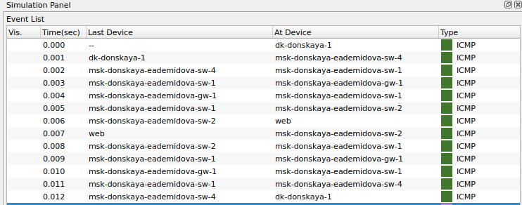{#fig:008 width=70%}

## Настройка Portfast

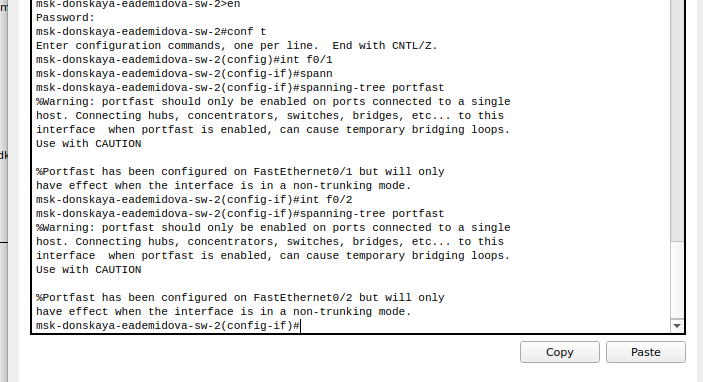{#fig:009 width=70%}

## Настройка Portfast

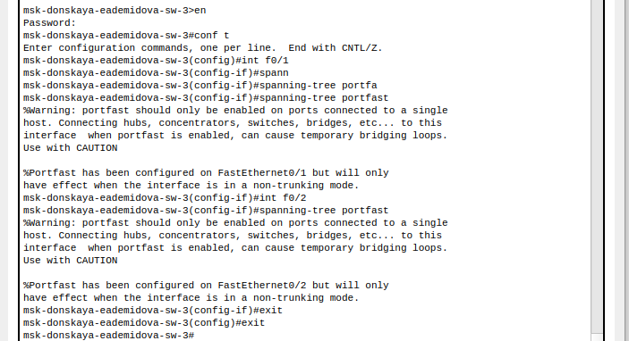{#fig:010 width=70%}

## Извучение отказоустойчивости

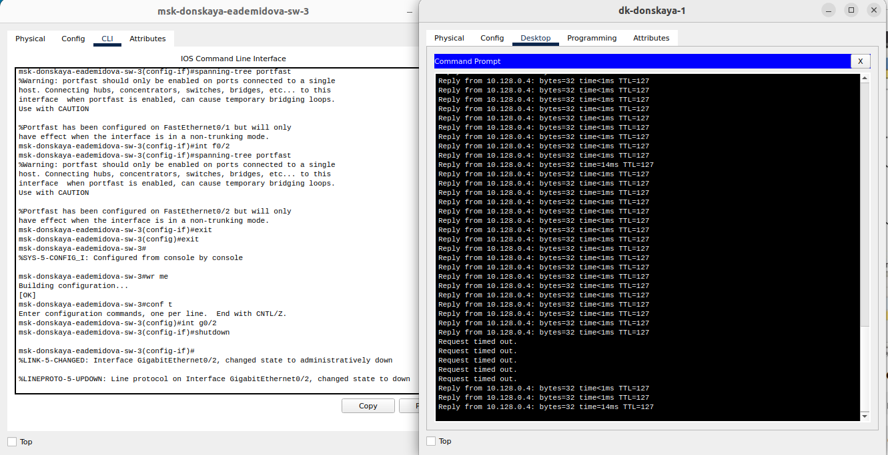{#fig:011 width=70%}

## Настройка Rapid PVST+

```
msk-donskaya-eademidova-sw-1( config )#spanning-tree mode rapid-pvst
msk-donskaya-eademidova-sw-2( config )#spanning-tree mode rapid-pvst
msk-donskaya-eademidova-sw-3( config )#spanning-tree mode rapid-pvst
msk-donskaya-eademidova-sw-4( config )#spanning-tree mode rapid-pvst
msk-pavlovskaya-eademidova-sw-1( config )#spanning-tree mode rapid-pvst
```

## Настройка Rapid PVST+

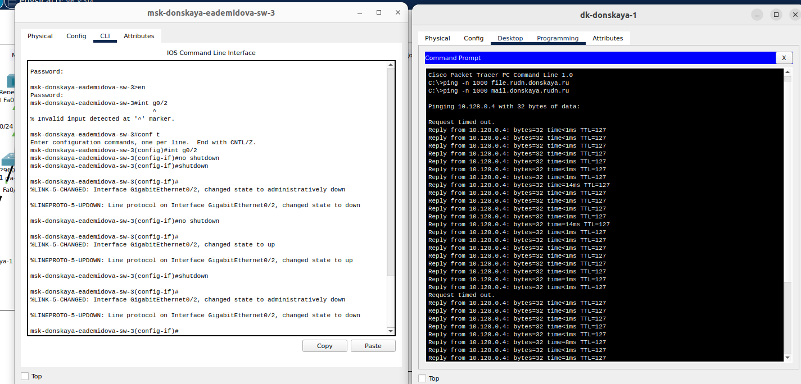{#fig:012 width=70%}

## Агрегирование каналов

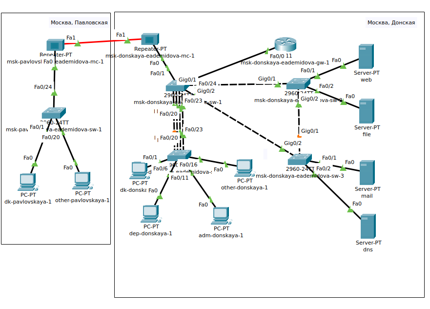{#fig:013 width=70%}

## Агрегирование каналов

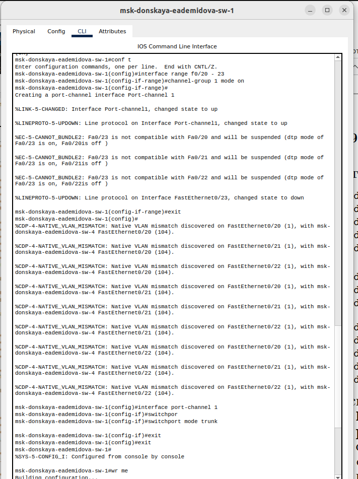{#fig:014 width=35%}

## Агрегирование каналов

{#fig:015 width=40%}

# Выводы

В результате выполнения лабораторной работы изучили возможности протокола STP и его модификаций по обеспечению отказоустойчивости сети, агрегированию интерфейсов и перераспределению нагрузки между ними.