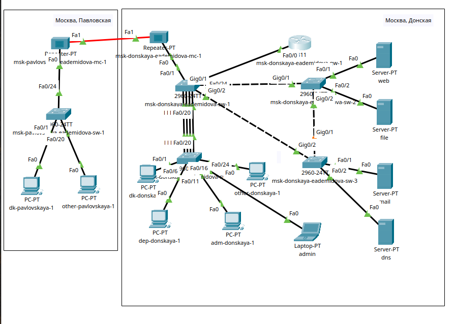
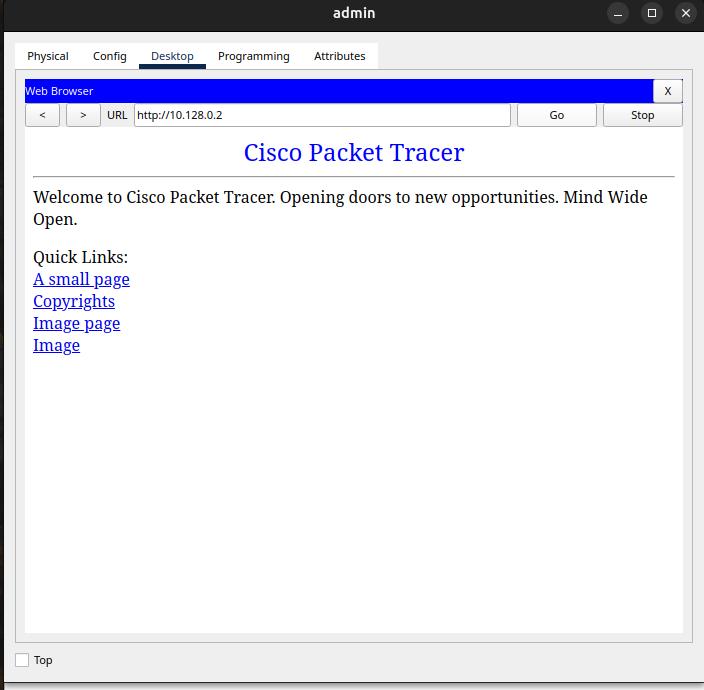
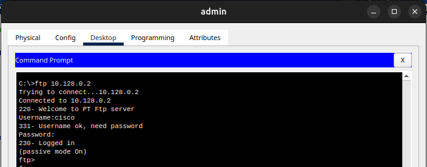
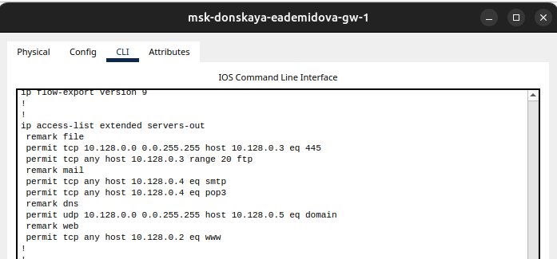
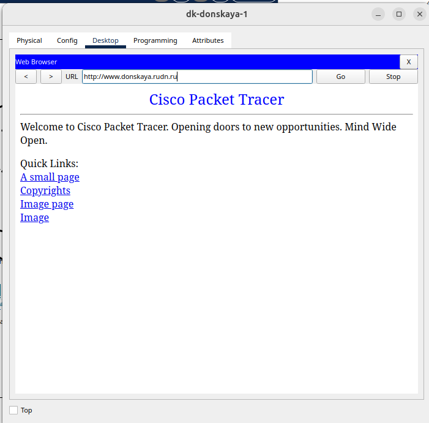
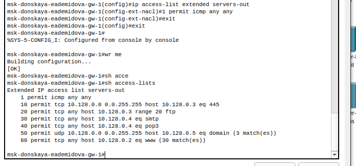
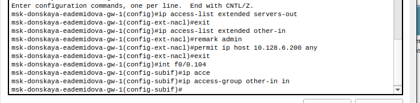
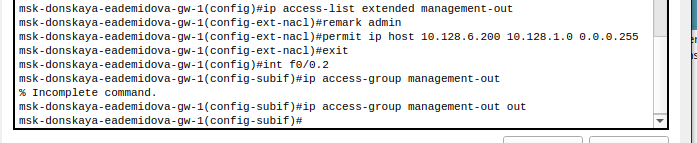
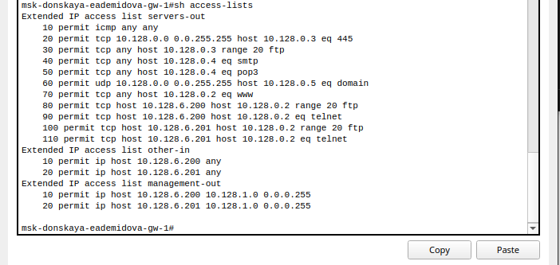
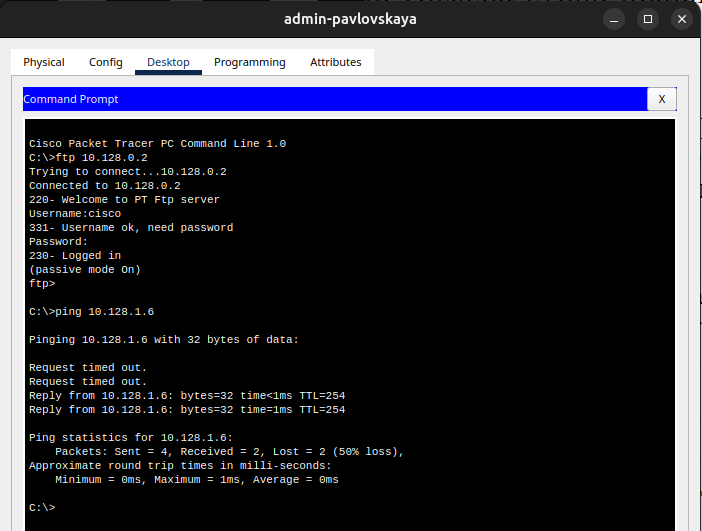

---
## Front matter
lang: ru-RU
title: Лабораторная работа № 10
subtitle: Настройка списков управления доступом (ACL)"
author:
  - Демидова Е. А.
institute:
  - Российский университет дружбы народов, Москва, Россия
date: 22 апреля 2024

## i18n babel
babel-lang: russian
babel-otherlangs: english

## Formatting pdf
toc: false
toc-title: Содержание
slide_level: 2
aspectratio: 169
section-titles: true
theme: metropolis
header-includes:
 - \metroset{progressbar=frametitle,sectionpage=progressbar,numbering=fraction}
 - '\makeatletter'
 - '\beamer@ignorenonframefalse'
 - '\makeatother'
---

# Вводная часть

## Цели и задачи

**Цели**

Освоить настройку прав доступа пользователей к ресурсам сети.

**Задачи**

1. Требуется настроить правила доступа.
2. Требуется проверить правильность действия установленных правил доступа.
3. Требуется выполнить задание для самостоятельной работы по настройке прав доступа администратора сети на Павловской.

# Выполнение лабораторной работы

## Схема сети

{#fig:002 width=50%}

## Настройка прав доступа к web-серверу по порту tcp 80

```
msk−donskaya−gw−1# configure terminal
msk−donskaya−gw−1(config )#ip access −list extended servers −out
msk−donskaya−gw−1(config−ext−nacl)#remark web
msk−donskaya−gw−1(config−ext−nacl)#permit tcp any host 10.128.0.2 eq 80
```

## Настройка прав доступа

```
msk−donskaya−gw−1# configure terminal
msk−donskaya−gw−1(config )# interface f0 /0.3
msk−donskaya−gw−1(config−subif)# ip access−group servers−out out
```

## Проверка прав доступа

{#fig:003 width=45%}

## Проверка прав доступа

{#fig:004 width=70%}

## Настройка прав доступа

```
msk−donskaya−gw−1# configure terminal
msk−donskaya−gw−1(config)# ip access−list extended servers−out
msk−donskaya−gw−1(config−ext−nacl)# permit tcp host 10.128.6.200 host
                     10.128.0.2 range 20 ftp
msk−donskaya−gw−1(config−ext−nacl)#permit tcp host 10.128.6.200 host
                     10.128.0.2 eq telnet
```

## Проверка прав доступа

{#fig:005 width=70%}

## Проверка прав доступа

{#fig:006 width=70%}

## Настройка прав доступа к файловому серверу:

```
msk−donskaya−gw−1# configure terminal
msk−donskaya−gw−1(config )#ip access−list extended servers−out
msk−donskaya−gw−1(config−ext−nacl)#remark file
msk−donskaya−gw−1(config−ext−nacl)#permit tcp 10.128.0.0 0.0.255.255
                                  host 10.128.0.3 eq 445
msk−donskaya−gw−1(config−ext−nacl)#permit tcp any host 10.128.0.3 
                                  range 20 ftp
```

## Настройка прав доступа к почтовому серверу

```
msk−donskaya−gw−1# configure terminal
msk−donskaya−gw−1(config )#ip access−list extended servers−out
msk−donskaya−gw−1(config−ext−nacl)#remark mail
msk−donskaya−gw−1(config−ext−nacl)#permit tcp any host 10.128.0.4 eq smtp
msk−donskaya−gw−1(config−ext−nacl)#permit tcp any host 10.128.0.4 eq pop3
```

## Настройка прав доступа доступа к DNS-серверу

```
msk−donskaya−gw−1# configure terminal
msk−donskaya−gw−1(config )#ip access−list extended servers−out
msk−donskaya−gw−1(config−ext−nacl)#remark dns
msk−donskaya−gw−1(config−ext−nacl)#permit udp 10.128.0.0 0.0.255.255
                               host 10.128.0.5 eq 53
```

## Просмотр прав доступа

{#fig:007 width=70%}

## Проверка прав доступа

{#fig:008 width=45%}

## Проверка прав доступа

{#fig:009 width=45%}

## Разрешение icmp-запросов

```
msk−donskaya−gw−1# configure terminal
msk−donskaya−gw−1(config)#ip access−list extended servers−out
msk−donskaya−gw−1(config−ext−nacl)#1 permit icmp any any
```

## Просмотр прав доступа

{#fig:010 width=70%}

## Настройка прав доступа для сети Other

{#fig:011 width=70%}

## Настройка прав доступа к сети сетевого оборудования

{#fig:012 width=80%}

## Самостоятельная работа

{#fig:013 width=40%}

## Самостоятельная работа

{#fig:014 width=50%}

## Самостоятельная работа

{#fig:015 width=40%}

## Самостоятельная работа

{#fig:016 width=70%}

## Самостоятельная работа

{#fig:017 width=45%}

## Самостоятельная работа

{#fig:018 width=70%}

## Самостоятельная работа

{#fig:019 width=60%}

# Выводы

В результате выполнения лабораторной работы освоили настройку прав доступа пользователей к ресурсам сети.