---
## Front matter
title: "Лабораторная работа № 10"
subtitle: "Настройка списков управления доступом (ACL)"
author: "Демидова Екатерина Алексеевна"

## Generic otions
lang: ru-RU
toc-title: "Содержание"

## Bibliography
bibliography: bib/cite.bib
csl: pandoc/csl/gost-r-7-0-5-2008-numeric.csl

## Pdf output format
toc: true # Table of contents
toc-depth: 2
lof: true # List of figures
lot: false # List of tables
fontsize: 12pt
linestretch: 1.5
papersize: a4
documentclass: scrreprt
## I18n polyglossia
polyglossia-lang:
  name: russian
  options:
	- spelling=modern
	- babelshorthands=true
polyglossia-otherlangs:
  name: english
## I18n babel
babel-lang: russian
babel-otherlangs: english
## Fonts
mainfont: PT Serif
romanfont: PT Serif
sansfont: PT Sans
monofont: PT Mono
mainfontoptions: Ligatures=TeX
romanfontoptions: Ligatures=TeX
sansfontoptions: Ligatures=TeX,Scale=MatchLowercase
monofontoptions: Scale=MatchLowercase,Scale=0.9
## Biblatex
biblatex: true
biblio-style: "gost-numeric"
biblatexoptions:
  - parentracker=true
  - backend=biber
  - hyperref=auto
  - language=auto
  - autolang=other*
  - citestyle=gost-numeric
## Pandoc-crossref LaTeX customization
figureTitle: "Рис."
tableTitle: "Таблица"
listingTitle: "Листинг"
lofTitle: "Список иллюстраций"
lotTitle: "Список таблиц"
lolTitle: "Листинги"
## Misc options
indent: true
header-includes:
  - \usepackage{indentfirst}
  - \usepackage{float} # keep figures where there are in the text
  - \floatplacement{figure}{H} # keep figures where there are in the text
---

# Цель работы

Освоить настройку прав доступа пользователей к ресурсам сети.

# Задание

1. Требуется настроить следующие правила доступа:
  1) web-сервер: разрешить доступ всем пользователям по протоколу HTTP через порт 80 протокола TCP, а для администратора открыть доступ по протоколам Telnet и FTP;
  2) файловый сервер: с внутренних адресов сети доступ открыт по портам   для общедоступных каталогов, с внешних -- доступ по протоколу FTP;
  3) почтовый сервер: разрешить пользователям работать по протоколам SMTP и POP3 (соответственно через порты 25 и 110 протокола TCP),  а для администратора -- открыть доступ по протоколам Telnet и FTP;
  4) DNS-сервер: открыть порт 53 протокола UDP для доступа из внутрен-
  ней сети;
  5) разрешить icmp-сообщения, направленные в сеть серверов;
  6) запретить для сети Other любые запросы за пределы сети, за исключением администратора;
  7) разрешить доступ в сеть управления сетевым оборудованием только администратору сети.
2. Требуется проверить правильность действия установленных правил доступа.
3. Требуется выполнить задание для самостоятельной работы по настройке прав доступа администратора сети на Павловской.
4. При выполнении работы необходимо учитывать соглашение об именовании.

# Выполнение лабораторной работы

Откроем проект прошлой лабораторной работы(рис. [-@fig:001]).

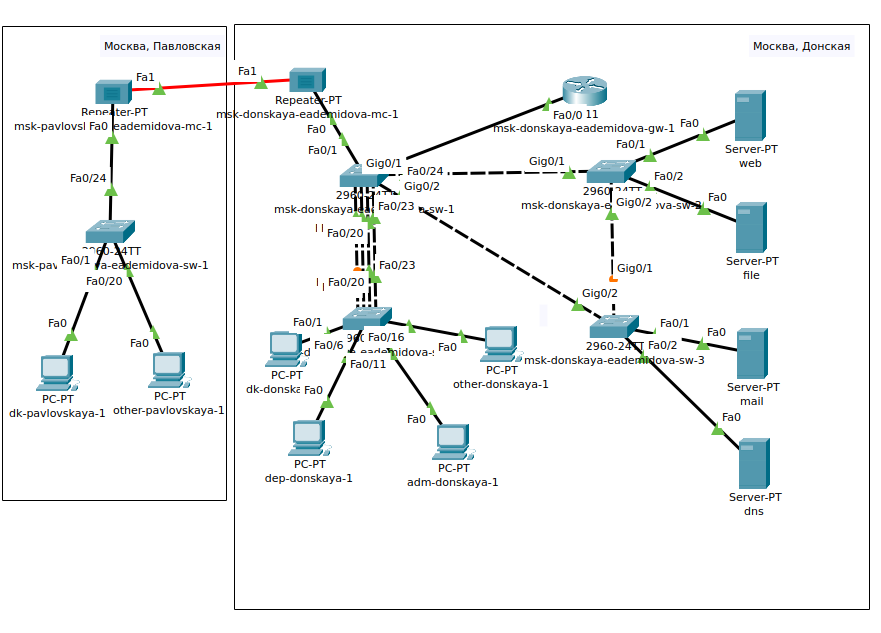{#fig:001 width=90%}

В рабочей области проекта подключим ноутбук администратора с именем admin к сети к other-donskaya-1 с тем, чтобы разрешить ему потом любые действия, связанные с управлением сетью. Для этого подсоединим ноутбук к порту 24 коммутатора msk-donskaya-eademidova-sw-4 и присвоим ему статический адрес 10.128.6.200, указав в качестве gateway-адреса 10.128.6.1 и адреса DNS-сервера 10.128.0.5 (рис. [-@fig:002]).

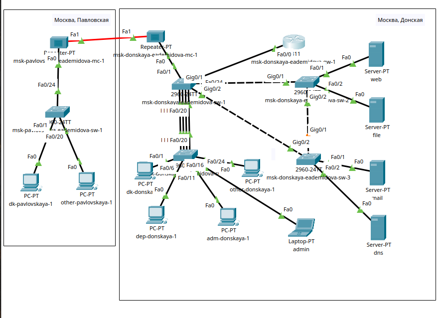{#fig:002 width=90%}

Права доступа пользователей сети будем настраивать на маршрутизаторе msk-donskaya-gw-1, поскольку именно через него проходит весь трафик сети. Ограничения можно накладывать как на входящий (in), так и на исходящий (out) трафик. По отношению к маршрутизатору накладываемые ограничения будут касаться в основном исходящего трафика. 

Следует помнить, что на оборудовании Cisco правила в списке доступа проверяются по порядку сверху вниз до первого совпадения -- как только одно из правил сработало, проверка списка правил прекращается и обработка трафика происходит на основе сработавшего правила. Поэтому рекомендуется сначала дать разрешение (permit) на какое-то действие, а уже потом накладывать ограничения (deny). Кроме того, после всех правил в конце дописывается неявное запрещение на всё, что не разрешено: deny ip any any (implicit deny).

1. Настроим доступа к web-серверу по порту tcp 80:

```
msk−donskaya−gw−1# configure terminal
msk−donskaya−gw−1(config )#ip access −list extended servers −out
msk−donskaya−gw−1(config−ext−nacl)#remark web
msk−donskaya−gw−1(config−ext−nacl)#permit tcp any host 10.128.0.2 eq 80
```

Создан список контроля доступа с названием servers-out (так как предполагается ограничить доступ в конкретные подсети и по отношению к маршрутизатору это будет исходящий трафик); указано (в качестве комментария-напоминания remark web), что ограничения предназначены для работы с web-сервером; дано разрешение доступа (permit) по протоколу TCP всем (any) пользователям сети (host) на доступ к web-серверу, имеющему адрес 10.128.0.2, через порт 80.

2. Добавим список управления доступом к интерфейсу. 

```
msk−donskaya−gw−1# configure terminal
msk−donskaya−gw−1(config )# interface f0 /0.3
msk−donskaya−gw−1(config−subif)# ip access−group servers−out out
```

Здесь: к интерфейсу f0/0.3 подключается список прав доступа servers-out и применяется к исходящему трафику (out).

Можно проверить, что доступ к web-серверу есть через протокол HTTP (введя в строке браузера хоста ip-адрес web-сервера)(рис. [-@fig:003]).

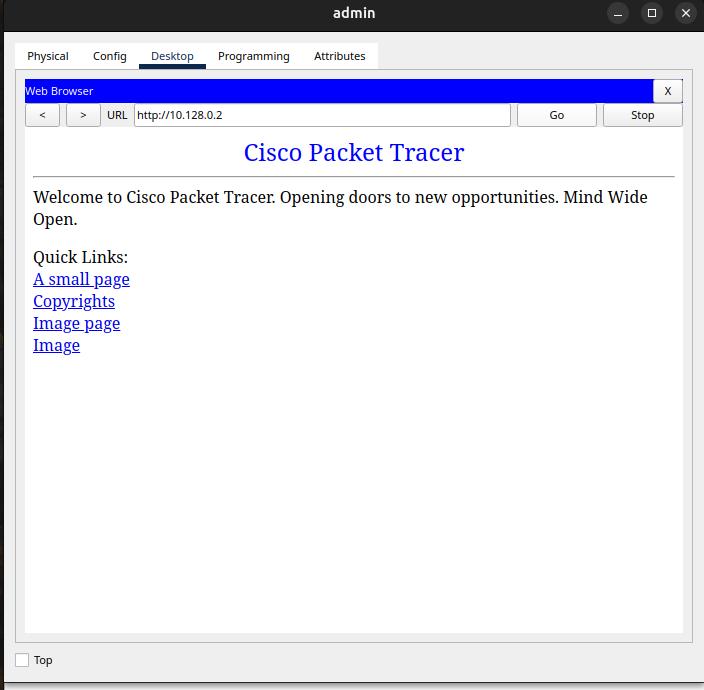{#fig:003 width=90%}

При этом команда ping будет демонстрировать недоступность web-сервера как по имени, так и по ip-адресу web-сервера(рис. [-@fig:004]).

{#fig:004 width=90%}

3. Дополнительный доступ для администратора по протоколам Telnet и FTP:

```
msk−donskaya−gw−1# configure terminal
msk−donskaya−gw−1(config)# ip access−list extended servers−out
msk−donskaya−gw−1(config−ext−nacl)# permit tcp host 10.128.6.200 host
                     10.128.0.2 range 20 ftp
msk−donskaya−gw−1(config−ext−nacl)#permit tcp host 10.128.6.200 host
                     10.128.0.2 eq telnet
```

В список контроля доступа servers-out добавлено правило, разрешающее устройству администратора с ip-адресом 10.128.6.200 доступ на web-сервер (10.128.0.2) по протоколам FTP и telnet.

Убедимся, что с узла с ip-адресом 10.128.6.200 есть доступ по протоколу FTP. Для этого в командной строке устройства администратора введем ftp 10.128.0.2, а затем по запросу имя пользователя cisco и пароль cisco(рис. [-@fig:005]):

{#fig:005 width=90%}

Попробуем провести аналогичную процедуру с другого устройства сети. Убедитмся, что доступ будет запрещён(рис. [-@fig:006]).

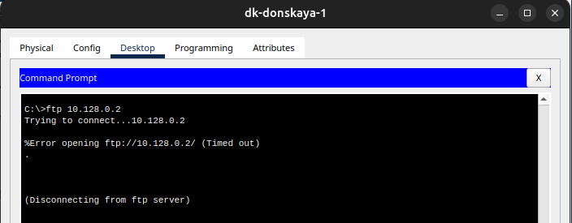{#fig:006 width=90%}


4. Настройка доступа к файловому серверу:

```
msk−donskaya−gw−1# configure terminal
msk−donskaya−gw−1(config )#ip access−list extended servers−out
msk−donskaya−gw−1(config−ext−nacl)#remark file
msk−donskaya−gw−1(config−ext−nacl)#permit tcp 10.128.0.0 0.0.255.255
                                  host 10.128.0.3 eq 445
msk−donskaya−gw−1(config−ext−nacl)#permit tcp any host 10.128.0.3 
                                  range 20 ftp
```

В списке контроля доступа servers-out указано (в качестве комментария-напоминания remark file), что следующие ограничения предназначены для работы с file-сервером; всем узлам внутренней сети (10.128.0.0) разрешён доступ по протоколу SMB (работает через порт 445 протокола TCP) к каталогам общего пользования; любым узлам разрешён доступ к file-серверу по протоколу FTP. Запись 0.0.255.255 — обратная маска (wildcard mask).

5. Настройка доступа к почтовому серверу:

```
msk−donskaya−gw−1# configure terminal
msk−donskaya−gw−1(config )#ip access−list extended servers−out
msk−donskaya−gw−1(config−ext−nacl)#remark mail
msk−donskaya−gw−1(config−ext−nacl)#permit tcp any host 10.128.0.4 eq smtp
msk−donskaya−gw−1(config−ext−nacl)#permit tcp any host 10.128.0.4 eq pop3
```

Здесь: в списке контроля доступа servers-out указано (в качестве комментария-напоминания remark mail), что следующие ограничения предназначены для работы с почтовым сервером; всем разрешён доступ к почтовому серверу по протоколам POP3 и SMTP.

6. Настройка доступа к DNS-серверу:

```
msk−donskaya−gw−1# configure terminal
msk−donskaya−gw−1(config )#ip access−list extended servers−out
msk−donskaya−gw−1(config−ext−nacl)#remark dns
msk−donskaya−gw−1(config−ext−nacl)#permit udp 10.128.0.0 0.0.255.255
                               host 10.128.0.5 eq 53
```

Здесь: в списке контроля доступа servers-out указано (в качестве комментария-напоминания remark dns), что следующие ограничения пред- назначены для работы с DNS-сервером; всем узлам внутренней сети разрешён доступ к DNS-серверу через UDP-порт 53.

Проверим правильность всех введённых прав доступа(рис. [-@fig:007]).

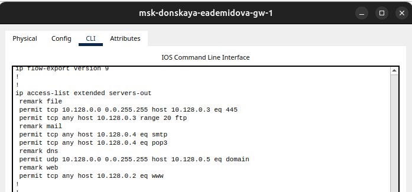{#fig:007 width=90%}

Проверм доступность web-сервера (через браузер) не только по ip-адресу, но и по имени(рис. [-@fig:008], [-@fig:009]):

{#fig:008 width=90%}

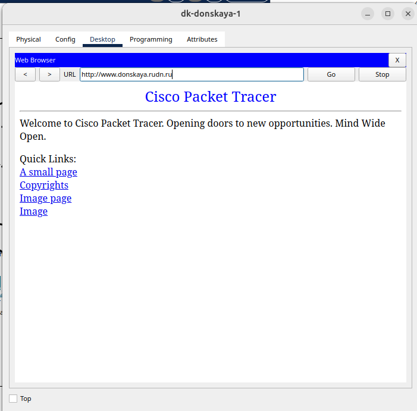{#fig:009 width=90%}

7. Разрешение icmp-запросов:
```
msk−donskaya−gw−1# configure terminal
msk−donskaya−gw−1(config)#ip access−list extended servers−out
msk−donskaya−gw−1(config−ext−nacl)#1 permit icmp any any
```

Здесь демонстрируется явное управление порядком размещения правил — правило разрешения для icmp-запросов добавляется в начало списка контроля доступа. Номера строк правил в списке контроля доступа можно посмотреть(рис. [-@fig:010]).

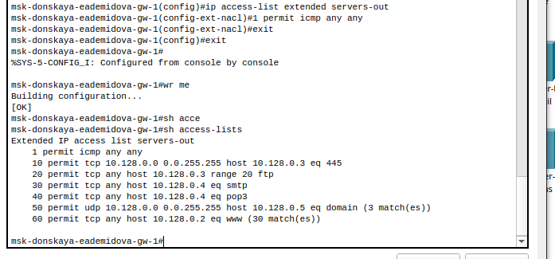{#fig:010 width=90%}

8. Настройка доступа для сети Other (требуется наложить ограничение на исходящий из сети Other трафик, который по отношению к маршрутизатору msk-donskaya-eademidova-gw-1 является входящим трафиком)(рис. [-@fig:011]).

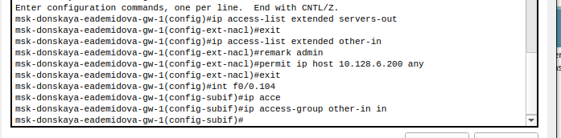{#fig:011 width=90%}

Здесь: в списке контроля доступа other-in указано, что следующие правила относятся к администратору сети; даётся разрешение устройству с адресом 0.128.6.200 на любые действия (any); к интерфейсу f0/0.104 подключается список прав доступа other-in и применяется к входящему трафику (in).

9. Настройка доступа администратора к сети сетевого оборудования(рис. [-@fig:012]).

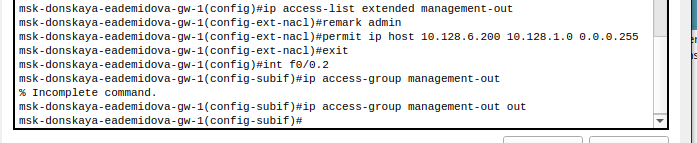{#fig:012 width=90%}

Здесь: в списке контроля доступа management-out указано (в качестве комментария-напоминания remark admin), что устройству администратора с адресом 10.128.6.200 разрешён доступ к сети сетевого оборудования (10.128.1.0); к интерфейсу f0/0.2 подключается список прав доступа management-out и применяется к исходящему трафику (out).

## Самостоятельная работа


Проверим доступность устройств с помощью команды `ping`. С устройства dep-donskaya-1 пингуются серверы и другие оконечные устройства, однако доступ к сетевому оборудованию запрещен, а также нет доступа по `ftp`(рис. [-@fig:013], [-@fig:014]).

{#fig:013 width=90%}

{#fig:014 width=90%}

С устройства администратора есть доступ ко всем устройствам сети по icmp-запросам, а также есть доступ к web-серверу по `ftp`(рис. [-@fig:015], [-@fig:016]).

{#fig:015 width=90%}

{#fig:016 width=90%}

Разрешим администратору из сети Other на Павловской действия, аналогичные действиям администратора сети Other на Донской. А именно дадим дополнительный  доступ для администратора по протоколам Telnet и FTP, настроим доступ для сети Other и настроим доступ к сети сетевого оборудования(рис. [-@fig:017], [-@fig:018]).

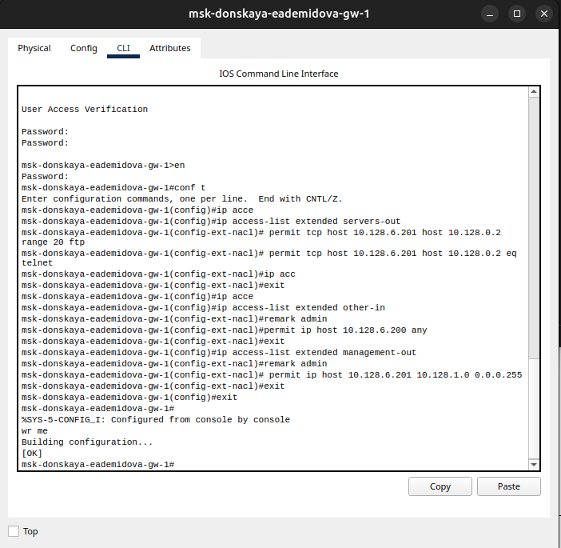{#fig:017 width=90%}

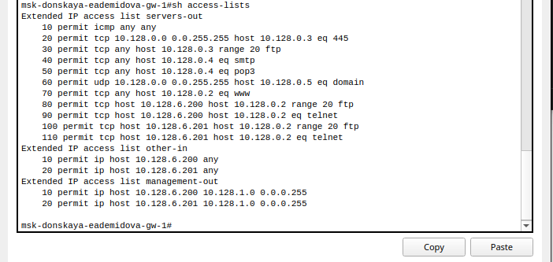{#fig:018 width=90%}

Проверим корректность внесенных прав доступа(рис. [-@fig:019]).

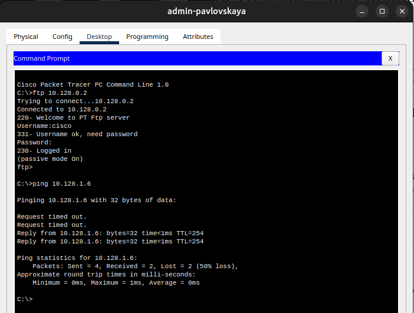{#fig:019 width=90%}

## Контрольные вопросы

1. Как задать действие правила для конкретного протокола?

Указать протокол в конце записи команды permit. Примеры:

```
permit tcp any host 10.128.0.3 range 20 ftp

permit tcp any host 10.128.0.4 eq smtp
```

2. Как задать действие правила сразу для нескольких портов?

Нужно использовать команду `interface range` и порты через дефис.

3. Как узнать номер правила в списке прав доступа?

С помощью команды `show access-lists`.

4. Каким образом можно изменить порядок применения правил в списке
контроля доступа?

Необходимо указать права доступа с номерами в нужном порядке, используя команду `access-list <Номер в списке> permit`.

# Выводы

В результате выполнения лабораторной работы освоили настройку прав доступа пользователей к ресурсам сети.
