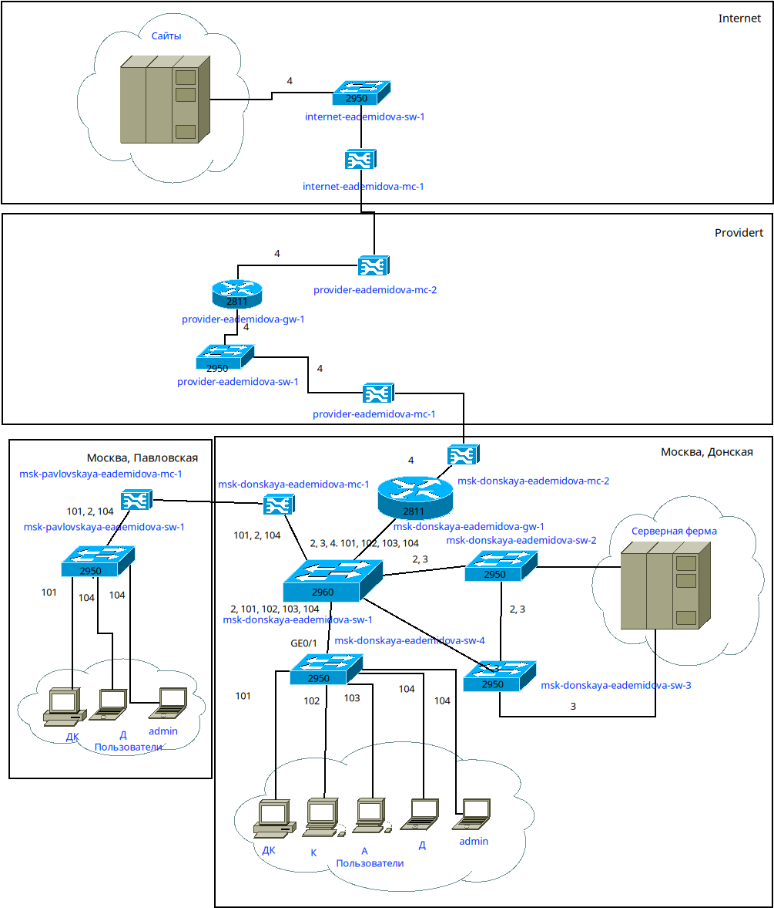
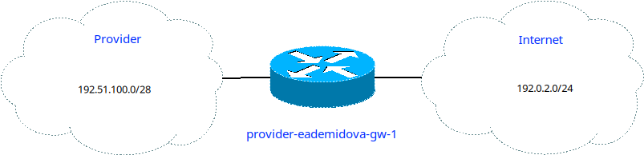
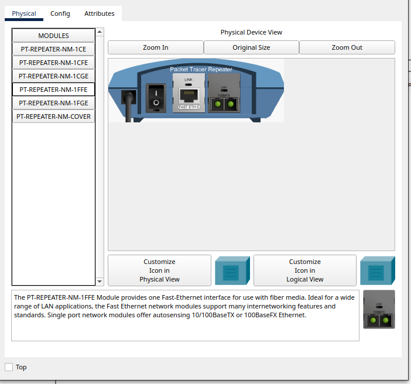
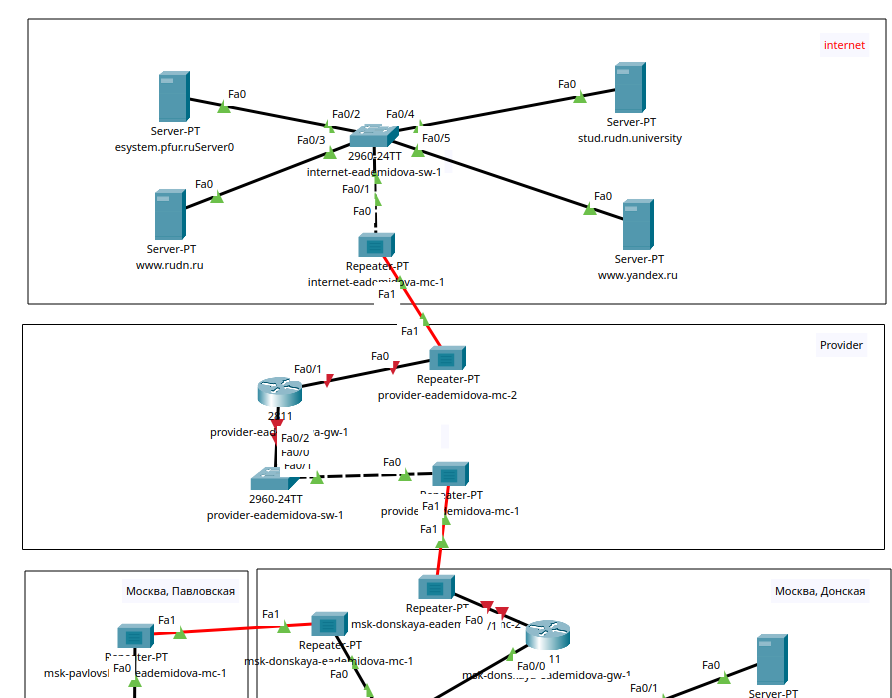
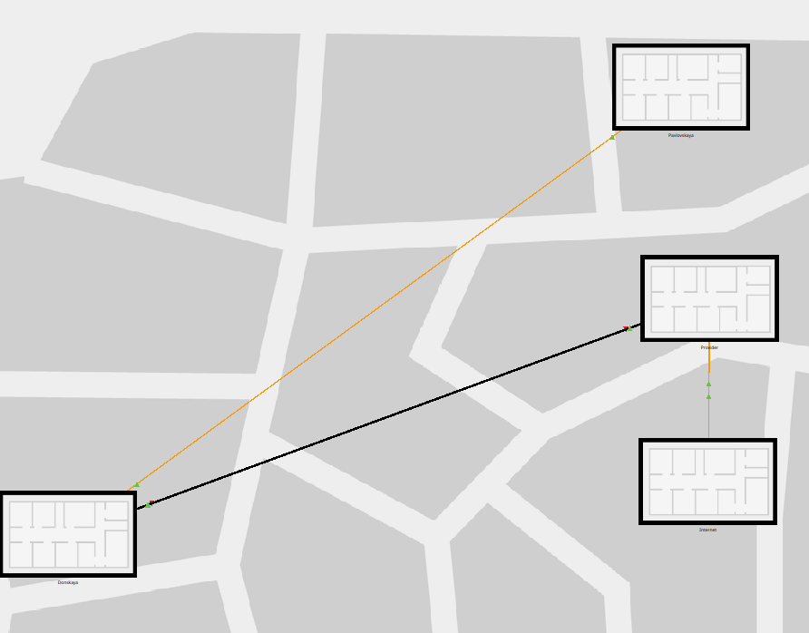
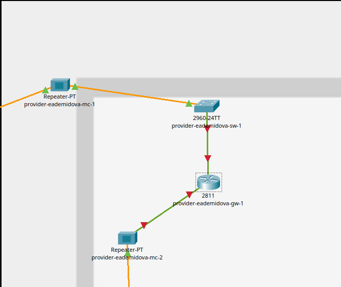
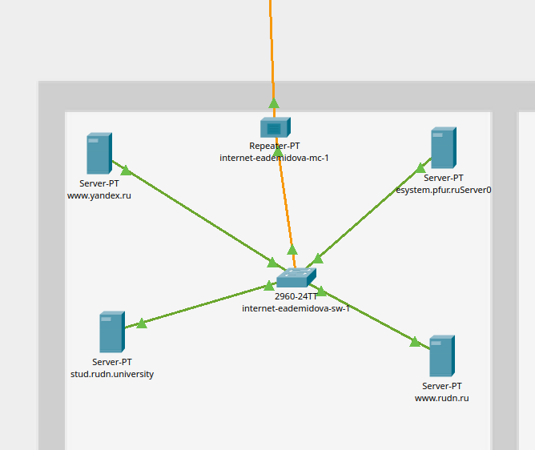
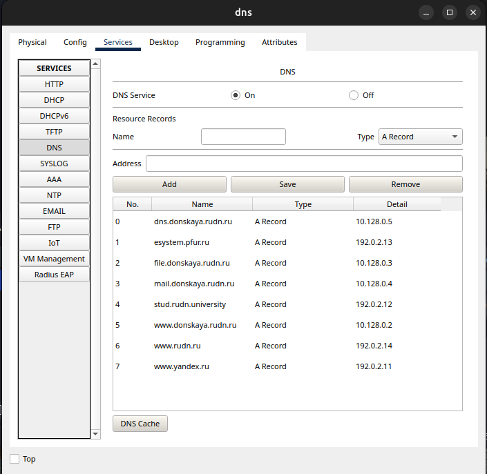

---
## Front matter
lang: ru-RU
title: Лабораторная работа № 11
subtitle: Настройка NAT. Планирование
author:
  - Демидова Е. А.
institute:
  - Российский университет дружбы народов, Москва, Россия
date: 27 апреля 2024

## i18n babel
babel-lang: russian
babel-otherlangs: english

## Formatting pdf
toc: false
toc-title: Содержание
slide_level: 2
aspectratio: 169
section-titles: true
theme: metropolis
header-includes:
 - \metroset{progressbar=frametitle,sectionpage=progressbar,numbering=fraction}
 - '\makeatletter'
 - '\beamer@ignorenonframefalse'
 - '\makeatother'
---

# Вводная часть

## Цели и задачи

**Цели**

Провести подготовительные мероприятия по подключению локальной сети организации к Интернету.

**Задачи**

1. Построить схему подсоединения локальной сети к Интернету.
2. Построить модельные сети провайдера и сети Интернет.
3. Построить схемы сетей L1, L2, L3.

# Выполнение лабораторной работы

## Схема сети

{#fig:001 width=40%}

## Схема сети

{#fig:003 width=40%}

## Схема сети

{#fig:002 width=90%}

## Схема сети

{#fig:004 width=50%}

## Схема сети

{#fig:005 width=50%}

## Схема сети

{#fig:006 width=50%}

## Схема сети

{#fig:007 width=60%}

## Схема сети

{#fig:008 width=60%}

## Добавление DNS-записей

: Распределение ip-адресов модельного Интернета {#tbl:ip}

| IP-адреса     | Примечание            |
|---------------|-----------------------|
| 192.0.2.1     | provider-gw-1         |
| 192.0.2.11    | www.yandex.ru         |
| 192.0.2.12    | stud.rudn.university  |
| 192.0.2.13    | esystem.pfur.ru       |
| 192.0.2.14    | www.rudn.ru           |

## Добавление DNS-записей

{#fig:009 width=50%}

# Выводы

В результате выполнения лабораторной работы провели подготовительные мероприятия по подключению локальной сети организации к Интернету.