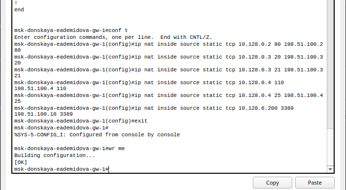

---
## Front matter
lang: ru-RU
title: Лабораторная работа № 12
subtitle: Настройка NAT
author:
  - Демидова Е. А.
institute:
  - Российский университет дружбы народов, Москва, Россия
date: 27 апреля 2024

## i18n babel
babel-lang: russian
babel-otherlangs: english

## Formatting pdf
toc: false
toc-title: Содержание
slide_level: 2
aspectratio: 169
section-titles: true
theme: metropolis
header-includes:
 - \metroset{progressbar=frametitle,sectionpage=progressbar,numbering=fraction}
 - '\makeatletter'
 - '\beamer@ignorenonframefalse'
 - '\makeatother'
---

# Вводная часть

# Цели и задачи

## Цели

Приобретение практических навыков по настройке доступа локальной сети к внешней сети посредством NAT.

## Задачи

1. Сделать первоначальную настройку маршрутизатора provider-gw-1 и коммутатора provider-sw-1 провайдера: задать имя, настроить доступ по паролю и т.п.
2. Настроить интерфейсы маршрутизатора provider-gw-1 и коммутатора provider-sw-1 провайдера: 
3. Настроить интерфейсы маршрутизатора сети «Донская» для доступа к сети провайдера.
4. Настроить на маршрутизаторе сети «Донская» NAT с правилами, указанными в разделе 12.2.
5. Настроить доступ из внешней сети в локальную сеть организации, как указано в разделе 12.2.
6. Проверить работоспособность заданных настроек.

# Выполнение лабораторной работы

## Настройка NAT

{#fig:001 width=50%}

## Настройка NAT

{#fig:003 width=50%}

## Настройка NAT

{#fig:002 width=42%}

## Настройка NAT

{#fig:004 width=42%}

## Настройка NAT

{#fig:005 width=45%}

## Проверка NAT

{#fig:006 width=90%}

## Проверка NAT

{#fig:007 width=90%}

## Настройка NAT

{#fig:008 width=90%}

## Настройка NAT

{#fig:009 width=90%}

## Настройка NAT

{#fig:010 width=90%}

## Настройка NAT

{#fig:011 width=90%}

## Настройка NAT

{#fig:012 width=90%}

## Проверка NAT

{#fig:013 width=70%}

## Проверка NAT

{#fig:014 width=70%}

## Проверка NAT

{#fig:015 width=70%}

## Проверка NAT

{#fig:016 width=70%}

## Проверка NAT

{#fig:017 width=45%}

## Проверка NAT

{#fig:018 width=90%}

# Выводы

В результате выполнения лабораторной были приобретены практические навыки по настройке доступа локальной сети к внешней сети посредством NAT.