---
## Front matter
title: "Лабораторная работа № 12"
subtitle: "Настройка NAT"
author: "Демидова Екатерина Алексеевна"

## Generic otions
lang: ru-RU
toc-title: "Содержание"

## Bibliography
bibliography: bib/cite.bib
csl: pandoc/csl/gost-r-7-0-5-2008-numeric.csl

## Pdf output format
toc: true # Table of contents
toc-depth: 2
lof: true # List of figures
lot: true # List of tables
fontsize: 12pt
linestretch: 1.5
papersize: a4
documentclass: scrreprt
## I18n polyglossia
polyglossia-lang:
  name: russian
  options:
	- spelling=modern
	- babelshorthands=true
polyglossia-otherlangs:
  name: english
## I18n babel
babel-lang: russian
babel-otherlangs: english
## Fonts
mainfont: PT Serif
romanfont: PT Serif
sansfont: PT Sans
monofont: PT Mono
mainfontoptions: Ligatures=TeX
romanfontoptions: Ligatures=TeX
sansfontoptions: Ligatures=TeX,Scale=MatchLowercase
monofontoptions: Scale=MatchLowercase,Scale=0.9
## Biblatex
biblatex: true
biblio-style: "gost-numeric"
biblatexoptions:
  - parentracker=true
  - backend=biber
  - hyperref=auto
  - language=auto
  - autolang=other*
  - citestyle=gost-numeric
## Pandoc-crossref LaTeX customization
figureTitle: "Рис."
tableTitle: "Таблица"
listingTitle: "Листинг"
lofTitle: "Список иллюстраций"
lotTitle: "Список таблиц"
lolTitle: "Листинги"
## Misc options
indent: true
header-includes:
  - \usepackage{indentfirst}
  - \usepackage{float} # keep figures where there are in the text
  - \floatplacement{figure}{H} # keep figures where there are in the text
---

# Цель работы

Приобретение практических навыков по настройке доступа локальной сети к внешней сети посредством NAT.

# Задание

Требуется подключить локальную сеть организации к сети Интернет с учётом ограничений, накладываемых на определённые подсети локальной сети:

1) сеть управления устройствами не должна иметь доступ в Интернет;
2) оконечные устройства сети дисплейных классов должны иметь доступ только к сайтам, необходимым для учёбы (в данном случае к www.yandex.ru, stud.rudn.university);
3) пользователям из сети кафедр разрешено работать только с образовательными сайтами (в данном случае это esystem.pfur.ru);
4) пользователям сети администрации разрешено работать только с сайтом университета www.rudn.ru;
5) в сети для других пользователей компьютер администратора должен иметь полный доступ во внешнюю сеть, а другие пользователи -- не должны выходить в Интернет;
6) ограничения для серверов:
- WEB-сервер должен быть доступен по порту 80;
- почтовый сервер должен быть доступен по портам 25 и 110;
- файловый сервер должен быть доступен извне по портам протокола FTP;
7) компьютер администратора должен быть доступен из внешней сети по протоколу удалённого рабочего стола (Remote Desktop Protocol, RDP).

**Задание**

1. Сделать первоначальную настройку маршрутизатора provider-gw-1 и коммутатора provider-sw-1 провайдера: задать имя, настроить доступ по паролю и т.п.
2. Настроить интерфейсы маршрутизатора provider-gw-1 и коммутатора provider-sw-1 провайдера: 
3. Настроить интерфейсы маршрутизатора сети «Донская» для доступа к сети провайдера.
4. Настроить на маршрутизаторе сети «Донская» NAT с правилами, указанными в разделе 12.2.
5. Настроить доступ из внешней сети в локальную сеть организации, как указано в разделе 12.2.
6. Проверить работоспособность заданных настроек.

# Выполнение лабораторной работы

Проведем первоначальную настройку маршрутизатора provider-eademidova-gw-1: зададим имя, настроим доступ по паролю к виртуальным терминалам(рис. [-@fig:001]).

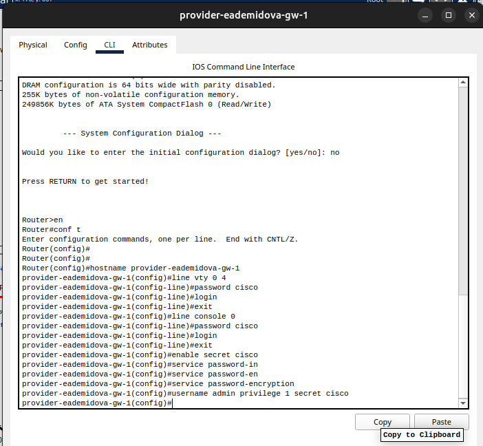{#fig:001 width=90%}

Затем сделаем то же самое для коммутатора provider-eademidova-sw-1(рис. [-@fig:002]):

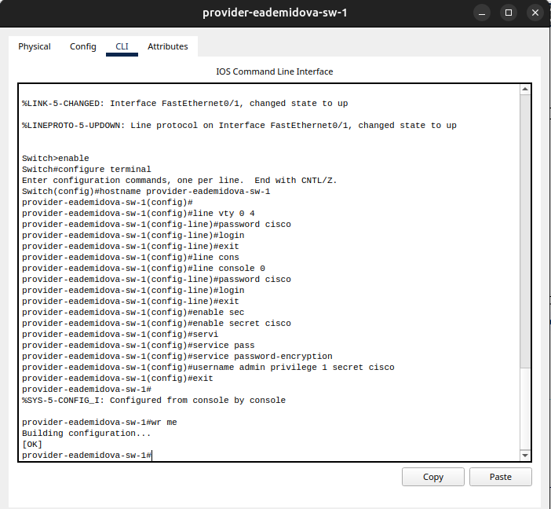{#fig:003 width=90%}

Настроим интерфейсы маршрутизатора provider-eademidova-gw-1: поднимем интерфейс f0/0, создадим интерфейс f0/0.4 для 4 vlan и зададим ip-адрес, поднимем интерфейс f0/1 для доступа в интернет(рис. [-@fig:003]).

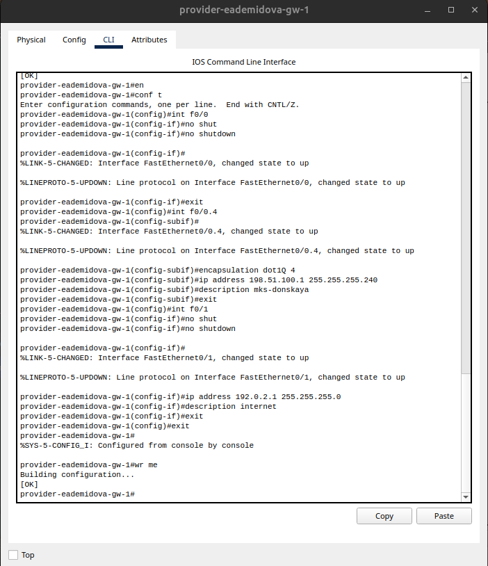{#fig:002 width=90%}

Настроим интерфейсы коммутатора provider-eademidova-gw-1: сделаем транковыми порты f0/1  и f0/2, зададим 4 vlan с именем nat(рис. [-@fig:004]).

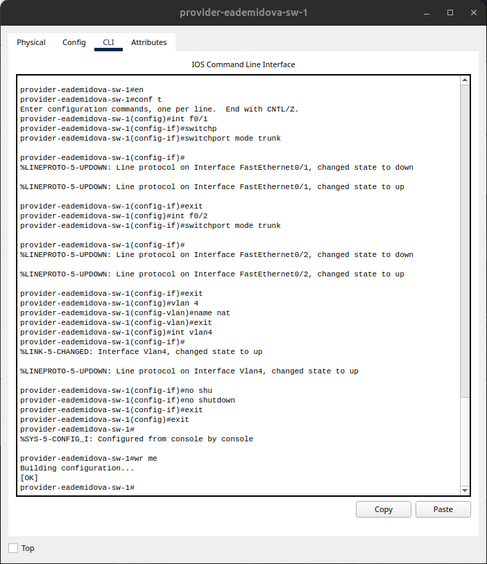{#fig:004 width=90%}

Настроим интерфейсы маршрутизатора msk-donskaya-eademidova-gw-1: поднимем интерфейс f0/1, создадим интерфейс f0/1.4 для 4 vlan и зададим ip-адрес(рис. [-@fig:005]):

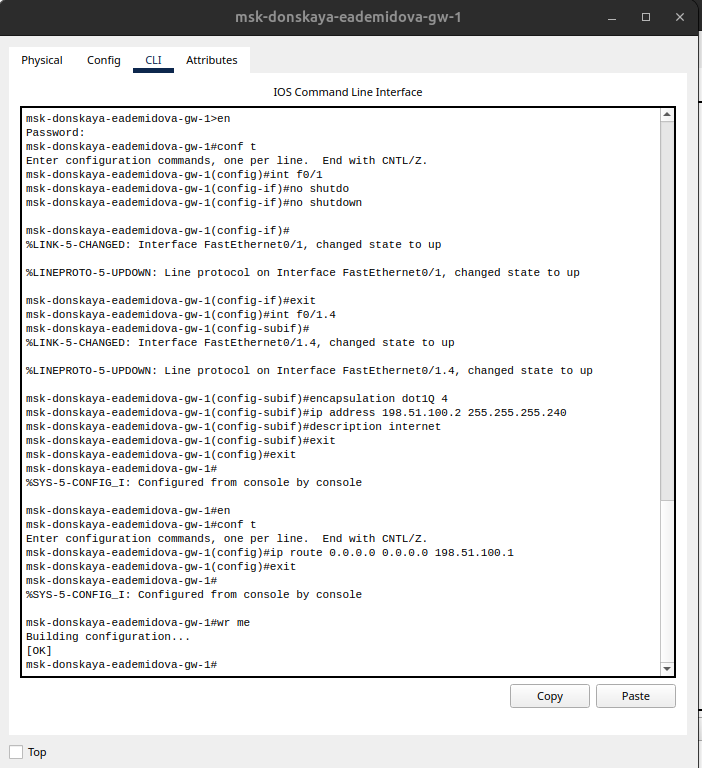{#fig:005 width=90%}

Проверим доступ с маршрутизатора на Донской к маршрутизатору провайдера(рис. [-@fig:006]).

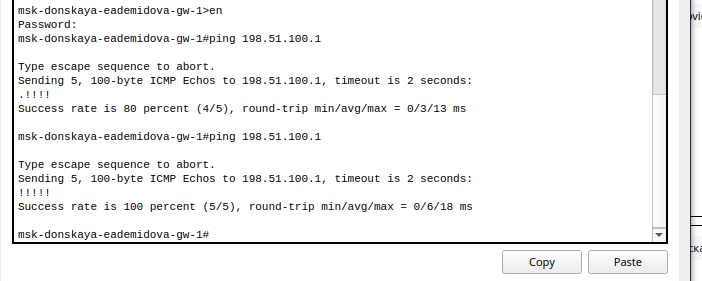{#fig:006 width=90%}

А также доступ с серверов интернете на маршрутизатор провайдера(рис. [-@fig:007]).

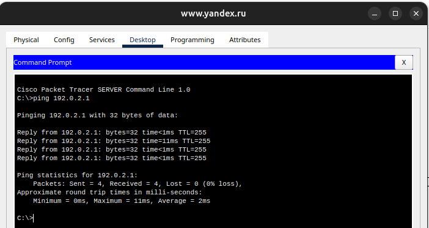{#fig:007 width=90%}

Настроим пул адресов 198.51.100.2 -- 198.51.100.14 для NAT(рис. [-@fig:008]).

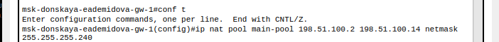{#fig:008 width=90%}

Теперь настроим список доступа к nat на всех подсетях для пользователей(рис. [-@fig:009]):

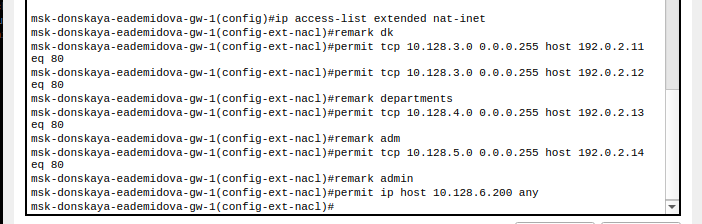{#fig:009 width=90%}

Настроим Port Address Translation (PAT) на субинтерфейсах маршрутизатора с территории Донская (рис. [-@fig:010]):

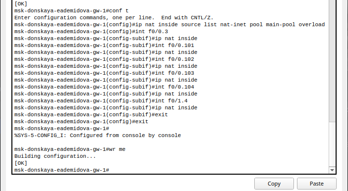{#fig:010 width=90%}

Настроим доступа из Интернета. Для этого добавим компьютер на территории Интернета(рис. [-@fig:011]):

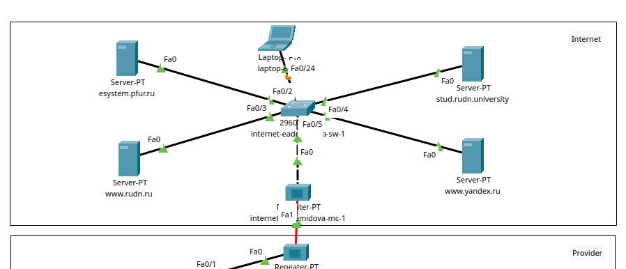{#fig:011 width=90%}

Затем свяжем ip-адреса серверов с территории Донская с ip-адресами серверов в Интернете(рис. [-@fig:012]):

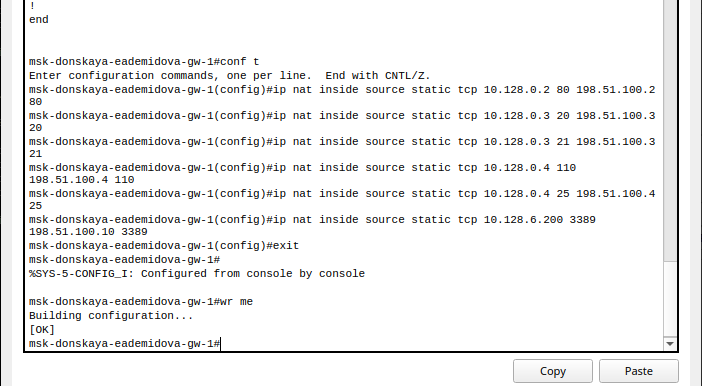{#fig:012 width=90%}

Проверим доступ к необходимым интернет-ресурсам конечных устройств сети. Убедимся, что устройствам доступны и недоступны заданные нами сайты(рис. [-@fig:013] - [-@fig:016]).

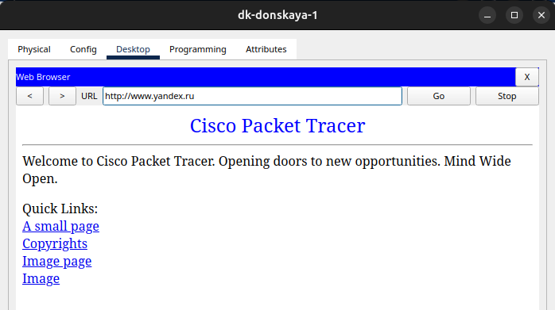{#fig:013 width=90%}

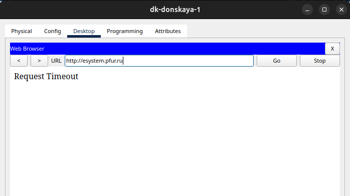{#fig:014 width=90%}

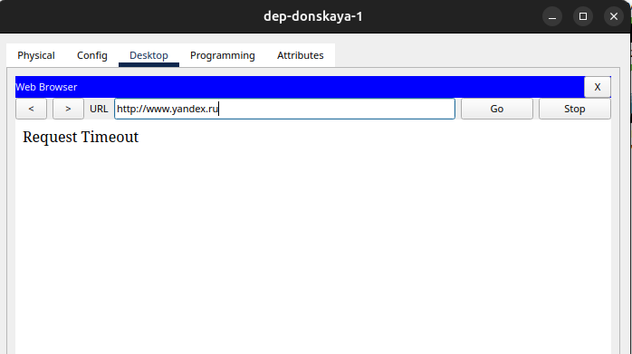{#fig:015 width=90%}

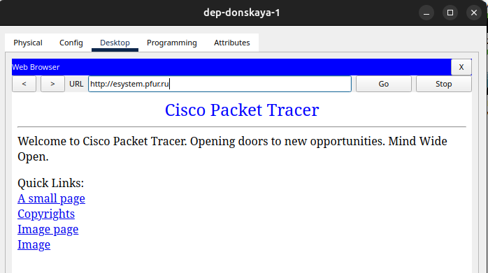{#fig:016 width=90%}

Также проверим работоспособность соединения из сети Интернет в сеть Донской к web-серверу и файловому серверу по ftp(рис. [-@fig:017], [-@fig:018]):

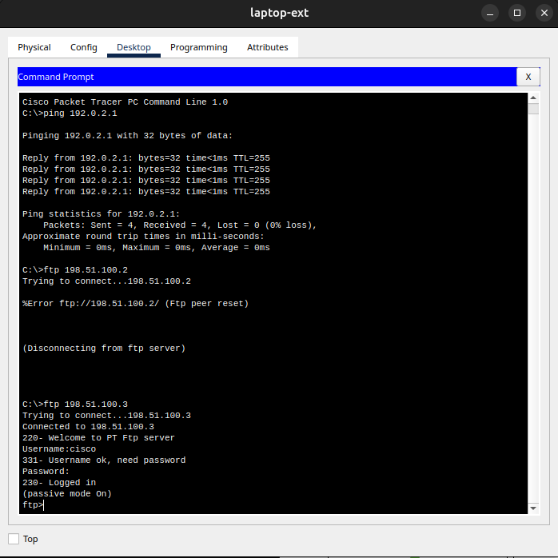{#fig:017 width=90%}

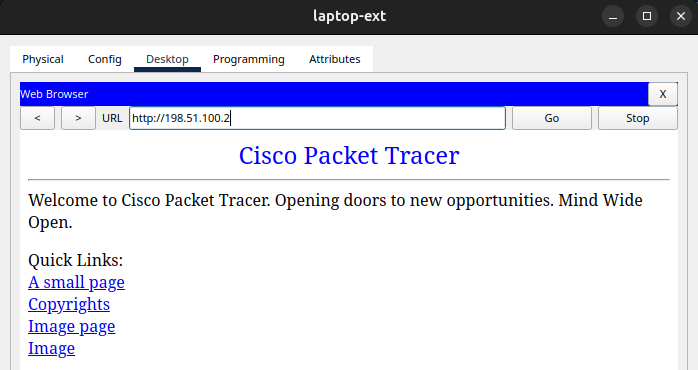{#fig:018 width=90%}

## Контрольные вопросы

1. В чём состоит основной принцип работы NAT (что даёт наличие NAT в сети
организации)?
2. В чём состоит принцип настройки NAT (на каком оборудовании и что
нужно настроить для из локальной сети во внешнюю сеть через NAT)?
3. Можно ли применить Cisco IOS NAT к субинтерфейсам?
4. Что такое пулы IP NAT?
5. Что такое статические преобразования NAT?

1. Основной принцип работы NAT (Network Address Translation) заключается в том, что он позволяет скрывать внутренние IP-адреса устройств в локальной сети за одним или несколькими публичными IP-адресами, которые используются для общения с внешними сетями, такими как Интернет. Наличие NAT в сети организации позволяет экономить публичные IP-адреса и повышать безопасность защитой внутренних устройств от прямого доступа извне.

2. Для настройки NAT на оборудовании (например, маршрутизаторе или межсетевом экране) необходимо определить правила преобразования адресов. Настройка NAT позволяет установить соответствие между внутренними и внешними IP-адресами, а также определить, какие порты и протоколы будут использоваться для коммуникации между внутренней и внешней сетями.

3. Да, Cisco IOS NAT можно применить к субинтерфейсам. Субинтерфейсы позволяют разделять один физический интерфейс на несколько логических интерфейсов, каждый из которых может иметь свои собственные настройки NAT.

4. Пулы IP NAT представляют собой диапазон публичных IP-адресов, которые используются для преобразования внутренних адресов при прохождении трафика через устройство NAT. Пулы IP NAT могут быть динамическими (когда каждое внутреннее устройство получает временный доступ к одному из публичных адресов из пула) или статическими (когда определенное внутреннее устройство всегда связано с определенным публичным адресом).

5. Статические преобразования NAT (Static NAT) — это метод, при котором определенный внутренний IP-адрес связывается с определенным публичным IP-адресом, и все запросы к этому внутреннему адресу направляются на соответствующий публичный адрес. Это позволяет установить постоянное соответствие между внутренним и внешним адресами для конкретных устройств в сети.

# Выводы

В результате выполнения лабораторной были приобретены практические навыки по настройке доступа локальной сети к внешней сети посредством NAT.