---
## Front matter
lang: ru-RU
title: Лабораторная работа № 13
subtitle: Статическая маршрутизация в Интернете. Планирование
author:
  - Демидова Е. А.
institute:
  - Российский университет дружбы народов, Москва, Россия
date: 27 апреля 2024

## i18n babel
babel-lang: russian
babel-otherlangs: english

## Formatting pdf
toc: false
toc-title: Содержание
slide_level: 2
aspectratio: 169
section-titles: true
theme: metropolis
header-includes:
 - \metroset{progressbar=frametitle,sectionpage=progressbar,numbering=fraction}
 - '\makeatletter'
 - '\beamer@ignorenonframefalse'
 - '\makeatother'
---

# Вводная часть

## Цели и задачи

**Цели**

Провести подготовительные мероприятия по организации взаимодействия через сеть провайдера посредством статической маршрутизации локальной сети с сетью основного здания, расположенного в 42-м квартале в Москве, и сетью филиала, расположенного в г. Сочи.

**Задачи**

1. Внести изменения в схемы L1, L2 и L3 сети, добавив в них информацию о сети основной территории (42-й квартал в Москве) и сети филиала в г. Сочи.
2. Дополнить схему проекта, добавив подсеть основной территории организации 42-го квартала в Москве и подсеть филиала в г. Сочи.
3. Сделать первоначальную настройку добавленного в проект оборудования.

# Выполнение лабораторной работы

## Планирование сети

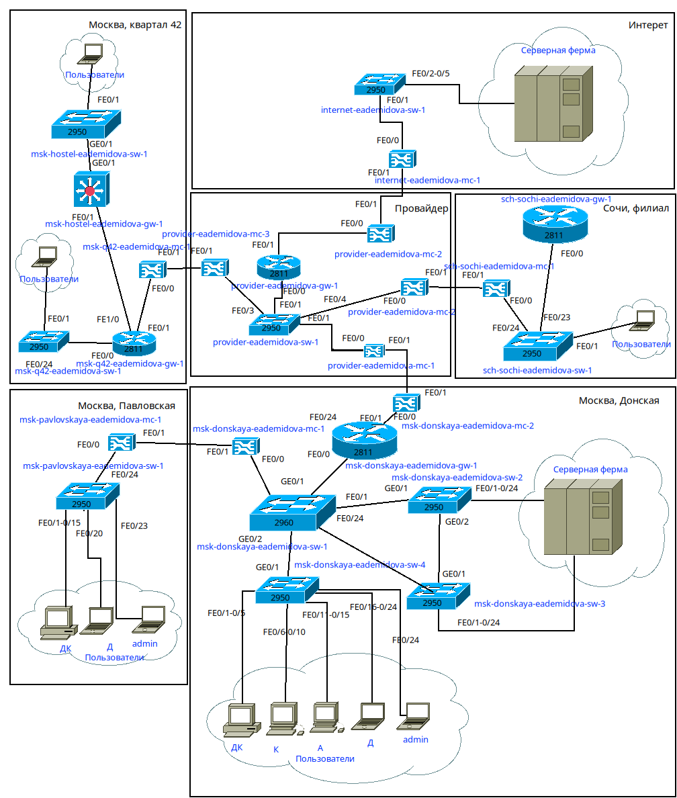{#fig:001 width=40%}

## Планирование сети

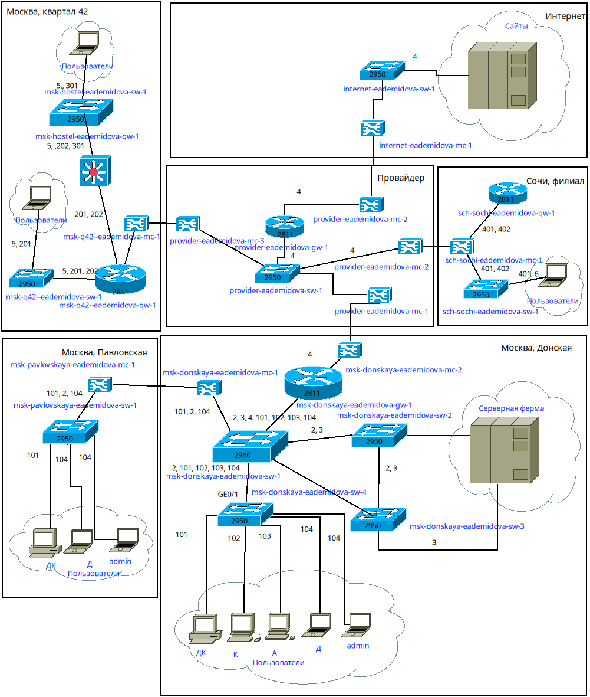{#fig:002 width=40%}

## Планирование сети

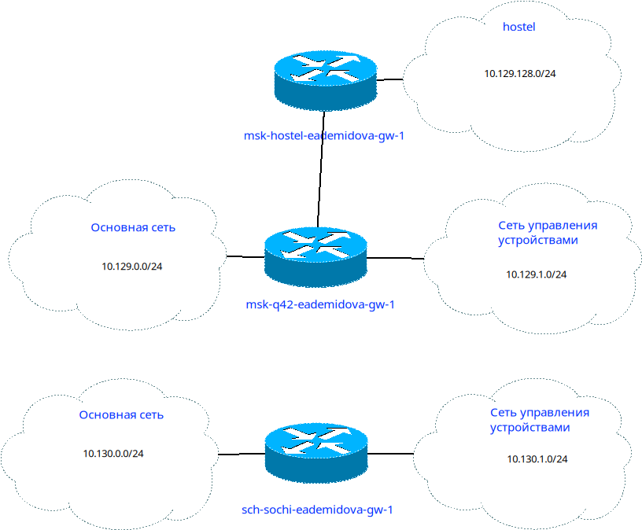{#fig:003 width=50%}

## Планирование сети

: Таблица VLAN 

| № VLAN       | Имя VLAN         | Примечание                                          |
|--------------|------------------|-----------------------------------------------------|
| 1            | default          | Не используется                                     |
| 2            | management       | Для управления устройствами                         |
| 3            | servers          | Для серверной фермы                                 |
| 4            | nat              | Зарезервировано                                     |
| 5            | q42              | Линк в сеть квартала 42 в Москве                    |
| 6            | sochi            | Линк в сеть филиала в Сочи                          |

## Планирование сети

: Таблица VLAN 

| № VLAN       | Имя VLAN         | Примечание                                          |
|--------------|------------------|-----------------------------------------------------|
| 101          | dk               | Дисплейные классы (ДК)                              |
| 102          | departments      | Кафедры                                             |
| 103          | adm              | Администрация                                       |
| 104          | other            | Для других пользователей                            |
| 201          | q42-main         | Основной для квартала 42 в Москве                   |
| 202          | q42-management   | Для управления устройствами 42-го квартала в Москве |
| 301          | hostel-main      | Основной для общежитий в квартале 42 в Москве       |
| 401          | sochi-main       | Основной для филиала в Сочи                         |
| 402          | sochi-management | Для управления устройствами в филиала в Сочи        |

## Планирование сети

: Таблица IP для филиала в г. Сочи 

| IP-адреса                        | Примечание                              | VLAN |
|----------------------------------|-----------------------------------------|------|
| 10.130.0.0/16                    | Вся сеть филиала в Сочи                 |      |
| 10.130.0.0/24                    | Основная сеть филиала в Сочи            | 401  |
| 10.130.0.1                       | sch-sochi-gw-1                          |      |
| 10.130.0.200                     | pc-sochi-1                              |      |
| 10.130.1.0/24                    | Сеть для управления устройствами в Сочи | 402  |
| 10.130.1.1                       | sch-sochi-gw-1                          |      |

## Планирование сети

: Таблица IP для связующих разные территории линков {#tbl:iplink}
                                                             
| IP-адреса                                         | Примечание                                                   | VLAN |
|---------------------------------------------------|--------------------------------------------------------------|------|
| 10.128.255.0/24                                   | Вся сеть для линков                                          |      |
| 10.128.255.0/30                                   | Линк на 42-й квартал                                         | 5    |
| 10.128.255.1                                      | msk-donskaya-gw-1                                            |      |
| 10.128.255.2                                      | msk-q42-gw-1                                                 |      |
| 10.128.255.4/30                                   | Линк в Сочи 6                                                | 6    |
| 10.128.255.5                                      | msk-donskaya-gw-1                                            |      |
| 10.128.255.6                                      | sch-sochi-gw-1                                               |      |

## Планирование сети

: Таблица IP для связующих разные территории линков {#tbl:iplink}
                                                             
| IP-адреса                                         | Примечание                                                   | VLAN |
|---------------------------------------------------|--------------------------------------------------------------|------|
| 10.129.0.0/16                                     | Вся сеть квартала 42 в Москве                                |      |
| 10.129.0.0/24                                     | Основная сеть квартала 42 в Москве                           | 201  |
| 10.129.0.1                                        | msk-q42-gw-1                                                 |      |
| 10.129.0.200                                      | pc-q42-1                                                     |      |
| 10.129.1.0/24                                     | Сеть для управления устройствами в сети квартала 42 в Москве | 202  |
| 10.129.1.1                                        | msk-q42-gw-1                                                 |      |
| 10.129.1.2                                        | msk-hostel-gw-1                                              |      |
| 10.129.128.0/17                                   | Вся сеть hostel                                              |      |
| 10.129.128.0/24                                   | Основная сеть hostel                                         | 301  |
| 10.129.128.1                                      | msk-hostel-gw-1                                              |      |
| 10.129.128.200                                    | pc-hostel-1                                                  |      |

## Первоначальная настройка оборудования

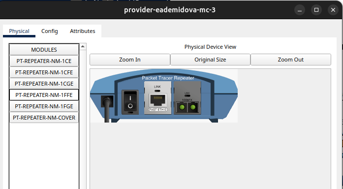{#fig:004 width=90%}

## Первоначальная настройка оборудования

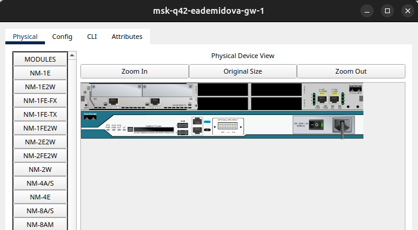{#fig:005 width=90%}

## Первоначальная настройка оборудования

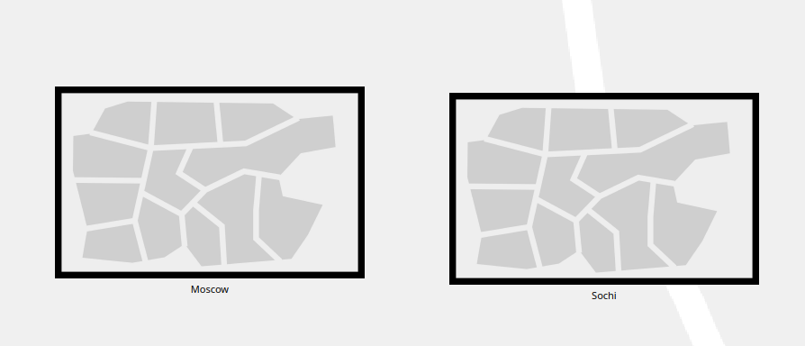{#fig:006 width=90%}

## Первоначальная настройка оборудования

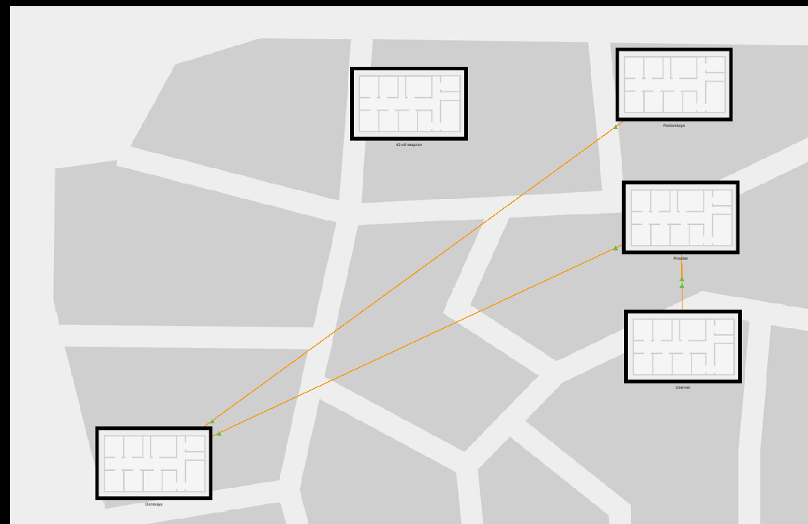{#fig:007 width=50%}

## Первоначальная настройка оборудования

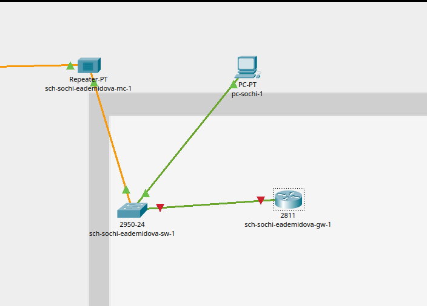{#fig:008 width=50%}

## Первоначальная настройка оборудования

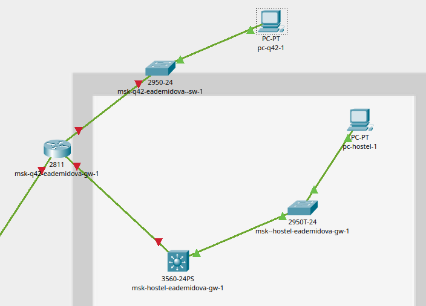{#fig:009 width=50%}

## Первоначальная настройка оборудования

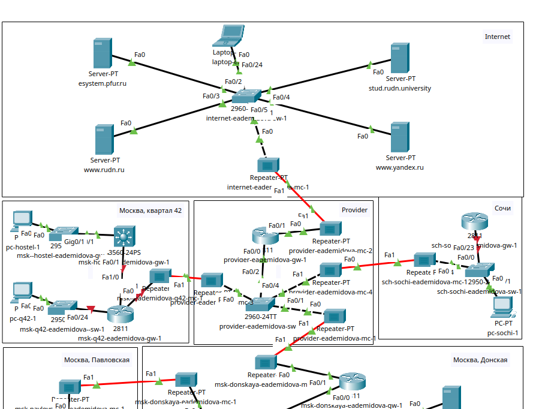{#fig:010 width=50%}

## Первоначальная настройка оборудования

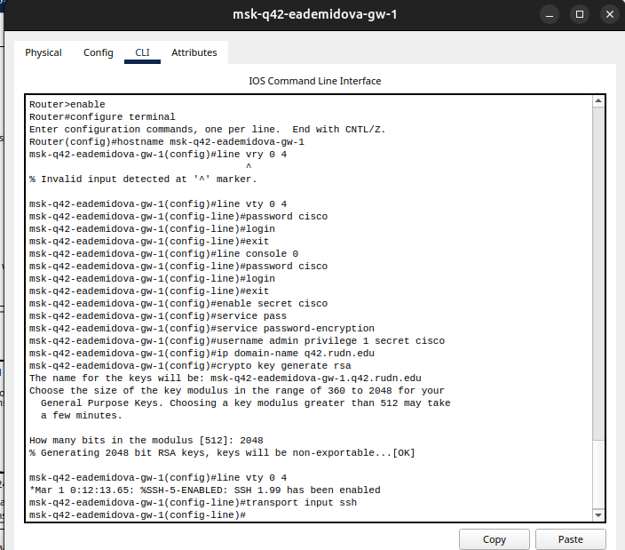{#fig:011 width=50%}

## Первоначальная настройка оборудования

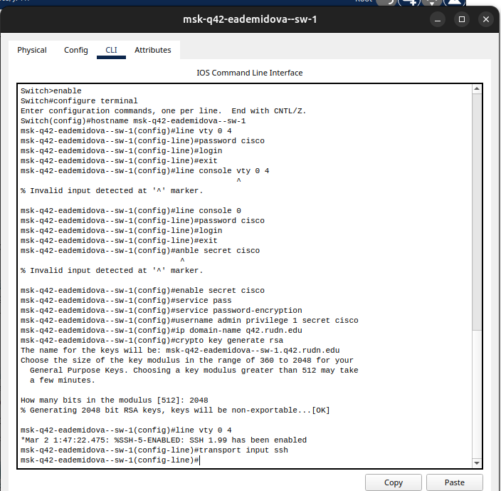{#fig:012 width=50%}

## Первоначальная настройка оборудования

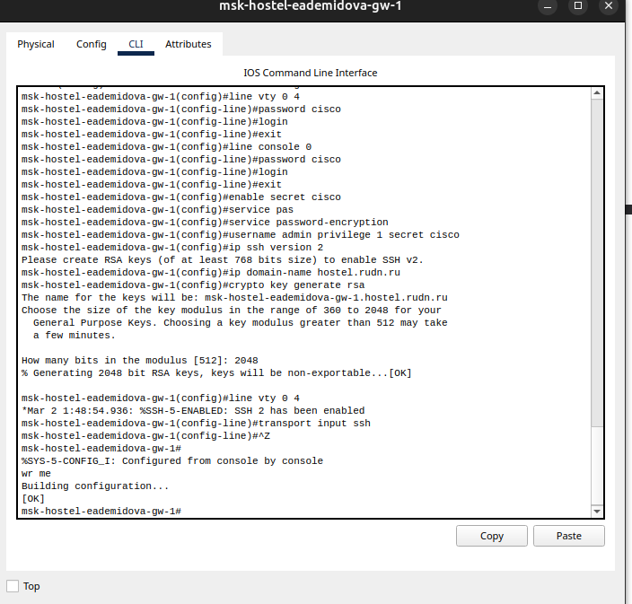{#fig:013 width=50%}

## Первоначальная настройка оборудования

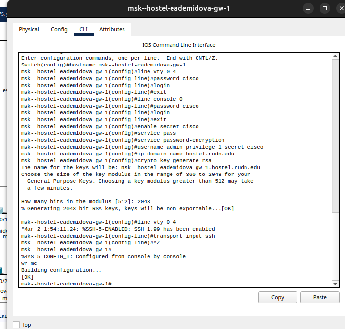{#fig:014 width=50%}

## Первоначальная настройка оборудования

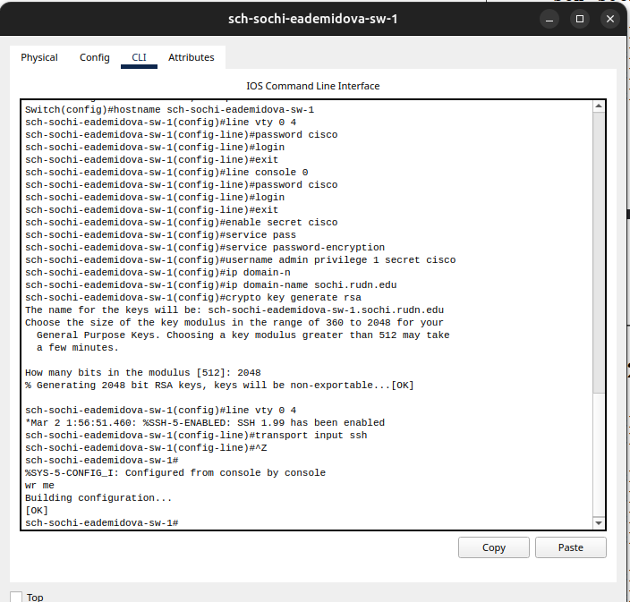{#fig:015 width=50%}

## Первоначальная настройка оборудования

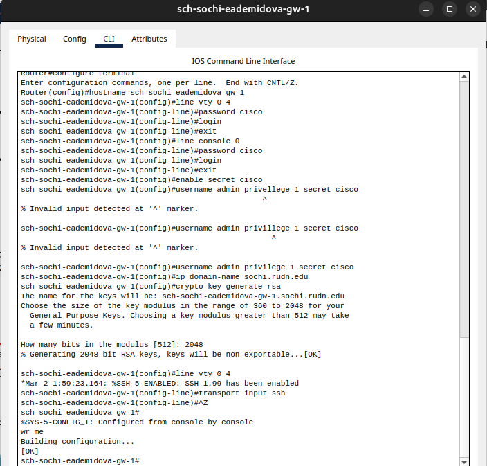{#fig:016 width=50%}

# Выводы

В результате выполнения лабораторной работы провели подготовительные мероприятия по организации взаимодействия через сеть провайдера посредством статической маршрутизации локальной сети с сетью основного здания, расположенного в 42-м квартале в Москве, и сетью филиала, расположенного в г. Сочи.