---
## Front matter
lang: ru-RU
title: Лабораторная работа № 14
subtitle: Статическая маршрутизация в Интернете
author:
  - Демидова Е. А.
institute:
  - Российский университет дружбы народов, Москва, Россия
date: 13 мая 2024

## i18n babel
babel-lang: russian
babel-otherlangs: english

## Formatting pdf
toc: false
toc-title: Содержание
slide_level: 2
aspectratio: 169
section-titles: true
theme: metropolis
header-includes:
 - \metroset{progressbar=frametitle,sectionpage=progressbar,numbering=fraction}
 - '\makeatletter'
 - '\beamer@ignorenonframefalse'
 - '\makeatother'
---

# Вводная часть

# Цели и задачи

## Цели

Настроить взаимодействие через сеть провайдера посредством статической маршрутизации локальной сети организации с сетью основного здания, расположенного в 42-м квартале в Москве, и сетью филиала, расположенного в г. Сочи.

## Задачи

1. Настроить связь между территориями.
2. Настроить оборудование, расположенное в квартале 42 в Москве.
3. Настроить оборудование, расположенное в филиале в г. Сочи.
4. Настроить статическую маршрутизацию между территориями.
5. Настроить статическую маршрутизацию на территории квартала 42 в г.
Москве.
6. Настроить NAT на маршрутизаторе msk-donskaya-gw-1.

# Выполнение лабораторной работы

## Настройка линка между площадками

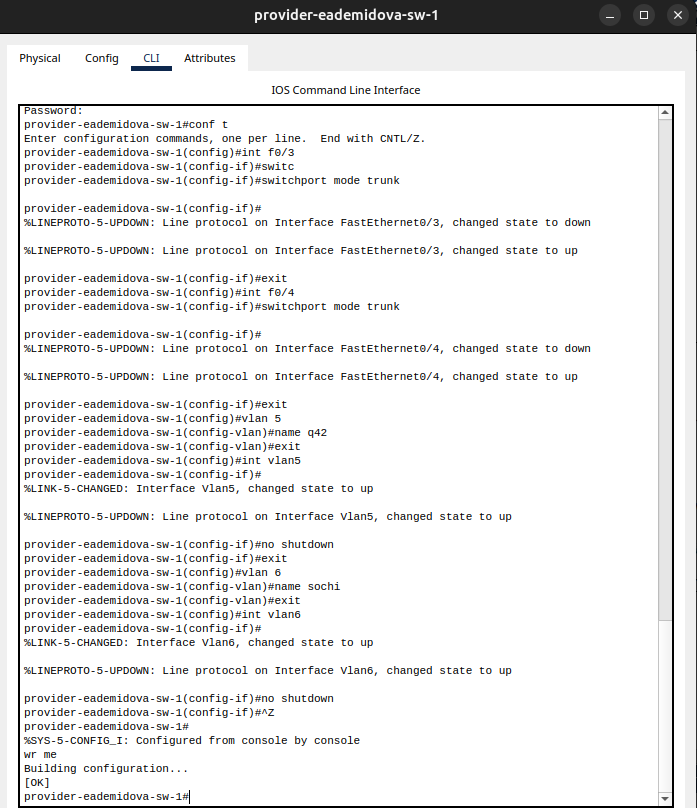{#fig:001 width=40%}

## Настройка линка между площадками

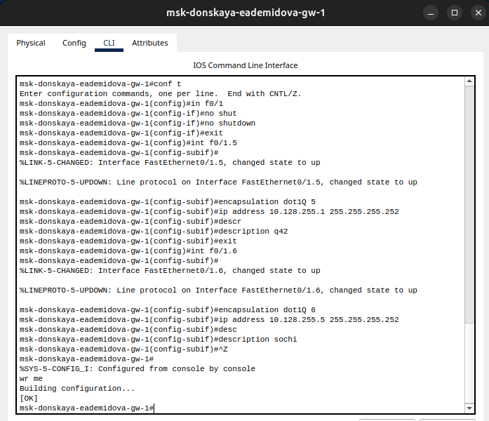{#fig:003 width=50%}

## Настройка линка между площадками

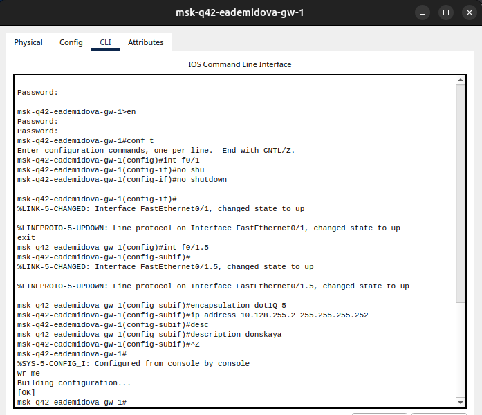{#fig:002 width=50%}

## Настройка линка между площадками

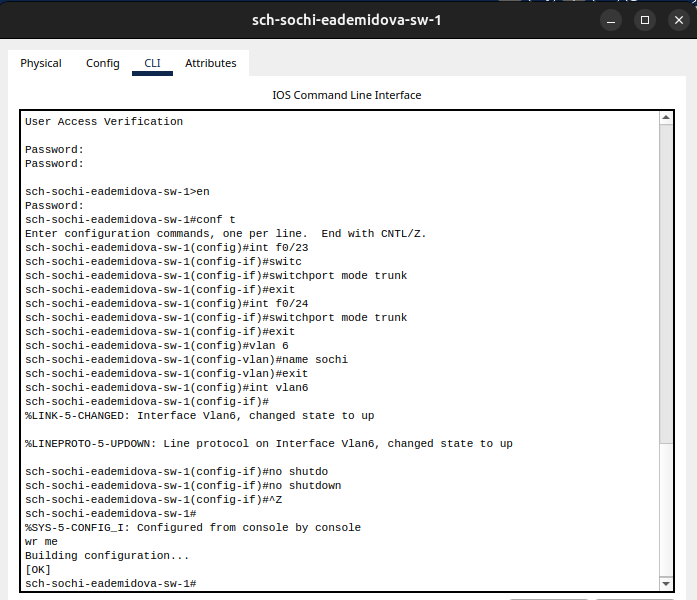{#fig:004 width=50%}

## Настройка линка между площадками

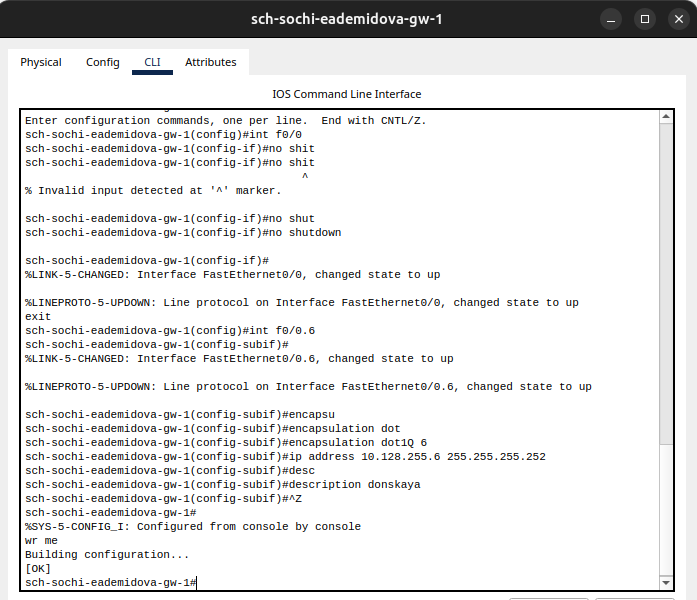{#fig:005 width=50%}

## Настройка площадки 42-го квартала

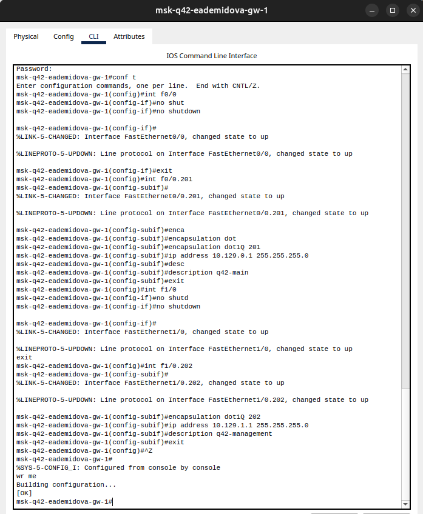{#fig:006 width=40%}

## Настройка площадки 42-го квартала

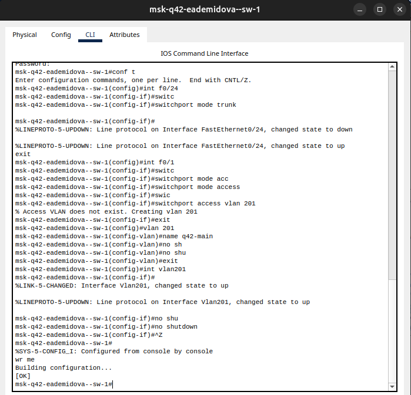{#fig:007 width=50%}

## Настройка площадки 42-го квартала

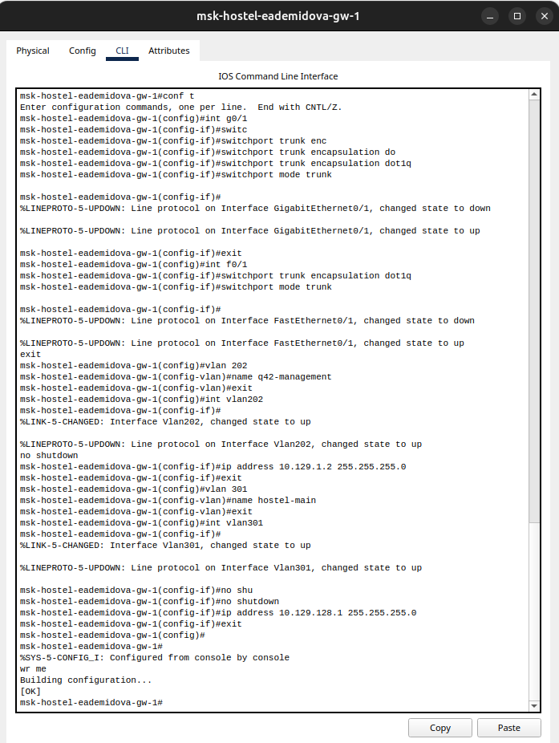{#fig:008 width=35%}

## Настройка площадки 42-го квартала

{#fig:009 width=50%}

## Настройка площадки в Сочи

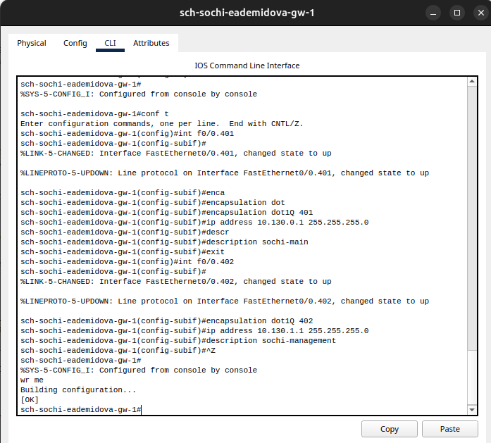{#fig:010 width=50%}

## Настройка площадки в Сочи

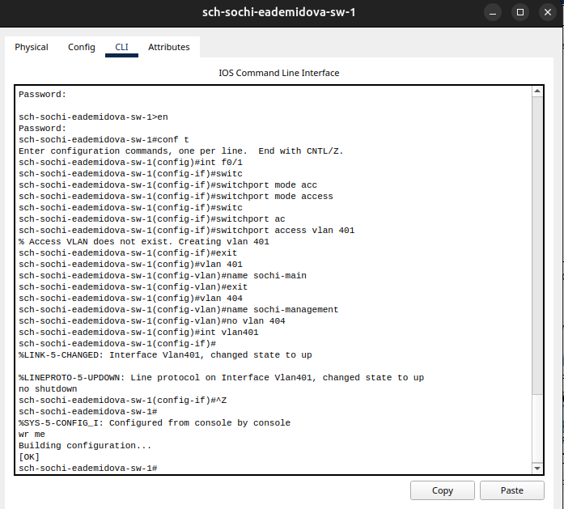{#fig:011 width=50%}

## Настройка маршрутизации между площадками

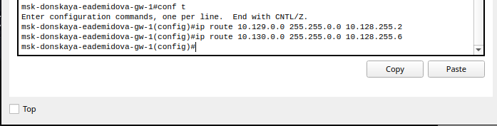{#fig:012 width=90%}

## Настройка маршрутизации между площадками

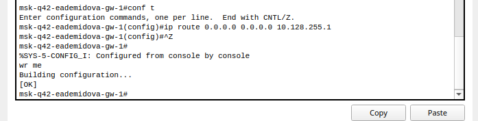{#fig:013 width=90%}

## Настройка маршрутизации между площадками

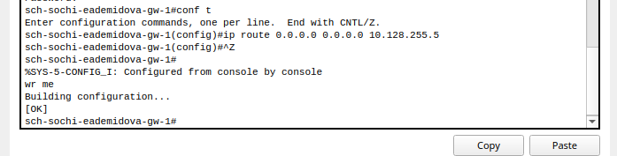{#fig:014 width=90%}

## Настройка маршрутизации на 42 квартале

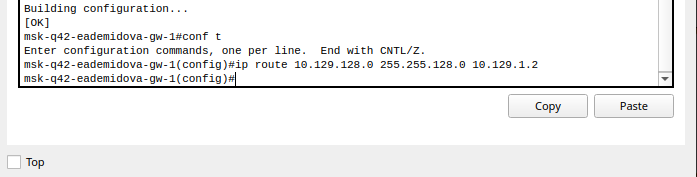{#fig:015 width=90%}

## Настройка маршрутизации на 42 квартале

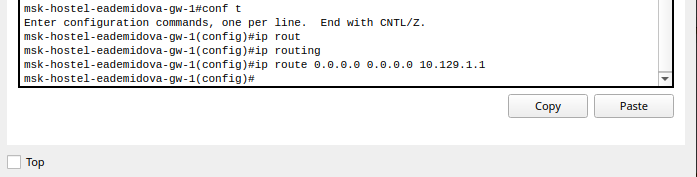{#fig:016 width=90%}

## Настройка NAT на маршрутизаторе msk-donskaya-gw-1

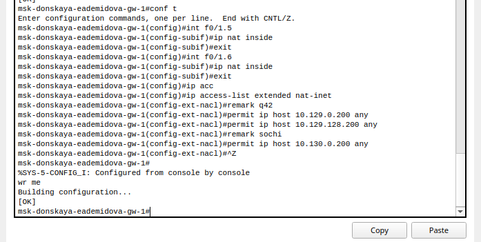{#fig:017 width=90%}

## Проверка настроек

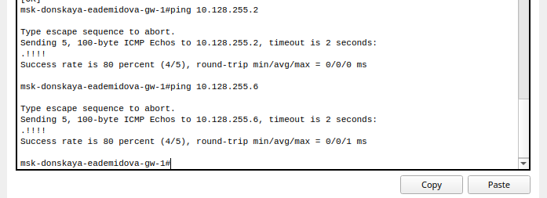{#fig:018 width=90%}

## Проверка настроек

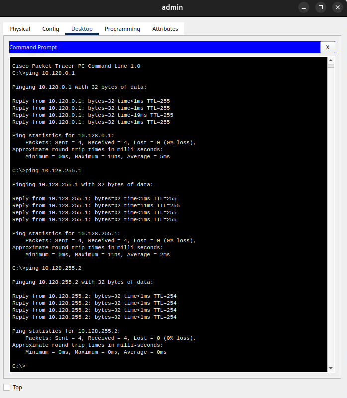{#fig:019 width=50%}

## Проверка настроек

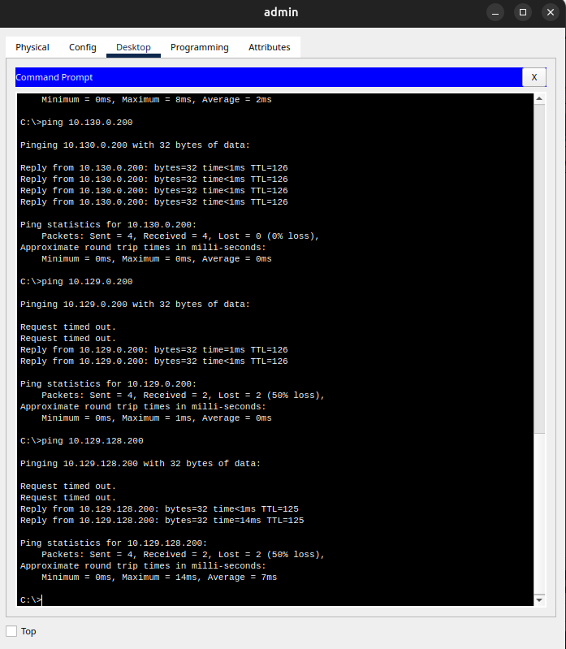{#fig:020 width=50%}

## Проверка настроек

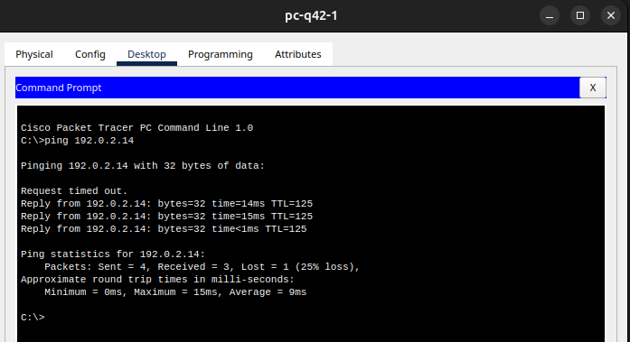{#fig:021 width=90%}

# Выводы

В результате выполнения лабораторной были приобретены практические навыки по настройке взаимодействие через сеть провайдера посредством статической маршрутизации локальной сети организации с сетью основного здания, расположенного в 42-м квартале в Москве, и сетью филиала, расположенного в г. Сочи.