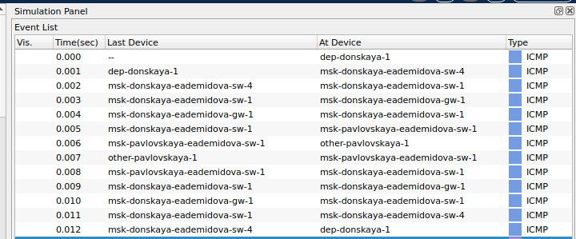

---
## Front matter
lang: ru-RU
title: Доклад
subtitle: Понятие и функции маршрутизатора, отличие маршрутизаторов от коммутаторов
author:
  - Демидова Е. А.
institute:
  - Российский университет дружбы народов, Москва, Россия
date: 25 марта 2024

## i18n babel
babel-lang: russian
babel-otherlangs: english

## Formatting pdf
toc: false
toc-title: Содержание
slide_level: 2
aspectratio: 169
section-titles: true
theme: metropolis
header-includes:
 - \metroset{progressbar=frametitle,sectionpage=progressbar,numbering=fraction}
 - '\makeatletter'
 - '\beamer@ignorenonframefalse'
 - '\makeatother'
---

# Вводная часть

## Цели и задачи

**Цель работы**

Рассмотреть понятие и функции маршрутизатора, а также отличие маршрутизаторов от коммутаторов. 

**Задачи**

- Рассмотреть понятие и функции маршрутизатора
- Сравнить маршрутизаторы и коммутаторы
- Практический пример, иллюстрирующий сравнение

**Материалы:** Cisco Packet Tracer

# Понятие и функции маршрутизатора

## Понятие маршрутизатора

Маршрутизатор (Router) -- устройство, которое пересылает пакеты между сетями.

## Функции маршрутизатора

{#fig:001 width=55%}

# Отличие маршрутизаторов от коммутаторов

## Понятие коммутатора

Сетевой коммутатор (Switch) — устройство, предназначенное для соединения нескольких узлов компьютерной сети в пределах одного сегмента.

## Основные отличия маршрутизатора от коммутатора

1. Принцип работы. Коммутатор использует канальный уровень при передаче информации, роутер функционирует на третьем уровне сетевой модели OSI.
2. Соединение. Маршрутизатор соединяет отдельные сети, коммутатор соединяет устройства одной сети.
3. Выход в глобальную сеть. Коммутатор не способен подключиться к интернету, в отличе от маршрутизатора.
4. Скорость работы. Коммутатор обладает большей скоростью передачи данных, чем маршрутизатор.
5. Цена. Коммуатор дешевле маршрутизатор.

## Практический пример отличия

{#fig:002 width=70%}

## Практический пример отличия

{#fig:003 width=90%}

## Практический пример отличия

{#fig:004 width=90%}

# Заключение

## Выводы

Рассмотрены понятие и функции маршрутизатора, а также отличие маршрутизаторов от коммутаторов и приведен практический пример.

##  Список литературы

1. ГОСТ Р 53632-2009. Показатели качества услуг доступа в интернет. Общие
требования. Федеральное агенство по техническому регулированию и метрологии, 2011.
2. Олифер В.Г., Олифер Н.А. Компьютерные сети. Принципы, технологии, протоколы – Учебник для вузов. 4-е изд. СПб.: Питер, 2010. 958 с.
3. Кулябов Д.С., Королькова А.В. Архитектура и принципы построения современных сетей и систем телекоммуникаций: Учеб. пособие. М.: РУДН, 2008.
309 с.
4. Таненбаум Э., Бос Х. Современные операционные системы. 4-е изд. СПб.: Питер, 2015. 1120 с.
5. Кулябов Д.С., Королькова А.В. Администрирование сетевых подсистем. Лабораторный практикум: учебное пособие - 2-е издание, исправленное и дополненное. М.: РУДН, 2021. 137 с.