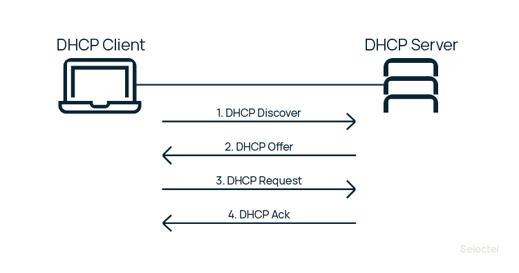
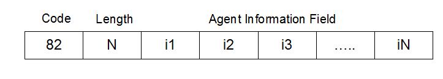
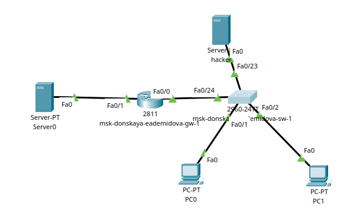
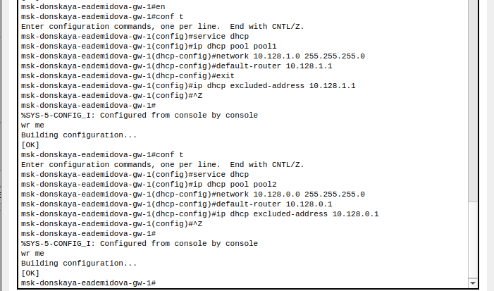
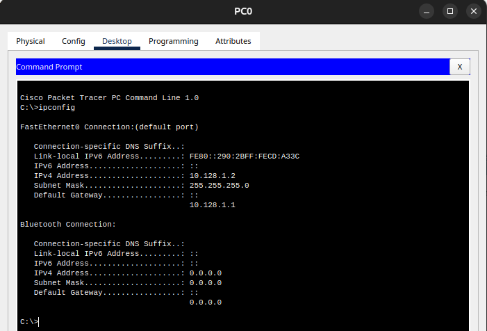
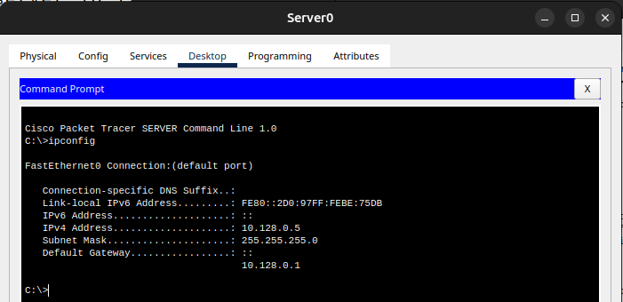
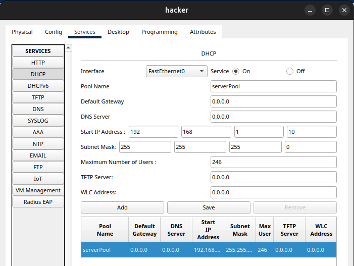
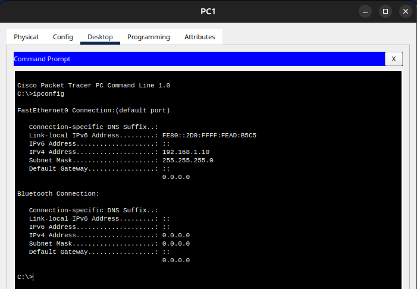
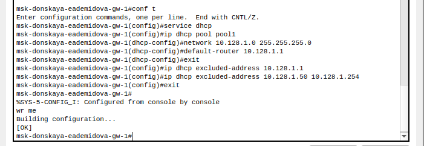

---
## Front matter
lang: ru-RU
title: Доклад
subtitle: Настройка сетевых сервисов на сетевом оборудовании. DHCP. Безопасность DHCP (option 82)
author:
  - Демидова Е. А.
institute:
  - Российский университет дружбы народов, Москва, Россия
date: 3 июня 2024

## i18n babel
babel-lang: russian
babel-otherlangs: english

## Formatting pdf
toc: false
toc-title: Содержание
slide_level: 2
aspectratio: 169
section-titles: true
theme: metropolis
header-includes:
 - \metroset{progressbar=frametitle,sectionpage=progressbar,numbering=fraction}
 - '\makeatletter'
 - '\beamer@ignorenonframefalse'
 - '\makeatother'
---

# Вводная часть

## Цели и задачи

**Цель работы**

Рассмотреть принципы работы DHCP, его настройку на сетевом оборудовании и обеспечение безопасности. 

**Задачи**

- Рассмотреть принцип работы DHCP
- Рассмотреть способы обеспечения безопаснти DHCP
- Привести практический пример настройки DHCP

**Материалы:** Cisco Packet Tracer

# Теоретические сведения

## Понятие DHCP

Протокол динамической конфигурации хоста (Dynamic Host Configuration Protocol, DHCP) -- автоматизирует процесс конфигурирования сетевых интерфейсов, обеспечивая отсутствие дублирования адресов за счет централизованного управления их распределением.

## Принцип работы DHCP

{#fig:001 width=70%}

## Безопасность DHCP

Типы атак:

- DHCP Starvation
- DHCP Spoofing

Решение:

DHCP Snooping -- это функция безопасности коммутатора, обеспечивающая получение DHCP клиентом IP-адреса только от легитимного DHCP сервера.

## Опция 82

{#fig:002 width=70%}

# Практический пример

## Практический пример настройки dhcp

{#fig:003 width=60%}

## Практический пример настройки dhcp

{#fig:004 width=60%}

## Практический пример настройки dhcp

{#fig:005 width=60%}

## Практический пример настройки dhcp

{#fig:006 width=60%}

## Практический пример настройки dhcp

{#fig:007 width=60%}

## Практический пример настройки dhcp

{#fig:008 width=60%}

## Практический пример настройки dhcp

{#fig:009 width=90%}

# Заключение

## Выводы

Рассмотрены принципы работы DHCP, его настройку на сетевом оборудовании и обеспечение безопасности.

##  Список литературы

1. Олифер В.Г., Олифер Н.А. Компьютерные сети. Принципы, технологии, протоколы – Учебник для вузов. 4-е изд. СПб.: Питер, 2010. 958 с.
2. ГОСТ Р 59802-2021. Национальный стандарт Российской Федерации. Телевидение вещательное цифровое [Электронный ресурс]. Федеральное агенство по техническому регулированию и метрологии, 2022. URL: https://npalib.ru/2021/10/26/gost-r-59802-2021-id301215/.
3. Таненбаум Э., Бос Х. Современные операционные системы. 4-е изд. СПб.: Питер, 2015. 1120 с.