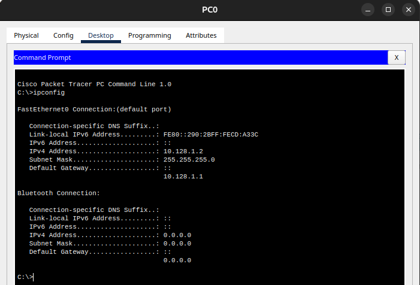

---
## Front matter
title: "Доклад"
subtitle: "Настройка сетевых сервисов на сетевом оборудовании. DHCP. Безопасность DHCP (option 82)."
author: "Демидова Екатерина Алексеевна"

## Generic otions
lang: ru-RU
toc-title: "Содержание"

## Bibliography
bibliography: bib/cite.bib
csl: pandoc/csl/gost-r-7-0-5-2008-numeric.csl

## Pdf output format
toc: true # Table of contents
toc-depth: 2
lof: true # List of figures
lot: false # List of tables
fontsize: 12pt
linestretch: 1.5
papersize: a4
documentclass: scrreprt
## I18n polyglossia
polyglossia-lang:
  name: russian
  options:
	- spelling=modern
	- babelshorthands=true
polyglossia-otherlangs:
  name: english
## I18n babel
babel-lang: russian
babel-otherlangs: english
## Fonts
mainfont: PT Serif
romanfont: PT Serif
sansfont: PT Sans
monofont: PT Mono
mainfontoptions: Ligatures=TeX
romanfontoptions: Ligatures=TeX
sansfontoptions: Ligatures=TeX,Scale=MatchLowercase
monofontoptions: Scale=MatchLowercase,Scale=0.9
## Biblatex
biblatex: true
biblio-style: "gost-numeric"
biblatexoptions:
  - parentracker=true
  - backend=biber
  - hyperref=auto
  - language=auto
  - autolang=other*
  - citestyle=gost-numeric
## Pandoc-crossref LaTeX customization
figureTitle: "Рис."
tableTitle: "Таблица"
listingTitle: "Листинг"
lofTitle: "Список иллюстраций"
lotTitle: "Список таблиц"
lolTitle: "Листинги"
## Misc options
indent: true
header-includes:
  - \usepackage{indentfirst}
  - \usepackage{float} # keep figures where there are in the text
  - \floatplacement{figure}{H} # keep figures where there are in the text
---

# Цель работы

Рассмотреть принципы работы DHCP, его настройку на сетевом оборудовании и обеспечение безопасности. 

# Задачи

- Рассмотреть принцип работы DHCP
- Рассмотреть способы обеспечения безопаснти DHCP
- Привести практический пример настройки DHCP

# Теоретические сведения

## Понятие протокола DHCP

Для нормальной работы сети каждому сетевому интерфейсу компьютера и маршрутизатора
должен быть назначен IP-адрес[@Olifer2006].
Процедура присвоения адресов происходит в ходе конфигурирования компьютеров и маршрутизаторов. При конфигурировании назначается не только IP-адрес, но маска подсети, IP-адрес машрутизатора по умолчанию, IP-адреса DNS-сервера, доменное имя и другие параметры стека TCP-IP. Поэтому вручную эта процедура представляет собой для администратора утомительную процедуру.

Протокол динамической конфигурации хоста (Dynamic Host Configuration Protocol, DHCP)[@Gost2022] -- автоматизирует процесс конфигурирования сетевых интерфейсов, обеспечивая отсутствие дублирования адресов за счет централизованного управления их распределением.

## Режимы DHCP

Протокол DHCP работает в соответствии с моделью клиент-сервер. Во время старта си стемы компьютер, являющийся DHCP-клиентом, посылает в сеть широковещательный запрос на получение ІР-адреса. DНСР-сервер откликается и посылает сообщение-ответ, содержащее ІР-адрес и некоторые другие конфигурационные параметры.

При этом сервер DHCP может работать в разных режимах, включая:

- ручное назначение статических адресов;
- автоматическое назначение статических адресов;
- автоматическое распределение динамических адресов.

Во всех режимах работы администратор при конфигурировании DHCP-сервера сообщает ему один или несколько диапазонов ІР-адресов, причем все эти адреса относятся к одной сети, то есть имеют одно и то же значение в поле номера сети.

В ручном режиме администратор, помимо пула доступных адресов, снабжает DHCP- сервер информацией о жестком соответствии IP-адресов физическим адресам или другим идентификаторам клиентских узлов. DHCP-сервер, пользуясь этой информацией, всегда  выдаст определенному DHCP-клиенту один и тот же назначенный ему администратором IP-адрес (а также набор других конфигурационных параметров).

В режиме автоматического назначения статических адресов DНСР-сервер самостоятельно без вмешательства администратора произвольным образом выбирает клиенту ІР-адрес из пула наличных ІР-адресов. Адрес дается клиенту из пула в постоянное пользование, то есть между идентифицирующей информацией клиента и его IP-адресом по-прежнему, как и при ручном назначении, существует постоянное соответствие. Оно устанавливается в момент первого назначения DНСР-сервером IP-адреса клиенту. При всех последующих запросах сервер возвращает клиенту тот же самый IP-адрес.

При динамическом распределении адресов DНСР-сервер выдает адрес клиенту на ограниченное время, называемое сроком аренды. Когда компьютер, являющийся DHCP- клиентом, удаляется из подсети, назначенный ему ІР-адрес автоматически освобождается. Когда компьютер подключается к другой подсети, то ему автоматически назначается новый адрес. Ни пользователь, ни сетевой администратор не вмешиваются в этот процесс. Это дает возможность впоследствии повторно использовать этот IP-адрес для назначения другому компьютеру.

## Принцип работы DHCP

Получение адреса проходит в четыре шага. Этот процесс называют DORA по первым буквам каждого шага: Discovery, Offer, Request, Acknowledgement(рис. [-@fig:001]):

{#fig:001 width=100%}

Каждая сеть должна иметь DHCP-сервер, отвечающий за настройки. Также могут существовать DHCP-агенты, которые играют роль посредников между клиентами и серверами. Таким образом один DHCP-сервер может обслуживать клиентов нескольких разных сетей.

Рассмотрим этот алгоритм[@Tanenbaum2015]:

- Для отыскания своего IP-адреса компьютер широковещательным способом распространяет специальный пакет DHCPDISCOVER. Он должен прибыть на DHCP-сервер.  Сервер всегда слушает 67 порт, ожидает широковещательное сообщение от клиента, а после его получения отправляет ответное предложение — DHCPOFFER. Клиент принимает сообщение на 68 порту.
- Когда сервер получает пакет, он выделяет свободный IP-адрес и отправляет его обратно с помощью пакета DHCPOFFER (который также может ретранслироваться). Чтобы это было возможным, даже если у хоста нет IP-адреса, сервер определяет хост по его Ethernet-адресу (который содержится в пакете DHCPDISCOVER).

IP выделяются из области (SCOPE) доступных адресов, которая задается администратором.

Если имеются адреса, которые не должны быть назначены DHCP-сервером, область можно ограничить, указав только разрешенные адреса. Например, администратор может задать диапазон используемых IP-адресов от 192.0.0.10 до 192.0.0.254.

Бывает и так, что не все доступные адреса должны быть назначены клиентам. Например, администратор может исключить (exclude) диапазон 192.0.0.100 - 192.0.0.200 из используемой области. Такое ограничение называется исключением.

- Клиент получает DHCPOFFER, а затем отправляет на сервер сообщение DHCPREQUEST. Этим сообщением он принимает предлагаемый адрес и уведомляет DHCP-сервер об этом. Широковещательное сообщение почти полностью дублирует DHCPDISCOVER, но содержит в себе уникальный IP, выделенный сервером. Таким образом, клиент сообщает всем доступным DHCP-серверам «да, я беру этот адрес», а сервера помечают IP как занятый.

- Сервер получает от клиента DHCPREQUEST и окончательно подтверждает передачу IP-адреса клиенту сообщением DHCPACK. Это широковещательное или прямое сообщение утверждает не только владельца IP, но и срок, в течение которого клиент может использовать этот адрес.

## Безопасность DHCP

DHCP Starvation

Эта ата­ка осно­вана на про­веде­нии рас­сылок огромно­го количес­тва сооб­щений DHCPDISCOVER с целью исто­щить адресное прос­транс­тво на сер­вере DHCP. Сер­вер DHCP будет реаги­ровать на каж­дый зап­рос и выдавать IP-адрес. Пос­ле перепол­нения допус­тимого адресно­го прос­транс­тва сер­вер DHCP боль­ше не смо­жет обслу­живать новых кли­ентов в сво­ей сети, выдавая им IP-адре­са.

DHCP Spoofing

Эта атака основана на подмене настоящего DHCP-сер­вера сервером хакера. Ког­да поддельный DHCP-сер­вер выда­ет IP-адре­са хос­там в сети, он переда­ет и информа­ция о том, что его IP-адре­с является шлю­зом по умол­чанию.

DHCP Snooping -- это функция безопасности коммутатора, обеспечивающая получение DHCP клиентом IP-адреса только от легитимного DHCP сервера.

При настройке DHCP Snooping порт, к которому подключен легитимный DHCP сервер, назначаются в качестве доверенного (trusted). Обычно это транзитные uplink порты коммутатора. Все прочие порты считаются недоверенными (обычно это клиентские Ethernet порты коммутатора).

При получении DHCP запросов от клиентского оборудования коммутатор отправляет их только в сторону доверенного порта. При этом коммутатор блокирует DHCP ответы от “нелегальных” DHCP серверов, подключенных к недоверенным портам, препятствуя тем самым получению сетевых настроек от недоверенного DHCP сервера. 

Еще одна очень полез­ная фун­кция DHCP Snooping -- огра­ниче­ние на отправ­ку DHCP-сооб­щений. Это огра­ниче­ние допус­кает отправ­ку через порт ком­мутато­ра опре­делен­ного количес­тва DHCP-тра­фика в секун­ду.

### Опция 82

Опция 82 протокола DHCP используется для того, чтобы проинформировать DHCP-сервер о том, от какого DHCP-ретранслятора и через какой его порт был получен запрос. Коммутатор с функцией  DHCP-snooping добавляет опцию в DHCP-запросы от клиента и передает их серверу. DHCP-сервер, в свою очередь, предоставляет IP-адрес и другую конфигурационную информацию в соответствии с преднастроенными политиками на основании информации, полученной в заголовке опции 82. Коммутатор снимет заголовок опции с принятого от DHCP-сервера сообщения и передаст сообщение клиенту в соответствии с информацией о физическом интерфейсе, указанной в опции. Применение опции 82 прозрачно для клиента(рис. [-@fig:002]).

{#fig:002 width=70%}

# Практический пример

Создадим сеть для демонстрации настройки dhcp.

Расположим в сети один маршрутизатор, к нему подключим сервер и коммутатор, а к коммутатору еще один сервер и два компьютера(рис. [-@fig:003]).

{#fig:003 width=70%}

Маршрутизатор сделаем dhcp-сервером и зададим два пула для сетей 10.128.0.0 и 10.128.1.1(рис. [-@fig:004]).

{#fig:004 width=90%}

Можно увидеть, что автоматически выдаются адреса из разных пулов для сервера и ПК(рис. [-@fig:005], [-@fig:006]).

{#fig:005 width=90%}

{#fig:006 width=90%}

Теперь настроим поддельный dhcp-сервер с пулом адресов, начинающихся с 192.168.1.10(рис. [-@fig:007]).

{#fig:007 width=90%}

В результате адреса могут выдаваться в том числе и с этого сервера(рис. [-@fig:008]).

{#fig:008 width=90%}

Для того чтобы адреса выдавались только с одного dhcp-сервера, нужно включить на коммутаторе dhcp-snooping и сделать порт, к которому подключен настоящий dhcp-сервер(в нашем случае f0.24)  trusted-портом(остальные порты по умолчанию untrusted)(рис. [-@fig:009]).

{#fig:009 width=90%}

# Выводы

Рассмотрены принципы работы DHCP, его настройку на сетевом оборудовании и обеспечение безопасности.

# Список литературы{.unnuпрmbered}

::: {#refs}
:::
